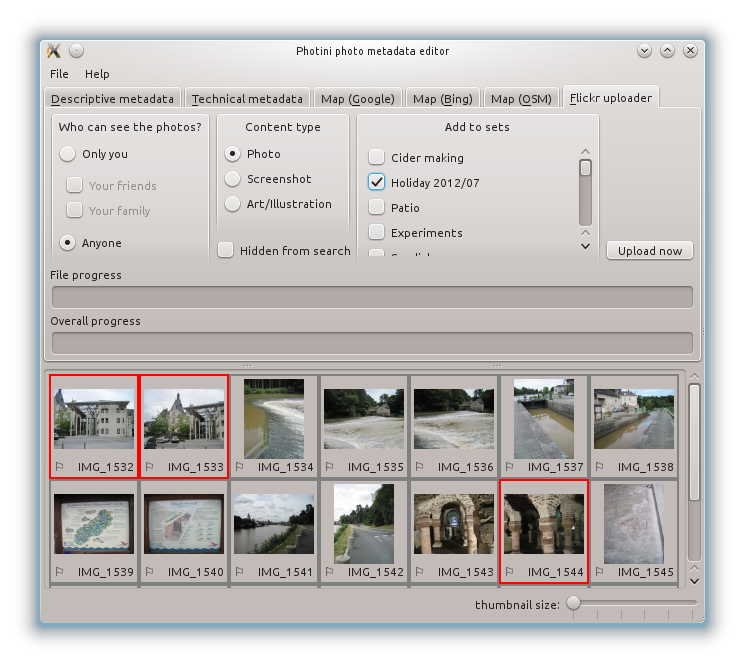
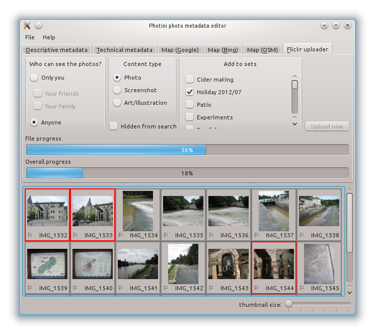

User Manual - Flickr uploader
=============================

The ``Flickr uploader`` tab (keyboard shortcut ``Alt+F``) allows you to upload your photographs to `Flickr <http://www.flickr.com/>`_.
Flickr is a popular online photograph sharing service.

Unlike some other Flickr uploaders, Photini uses the descriptive metadata you've created to set Flickr's title, description and tags.
This means you don't have to retype all that information!

The first time you select Photini's Flickr uploader tab it will ask you to authorise Photini to access Flickr.
It does this by connecting your web browser to Flickr, from where you can log in and then give Photini permission to access Flickr on your behalf.
Once you have done this you can close your web browser and return to Photini.

.. image:: ../images/screenshot_22.png

To upload one or more photographs to Flickr, select them in the image selector area, then choose which (if any) of your sets to add them to and set any of the other attributes, then click on the ``Upload now`` button.

During uploading Photini displays two progress bars - one for the current file and one for the complete job.

