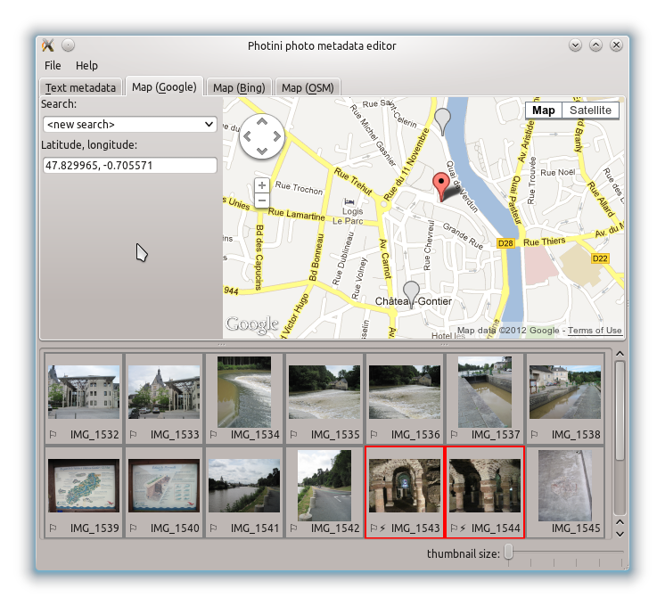

User Manual
===========

Editing title & description
---------------------------

.. image:: ../images/screenshot_text.png

Select the ``Text metadata`` tab (keyboard shortcut ``Alt+T``) to edit textual metadata such as title and description.
If you haven't already done so, load some images using the ``File`` menu ``Open images`` item (keyboard shortcut ``Ctrl+O``).
Select one or more images by clicking on their thumbnails and then type appropriate information into each of the fields.
I usually start by selecting all the images and pressing the ``Auto`` buttons to set their copyright and creator fields, then selecting smaller groups of images before setting the other fields.
It's a good idea to save your edits as you go, using the ``File`` menu ``Save images with new data`` item.
Every image that has unsaved changes has a 'electrical warning' symbol next to its file name.

Setting geolocation data
------------------------

Select the ``Map (Google)`` tab (keyboard shortcut ``Alt+G``) to set the latitude and longitude of your photographs.
The first time you do this you will need to click on the ``connect to Google`` button.
Having this button allows you to use Photini without a network connection, and reduces the load on Google's servers.
The ``Search`` box allows you to search Google's database for a city, town or even street name to help find where a photograph was taken.
The search is biased by the current location of the map.
For example, if the map is showing somewhere in France and I search for 'Newport', three results are offered, none of which is the one in Essex I was looking for.
If I then drag the map to show Cambridge (UK) and repeat the search, I get one more Newport - the one in Essex.
This takes a little bit of getting used to, so don't be afraid to experiment.
Just zoom out, drag the map, zoom in and click ``<repeat serch>``.

Having found your location, select one or more images and drag them onto the map.
You can adjust the positions by dragging the markers around the map, or by editing the latitude and longitude coordinates directly.
Every image that has a location set displays a little flag symbol next to its file name.