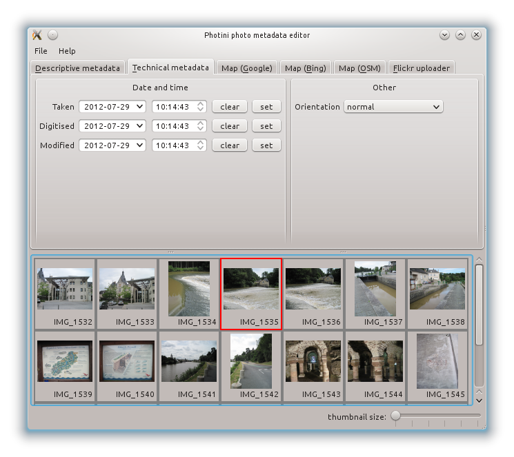

User Manual - Technical metadata
================================

The ``Technical metadata`` tab (keyboard shortcut ``Alt+T``) allows you to edit 'technical' information about your photographs, such as the date & time they were taken.
Generally you should not need to edit any of this data, as it should have been correctly set by your camera.

The date and time fields can be cleared with the ``clear`` button or set to the current date and time with the ``set`` button.
The date can also be picked from a calendar widget that pops up when you click on the down arrow.
The time can be adjusted by clicking on the hour, minute or second and then using the up or down arrows.

The ``Orientation`` value sets the required rotation or reflection to display the image.
Note that this does not actually transform the image data.
Image display programs should rotate or reflect the image according to the orientation metadata, but not all do.