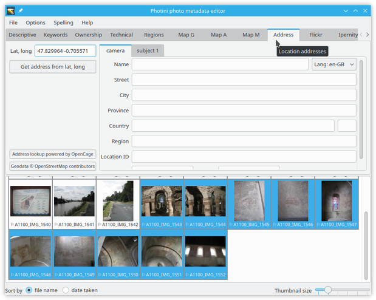
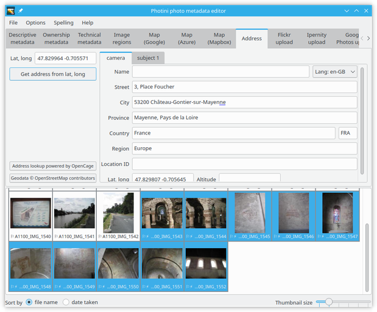
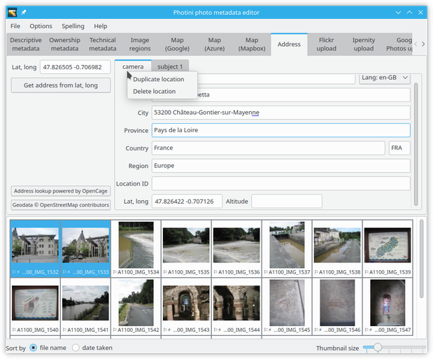
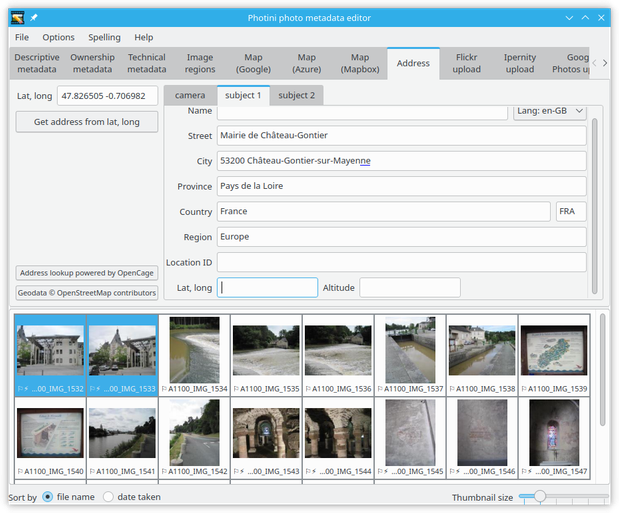

.. This is part of the Photini documentation.
   Copyright (C)  2019-23  Jim Easterbrook.
   See the file ../DOC_LICENSE.txt for copying conditions.

Location addresses
==================

The ``Address`` tab shows text address data for the location from where the photograph was taken (``camera``) and one or more locations shown in the photograph (``subject``).
For example, if the subject location is the Eiffel Tower then the camera location is almost certainly somewhere else in Paris.

Locations are stored in a 5-level hierarchy: ``street``, ``city``, ``province``, ``country`` and ``region``.
The meaning of these terms is rather vague, especially when out in the countryside, and there's no requirement to fill them all in.
Typically ``city`` can be anything from a village to a metropolis, and ``street`` is a more specific location, e.g. "23 Abdication Avenue".
``Province`` would be a state in the USA or a county in the UK.
``Country`` is stored as a name and a 2 or 3 letter `ISO code`_.
``Region`` appears to be rarely used but could be a continent or sub-continent.

``Name``, ``Location ID``, and GPS data are recent additions to the IPTC location specification.
More detail about all of these can be found on the `IPTC web site`_.

Note that "legacy" IPTC-IIM address metadata only stores the ``street``, ``city``, ``province``, and ``country`` fields and only the ``camera`` location.

The ``Get address from lat, long`` button uses "reverse geocoding" to convert latitude & longitude into a hierarchical address.
This is a rather imprecise process so you may need to edit the results yourself.
The address lookup service is provided by OpenCage_, using data from OpenStreetMap_.
Other map providers don't allow lookup results to be permanently stored.

Photini attempts to use all the data returned in an address lookup.
This can lead to some duplication, e.g. Château-Gontier appears twice in ``city``.
Note also the blue underlining indicating text that is too long to store in IPTC-IIM metadata.

Scrolling down shows the latitude and longitude of the location.
Note that these are not the same as the GPS coordinates shown at the top left.
The reverse geocoding process chooses a "place" (address, business, landmark, etc.) near the actual coordinates and it is the coordinates of that place that are shown in the ``camera`` address.

It is usually necessary to edit the address quite a lot.

Right-clicking on a location tab displays a context menu that allows the tab to be copied to a new tab or deleted.
Copying the ``camera`` location is an easy way to initialise a ``subject`` location.
(An empty ``subject 2`` tab is immediately created, in case the photograph has more than one subject.)

In this case most of the data is the same, but I changed ``street`` to the subject of the photograph rather than the place where I was standing, and then deleted the latitude & longitude.

To reorder the subject locations, or to convert between camera and subject, you can drag any of the tabs to another position.
Photini ensures there is always one empty subject location ready to be filled in.

.. _IPTC web site: http://www.iptc.org/std/photometadata/specification/IPTC-PhotoMetadata#location-structure
.. _ISO code:      https://www.iso.org/iso-3166-country-codes.html
.. _OpenCage:      https://opencagedata.com/
.. _OpenStreetMap: https://www.openstreetmap.org/about/
