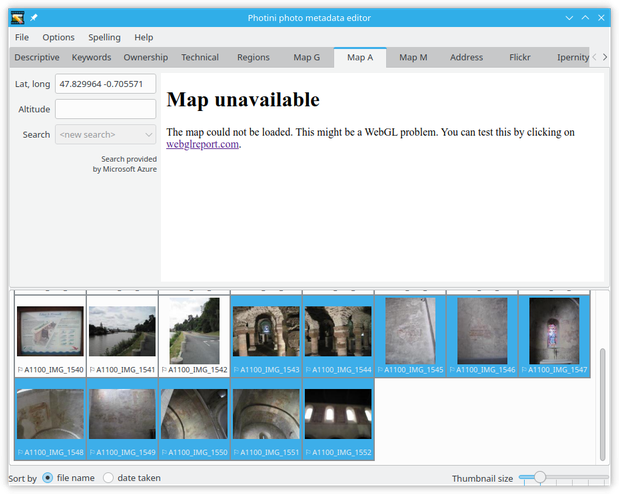

.. This is part of the Photini documentation.
   Copyright (C)  2019  Jim Easterbrook.
   See the file ../DOC_LICENSE.txt for copying conditions.

Location addresses
==================

The ``Address`` tab shows text address data for the location from where the photograph was taken (``camera``) and one or more locations shown in the photograph (``subject``).
For example, a general view of the Eiffel Tower will almost certainly have been taken from somewhere else in Paris.

These are stored in a 5-level hierarchy: ``street``, ``city``, ``province``, ``country`` and ``region``.
The meaning of these terms is rather loose, especially when out in the countryside, and there's no requirement to fill them all in.
Typically ``city`` can be anything from a village to a metropolis, and ``street`` is a more specific location, e.g. "23 Abdication Avenue".
``Province`` would be a state in the USA or a county in the UK.
``Country`` is stored as a name and a 2 or 3 letter ISO code.
``Region`` appears to be rarely used but could be a continent or sub-continent.
More detail about these can be found on the `IPTC web site <https://www.iptc.org/std/photometadata/documentation/userguide/index.htm#!Documents/locations.htm>`_.

The separation of camera and subject addresses was added to the IPTC specification in 2009, but you may still have software that only recognises "legacy" address metadata.
In this case you should not use the ``subject`` tabs or ``region`` field.
(Note that although the address metadata is standardised by the IPTC, it's actually stored in the XMP data.)

.. image:: ../images/screenshot_141.png

The ``Get address from lat, long`` button uses "reverse geocoding" to convert latitude & longitude into a hierarchical address.
This is a rather imprecise process so you may need to edit the results yourself.
The address lookup service is provided by OpenCage_, using data from OpenStreetMap_.
Other map providers don't allow lookup results to be permanently stored.

.. image:: ../images/screenshot_142.png

Photini attempts to use all the data returned in an address lookup.
This can lead to some duplication, e.g. Château-Gontier appears in both city and province.

It is usually necessary to edit the address quite a lot.

.. image:: ../images/screenshot_144.png

Right-clicking on a location tab displays a context menu that allows the tab to be copied to a new tab or deleted.
Copying the ``camera`` location is an easy way to initialise a ``subject`` location.
(An empty ``subject 2`` tab is immediately created, in case the photograph has more than one subject.)

.. image:: ../images/screenshot_145.png

In this case most of the data is the same, but I changed the ``street`` to the subject of the photograph rather than the place where I was standing.

.. image:: ../images/screenshot_146.png

To reorder the subject locations, or to convert between camera and subject, you can drag any of the tabs to another position.
If this results in the rightmost tab having data then another tab will be added.
If the two rightmost tabs have no data then one of the empty tabs will be removed.

.. _OpenCage:      https://opencagedata.com/
.. _OpenStreetMap: https://www.openstreetmap.org/about/
