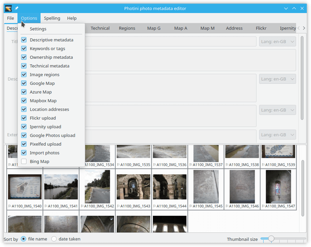
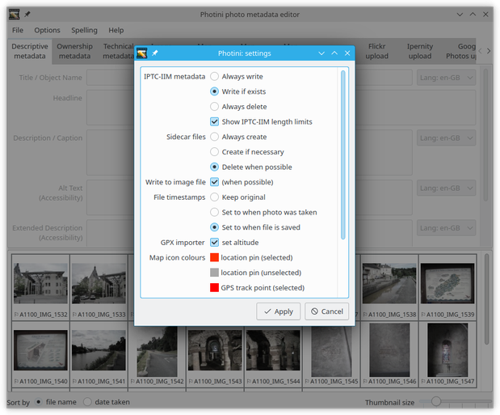
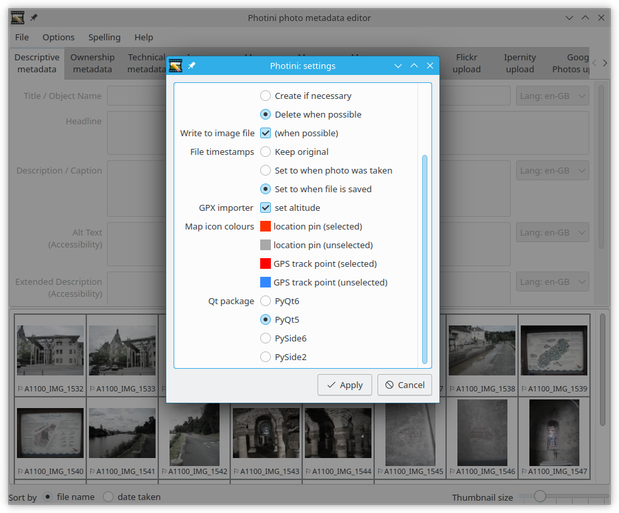
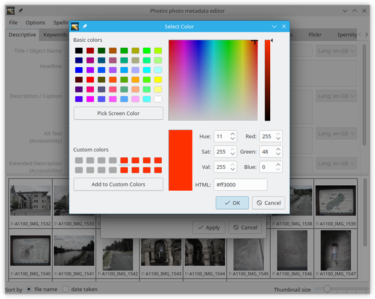
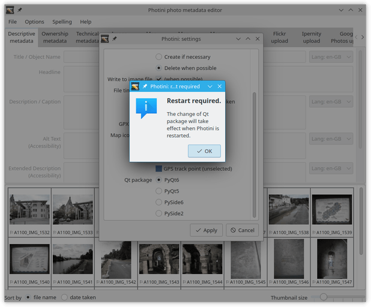
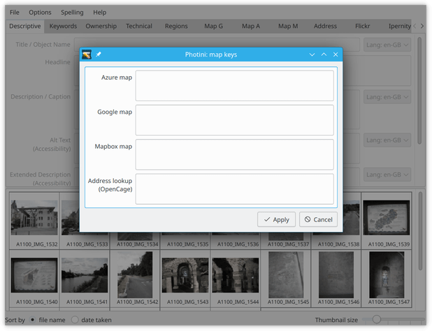
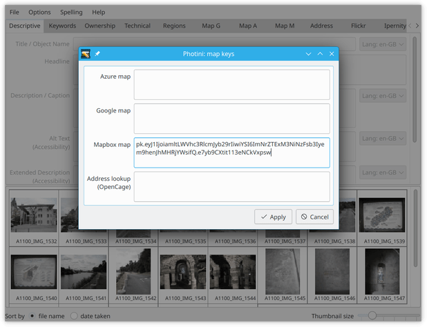
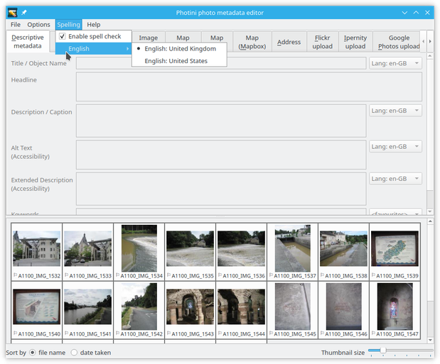
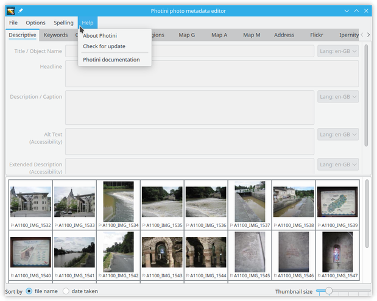

.. This is part of the Photini documentation.
   Copyright (C)  2012-25  Jim Easterbrook.
   See the file ../DOC_LICENSE.txt for copying conditions.

Configuration
=============

Photini's ``Options`` menu allows you to adjust its operation to suit your personal preferences.

If there are tabs in the Photini GUI that you don't use, you can remove them by deselecting their entry in the ``Options`` menu.

The ``Options`` menu has a ``Settings`` item which opens the dialog shown above.

The first three items adjust how Photini uses IPTC-IIM "legacy" metadata.
(Since 2004 the `IPTC standard`_ uses XMP to store metadata.
Photini always writes these XMP fields.)
The first option is to always write IPTC-IIM metadata.
You may need this if you use other software that reads IPTC-IIM but not XMP.
The second option only writes IPTC-IIM metadata if it is already present in the file, as recommended by the `Metadata Working Group`_.
The third option is to delete any IPTC-IIM metadata that might be present.

IPTC-IIM metadata has limited length for some fields.
Photini truncates the IPTC-IIM data if necessary, but the full length data is still stored in Exif and / or XMP.
Text that exceeds the IPTC-IIM length is shown with a blue underline.
If you don't need to worry about IPTC-IIM compatibility you can disable this warning.

Sidecar files allow metadata to be stored without needing to write to the actual image file.
If you deselect "write to image file" then sidecars will always be created.
Otherwise, you can choose to have them always created (storing data in parallel with the image file), only created when necessary (e.g. an image file is write protected), or deleted when possible (if metadata can be copied to the image file the sidecar is deleted).

Next there are options to adjust file timestamps.
"Keep original" leaves image files' timestamps unchanged.
"Set to when photo was taken" changes files' timestamps to the date & time taken (as shown on the technical tab).
"Set to when the file is saved" sets files' timestamps to when you save the file with Photini, like most other computer programs do.
You may find these options useful if you often use a file browser to sort files by date.

You may need to scroll down to see all the settings available.

If you have installed gpxpy_ then there is an option to determine if the altitude is included when a GPX file is used to set pictures' GPS data.

Clicking on one of the "map icon colours" fields opens a colour chooser dialog that allows you to click on a colour or type in its values in a variety of formats.

Lastly, if you have more than one Qt package installed then you can choose which one to use.
If you change the Qt package Photini informs you that it needs to be restarted to use the new package.

.. _configuration-api-keys:

Map API keys
^^^^^^^^^^^^

If you have `Python keyring`_ installed then the ``Options`` menu has a ``Map keys`` item which opens the dialog shown above.
This shows your current "personal" API keys for the map and geolocation (address lookup) services.
Photini's default API keys are not shown.

If you obtain your own API key from any of the service providers then you can copy it into the appropriate text box and then click the ``Apply`` button.
Your API key will be securely stored and used to access the service.
(Don't bother copying the key shown in the screenshot -- it's disabled.)

To learn more about why you might want to do this, see the :doc:`../other/api_keys` section.

.. _configuration-spell:

Spell checking
^^^^^^^^^^^^^^

The ``Spelling`` menu allows you to enable or disable spell checking on Photini's text fields, and to select the language dictionary to use.
The available languages depend on what dictionaries you have installed.
Adding extra languages on Linux is easy -- just use your system's package manager to install the appropriate dictionary (and make sure you have the appropriate enchant "backend" installed).

Windows programs don't share spell checking dictionaries as easily as on Linux.
The Hunspell `LibreOffice dictionaries`_ can be used.
Select the subdirectory with the language you need (e.g. ``fr_FR`` for French as spoken in France) and download the ``.aff`` and ``.dic`` files.
(Ignore hyphen and thesaurus files.)
Put these files in the same directory as the English dictionaries installed with pyenchant.
On my computer the directory is ``C:\Users\Jim\AppData\Local\Programs\Python\Python38\Lib\``
``site-packages\enchant\data\mingw64\share\enchant\hunspell`` but this will depend on your Python installation.

The ``Help`` menu has options to display information about Photini, check you are running the latest version, and open this documentation in your web browser.

.. _configuration-file-location:

Configuration file location
^^^^^^^^^^^^^^^^^^^^^^^^^^^

Photini stores its configuration in a file called ``editor.ini``.
The default location of this file is ``$HOME/.config/photini/`` (Linux), ``$HOME/Library/Preferences/photini`` (MacOS), or ``%USERPROFILE%\AppData\Local\photini\`` (Windows).
If you'd like to store it elsewhere (e.g. on a networked drive so you can share configuration between several computers) you can set an environment variable ``PHOTINI_CONFIG`` to the directory you'd like to use.

Config file backups
-------------------

.. versionadded:: 2025.3.0

Photini makes backup copies of the configuration file ``editor.ini`` and the hierarchical tags store ``keywords.json``.
It keeps up to 7 daily backups, 6 monthly backups, and 5 yearly backups.
During startup Photini will use one of the backup copies if normal loading (and parsing) of one of the config files fails.

Manual use of a backup is available by starting Photini from the command line with the ``--restore`` or ``-r`` option::

    $ photini -r
    Restore "editor.ini"? [y/n]: n
    Restore "keywords.json"? [y/n]: y
    Available backups:
      1: 2025-03-11
      2: 2025-03-10
      3: 2025-03-08
      4: 2025-03-05
      5: 2025-03-01
      6: 2025-02-04
      7: 2025-01-24
      8: 2025-01-23
      9: 2024-12-13
     10: 2024-11-02
     11: 2024-10-17
     12: 2024-01-16
     13: 2023-01-15
     14: 2022-01-10
     15: 2021-01-21
    Backup number [1-15]: 3
    Using 2025-03-08/keywords.json

.. _configuration-pyqt:

PyQt options
^^^^^^^^^^^^

Some less used Qt options can only be set by editing the configuration file.
These options are in the ``[pyqt]`` section:

.. code-block:: guess

   [pyqt]
   qt_lib = 'PyQt6'
   scale_factor = 1
   native_dialog = True

If your computer has a high resolution screen, or you have poor eyesight, you may find the Photini user interface's text is too small to read comfortably.
Setting ``scale_factor`` to a value larger than ``1`` should enlarge Photini.
Using non-integer values is possible, but might show artefacts from the scaling.

Setting the ``native_dialog`` option to ``False`` makes Photini use a Qt dialog to select files to open instead of the normal operating system dialog.

Note that there is no GUI to set these options.
You may need to adjust them if Photini crashes on startup, in which case the GUI would be unusable.
The configuration file can be edited with any plain text editing program.

.. warning::
   Make sure your editor doesn't change the file's encoding (e.g. from utf-8 to iso-8859) or insert a "byte order mark".

.. _configuration-style:

Application style
^^^^^^^^^^^^^^^^^

Qt applications can have their appearance changed by selecting different "styles".
Normally a style is automatically chosen that suits the operating system, but you may want to override this if you prefer something different.
For example, on one of my computers the default style doesn't draw lines round the grouped elements on the uploader tabs, so I change the style to one that does.

The choice of style affects how some "widgets" are drawn.
If you find problems such as date or timezone values (on the "technical metadata" tab) being partly hidden then it might be worth trying another style.

To find out what styles are available on your computer you can use Photini's ``--version`` flag.
(You need to run Photini from a command window to do this, see the :ref:`installation troubleshooting<installation-troubleshooting>` section.)

::

    $ photini --version
    Photini 2022.3.2, build 2084 (3194bd4)
      Python 3.6.15 (default, Sep 23 2021, 15:41:43) [GCC]
      python-exiv2 0.11.0, exiv2 0.27.5
      PySide2 5.12.3, Qt 5.12.7, using QtWebEngine
      PyEnchant 3.2.2
      ffmpeg version 3.4.9 Copyright (c) 2000-2021 the FFmpeg developers
      available styles: Breeze, bb10dark, bb10bright, cleanlooks, gtk2, cde, motif, plastique, Windows, Fusion
      using style: breeze

You can then try one of these styles by specifying it on the command line::

    $ photini --style motif

Note that the style names are not case sensitive.
If none of the available styles is to your liking you may be able to install extra ones.
For example, on some Ubuntu Linux systems the package ``qt5-style-plugins`` is available.

Once you find a style that you like, you can set Photini to use that style by editing the configuration file as described above.
Add a line such as ``style = cleanlooks`` to the ``[pyqt]`` section to set your chosen style.
Note that after doing this you can not set a different style on the command line unless you remove the ``style = ...`` line from your config file.

.. code-block:: guess

   [pyqt]
   qt_lib = 'PyQt5'
   scale_factor = 1
   native_dialog = True
   style = cleanlooks

.. _configuration-tabs:

Tab order
^^^^^^^^^

.. versionadded:: 2022.5.2
    The tabs can be re-ordered by dragging and dropping a tab to your preferred position.
    This is much easier to do than editing the configuration file.

Photini's tabs can be enabled or disabled with the ``Options`` menu as described above, but their order is set in the configuration file.
The ``[tabs]`` section has a ``modules`` entry which lists the modules to be imported for each tab.
You can reorder the tabs by reordering this list.

.. code-block:: guess

   [tabs]
   modules = ['photini.descriptive',
           'photini.ownership',
           'photini.technical',
           'photini.googlemap',
           'photini.bingmap',
           'photini.mapboxmap',
           'photini.openstreetmap',
           'photini.address',
           'photini.flickr',
           'photini.googlephotos',
           'photini.importer']
   photini.descriptive = True
   photini.technical = True
   photini.googlemap = True
   photini.bingmap = True
   photini.mapboxmap = True
   photini.openstreetmap = True
   photini.flickr = True
   photini.googlephotos = True
   photini.importer = True
   photini.address = True
   photini.ownership = True

You could even use a tab provided by another Python package by adding its module name to the list.
See :doc:`extending` for more information.

.. _gpxpy:
    https://github.com/tkrajina/gpxpy
.. _IPTC standard:
    http://www.iptc.org/std/photometadata/specification/IPTC-PhotoMetadata
.. _LibreOffice dictionaries:
    https://cgit.freedesktop.org/libreoffice/dictionaries/tree/
.. _Metadata Working Group: https://en.wikipedia.org/wiki/Metadata_Working_Group
.. _Python keyring:
    https://keyring.readthedocs.io/
