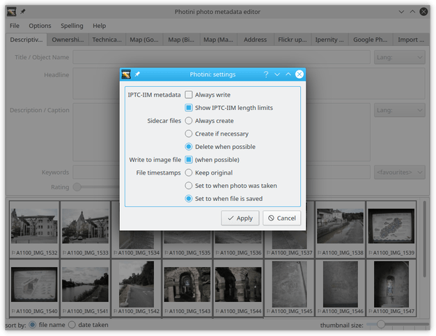

.. This is part of the Photini documentation.
   Copyright (C)  2012-18  Jim Easterbrook.
   See the file ../DOC_LICENSE.txt for copying condidions.

Configuration
=============

If there are tabs in the Photini GUI that you don't use, you can remove them by deselecting their entry in the ``Options`` menu.

The ``Options`` menu also has a ``Settings`` item which opens the dialog shown below.

The top three items can be used to adjust the auto-generated copyright and creator fields on the descriptive metadata tab.
The ``copyright text`` entry has place-holders where the photograph's "taken" year and the copyright holder's name are inserted.
You might want to change the surrounding text to suit the law in your country, or even to make your photographs rights free if you like.

The next items adjust how Photini uses "sidecar" files and IPTC metadata.
The `Metadata Working Group`_ recommends that IPTC metadata is not written to files unless already present.
Photini has an option to always write IPTC metadata.
You may need this if you use some other software that reads IPTC but not Exif or XMP.

Sidecar files allow metadata to be stored without needing to write to the actual image file.
If you deselect "write to image file" then sidecars will always be created.
Otherwise, you can choose to have them always created (storing data in parallel with the image file), only created when necessary (e.g. an image file is write protected), or deleted when possible (if metadata can be copied to the image file the sidecar is deleted).

Finally there is an option to preserve file timestamps.
This allows Photini to write metadata to an image file without changing the file's "modification time" as displayed in a file browser.
You may find this useful if you often use a browser to sort files by date.

Spell checking
^^^^^^^^^^^^^^

The ``Spelling`` menu allows you to enable or disable spell checking on Photini's text fields, and to select the language dictionary to use.
The available languages depend on what dictionaries you have installed.
Adding extra languages on Linux is easy -- just use your system's package manager to install the appropriate Aspell dictionary.

Windows programs don't share spell checking dictionaries as easily as on Linux.
I think the easiest way to install an extra language is to copy the dictionary files from another application such as LibreOffice_.
Search the program's files for ``.dic`` files, e.g. ``C:\Program Files\LibreOffice\share\extensions\dict-en\en_ZA.dic``, then check any accompanying licence or copyright information before copying all the related files (e.g. ``en_ZA.dic``, ``en_ZA.aff``, and ``README_en_ZA.txt``) to Photini's dictionary folder, e.g. ``C:\Program Files (x86)\Photini\python-3.6.3\Lib\site-packages\gnome\share\enchant\myspell``.

You may be able to find a suitable dictionary to download directly.
There is a list of ispell dictionaries at https://www.cs.hmc.edu/~geoff/ispell-dictionaries.html that might help.
To install one of these dictionaries, unpack the archive file (if necessary) and copy the ``.aff`` and ``.dic`` files to the Photini ``site-packages\gnome\share\enchant\myspell`` folder.

Configuration file location
^^^^^^^^^^^^^^^^^^^^^^^^^^^

Photini stores its configuration in a file called ``editor.ini``.
The default location of this file is ``$HOME/.config/photini/`` (Linux) or ``%USERPROFILE%\AppData\Local\photini\`` (Windows).
If you'd like to store it elsewhere (e.g. on a networked drive so you can share configuration between several computers) you can set an environment variable ``PHOTINI_CONFIG`` to the directory you'd like to use.

.. _configuration-pyqt:

PyQt options
^^^^^^^^^^^^

The configuration file includes options to force use of PyQt4 instead of PyQt5 and use of QtWebKit instead of QtWebEngine.
These may be useful if either of these components on your computer is incompatible with Photini.
There are so many versions of PyQt that it is impossible to test Photini with every one.

The default options in the configuration file are in the ``[pyqt]`` section:

.. code-block:: guess

   [pyqt]
   using_pyqt5 = auto
   using_qtwebengine = auto
   native_dialog = True

To force use of PyQt4 set the value of ``using_pyqt5`` to ``False``.
To force the use of QtWebKit set the value of ``using_qtwebengine`` to ``False``.
You can check which versions Photini is currently using by running it in a command window with the ``--version`` option::

   python -m photini.editor --version

Setting the ``native_dialog`` option to ``False`` makes Photini use a Qt dialog to select files to open instead of the normal operating system dialog.
This may be useful if your operating system has a case sensitive file filter, so selecting "Images" or "Videos" doesn't work properly if your files have upper case names.

Note that there is no GUI to set these options.
You may need to adjust them if Photini crashes on startup, in which case the GUI would be unusable.
The configuration file can be edited with any plain text editing program.

.. _configuration-style:

Application style
^^^^^^^^^^^^^^^^^

Qt applications can have their appearance changed by selecting different "styles".
Normally a style is automatically chosen that suits the operating system, but you may want to override this if you prefer something different.
For example, on one of my computers the default style doesn't draw lines round the grouped elements on the uploader tabs, so I change the style to one that does.

To find out what styles are available on your computer you can use Photini's ``--version`` flag.
(You need to run Photini from a command window to do this, see the :ref:`installation troubleshooting<installation-troubleshooting>` section.)
You can then try one of these styles as follows::

   jim@brains:~$ python3 -m photini.editor --version
   Photini 2017.8.1, build 898 (a98bfac)
     Python 3.4.5 (default, Jul 03 2016, 13:32:18) [GCC]
     pgi 0.0.11.1, GExiv2 0.10.6, GObject 2.0
     PyQt 5.4, Qt 5.5.0, using QtWebKit
     enchant 1.6.6
     flickrapi 2.2.1
     available styles: Breeze, Windows, GTK+, Fusion
   jim@brains:~$ python3 -m photini.editor -style breeze

Note that the style names are not case sensitive.
If none of the available styles is to your liking you may be able to install extra ones.
For example, on some Ubuntu Linux systems the package ``qt5-style-plugins`` is available.

Once you find a style that you like, you can set Photini to use that style by editing the configuration file as described above.
Add a line such as ``style = breeze`` to the ``[pyqt]`` section to set your chosen style.
Note that after doing this you can not set a different style on the command line unless you remove the ``style = ...`` line from your config file.

.. code-block:: guess

   [pyqt]
   using_pyqt5 = auto
   using_qtwebengine = auto
   native_dialog = True
   style = breeze

.. _LibreOffice:            https://www.libreoffice.org/
.. _Metadata Working Group: http://www.metadataworkinggroup.org/specs/
