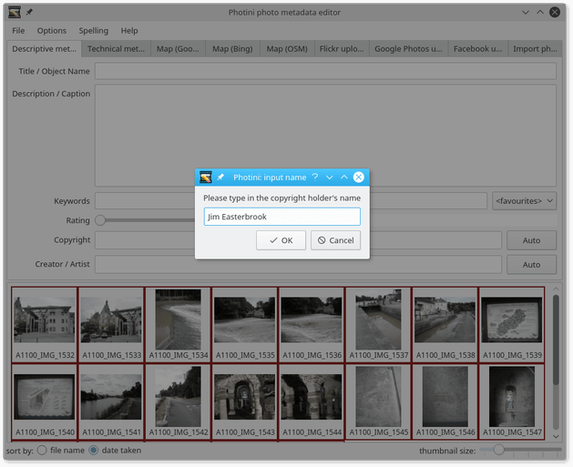
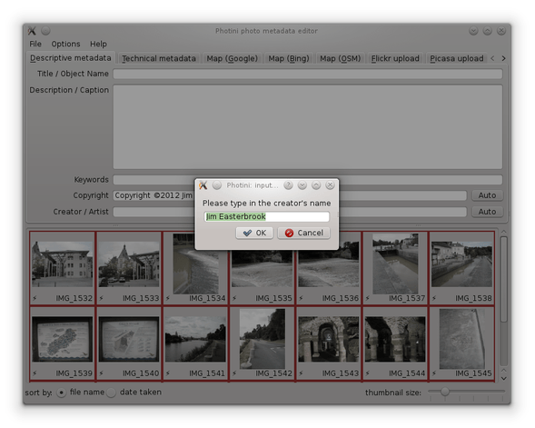
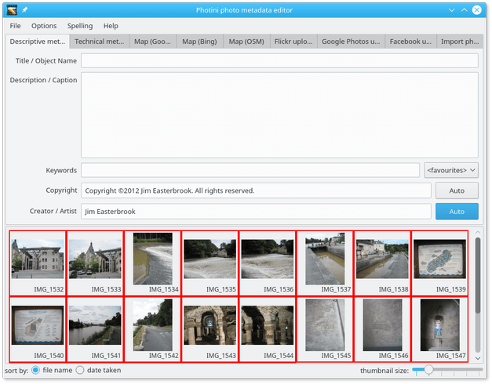
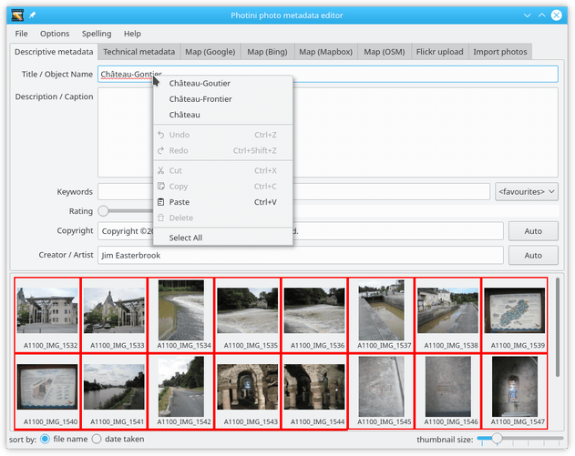
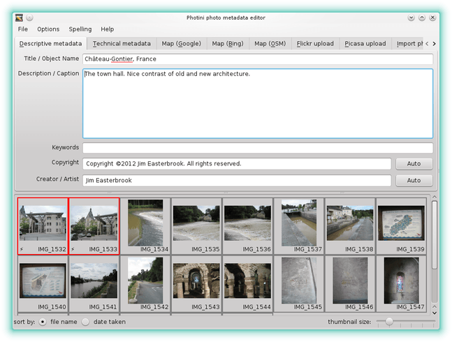
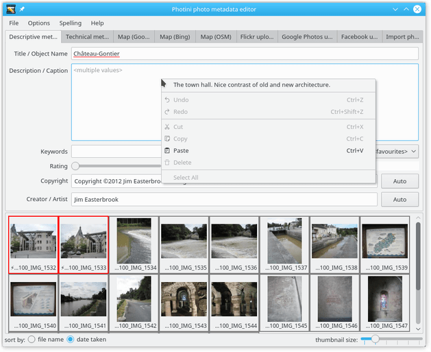
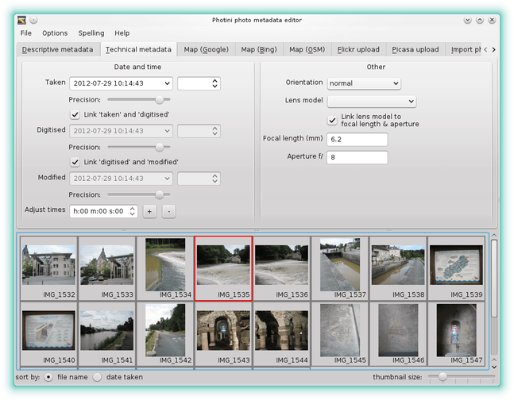
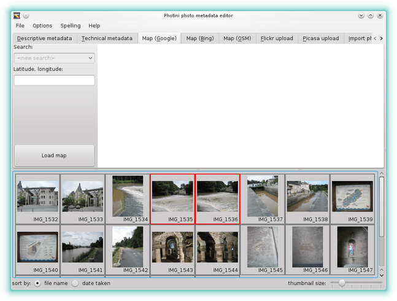
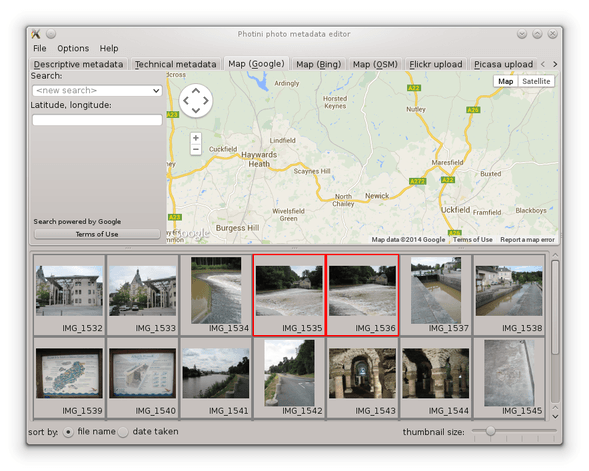

.. This is part of the Photini documentation.
   Copyright (C)  2012-19  Jim Easterbrook.
   See the file ../DOC_LICENSE.txt for copying condidions.

Descriptive metadata
====================

The ``Descriptive metadata`` tab (keyboard shortcut ``Alt+D``) allows you to edit basic information about your photographs, such as the title and description.

The first thing I usually do with a new set of photographs is to set the copyright and creator/artist metadata.
Select all the images (keyboard shortcut ``Ctrl+A``) then click on the ``Auto`` button next to the ``Copyright`` text entry box.
The first time you do this Photini asks you to provide the name of the copyright holder.
This should probably be your name, but could be the name of a company.
Type in the name and click ``OK``.

The ``Auto`` button generates a standard copyright notice.
If you prefer a different wording you can change the template, as described in :doc:`configuration <configuration>`.

Next click on the ``Creator / Artist`` field's ``Auto`` button.
Now Photini will ask for the name of the creator.
Edit the name if required, then click ``OK``.

.. |hazard| unicode:: U+026A1

Note that all the image thumbnails now have a warning symbol (|hazard|) displayed next to them.
This shows that they have unsaved metadata edits.
The ``File`` menu ``Save images with new data`` item (keyboard shortcut ``Ctrl+S``) saves your edits and clears the warning symbols, as shown below.
I do this frequently to avoid losing any of my work.

Next I set the title.
Select all the images that should have the same title, then type the title in the ``Title / Object name`` text editing box.
Note that the title (and keywords) are stored in XMP but not in Exif, so may not be visible to software that only handles Exif metadata (see :doc:`tag reference <tags>` for more detail).
You may prefer to leave the title and keywords fields blank.

The ``Title / Object name`` field has an optional spell checker, enabled with the ``Spelling`` menu.
The word "Château-Gontier" is not in the British English dictionary, as indicated by the red underlining.
Right-clicking on a misspelled word shows a list of suggested alternatives, one of which can be chosen by clicking on it.

Now you can add more detail in the ``Description / Caption`` box.
There are probably only one or two photographs that share the same description, so select those images first.

If you select a group of images you may see ``<multiple values>`` displayed in some of the text boxes.
You can right-click on the box to bring up a context menu from which you can choose a value to be copied to all the selected photographs.
In this case there is only one choice as one photo has a description and the other does not.

Next you can set a list of keywords for the image by typing them in the ``Keywords`` box.
Keywords should be separated by semi-colon (;) characters.
The ``<favourites>`` drop-down list can be used to select keywords from the ones you use most often.

Finally the ``Rating`` slider allows you to note any particularly good or bad pictures.
Good pictures can be given a one to five star rating.

Bad pictures can be given a ``reject`` rating.
This is stored in the metadata as a rating value of -1.

