.. This is part of the Photini documentation.
   Copyright (C)  2012-22  Jim Easterbrook.
   See the file ../DOC_LICENSE.txt for copying condidions.

Descriptive metadata
====================

The ``Descriptive metadata`` tab (keyboard shortcut ``Alt+D``) allows you to edit basic information about your photographs, such as the title and description.

The data form is disabled until you select one or more images to edit.
Hovering the mouse over one of the data fields displays a popup "tooltip" describing the sort of information to put in that field.
This help text is taken from the `IPTC standard`_.

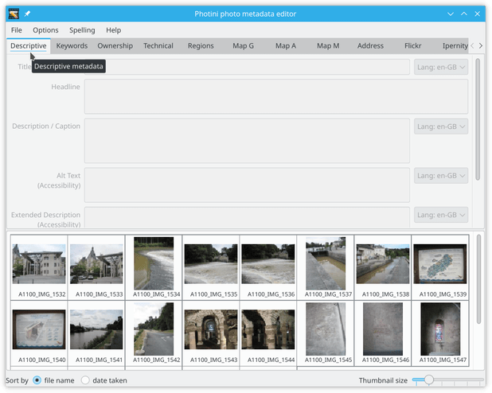

The first thing I usually do with a new set of photographs is to set the title.
Select all the images that should have the same title, then type the title in the ``Title / Object name`` text editing box.
Note that the title (and headline and keywords) are stored in XMP and IPTC-IIM but not in Exif, so may not be visible to software that only handles Exif metadata (see :doc:`tag reference <tags>` for more detail).
You may prefer to leave these fields blank.

The legacy IPTC-IIM standard has a maximum number of bytes for each data item.
If your text has more bytes then the excess is shown underlined in blue.
You can ignore this if you don't need compatibility with old software that relies on IPTC-IIM data.
This warning can be turned off in Photini's :doc:`configuration <configuration>`.

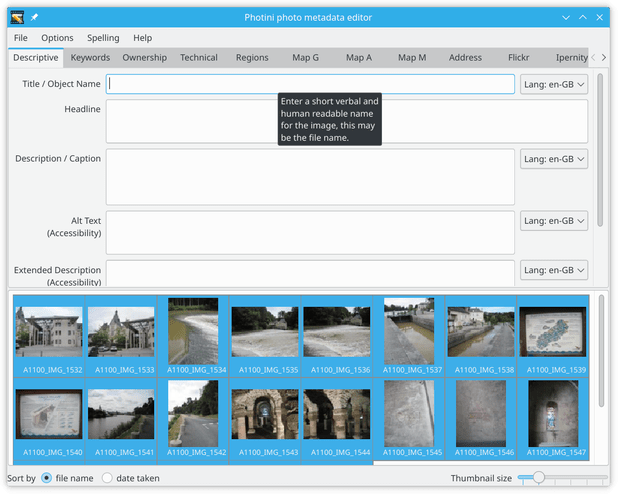

The ``Title / Object name`` field has an optional spell checker, enabled with the ``Spelling`` menu.
The word "Château-Gontier" is not in the British English dictionary, as indicated by the red underlining.
Right-clicking on a misspelled word shows any suggested alternatives, one of which can be chosen by clicking on it.

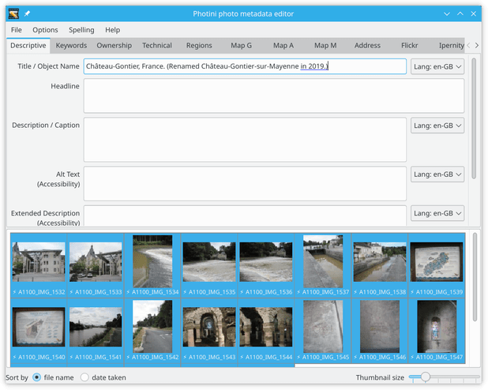

.. |hazard| unicode:: U+026A1

Note that all the image thumbnails now have a warning symbol (|hazard|) displayed next to them.
This shows that they have unsaved metadata edits.
The ``File`` menu ``Save images with new data`` item (keyboard shortcut ``Ctrl+S``) saves your edits and clears the warning symbols, as shown below.
I do this frequently to avoid losing any of my work.

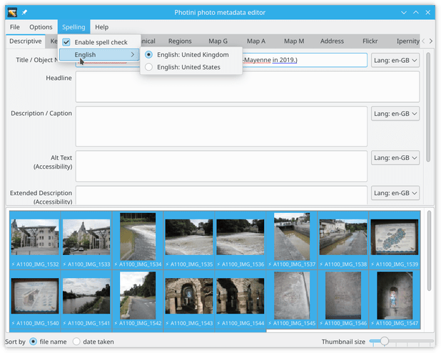

Now you can add more detail in the ``Headline`` and / or ``Description / Caption`` boxes.
(My descriptions are usually so short that a separate headline summary isn't needed.)
There are probably only one or two photographs that share the same description, so select those images first.

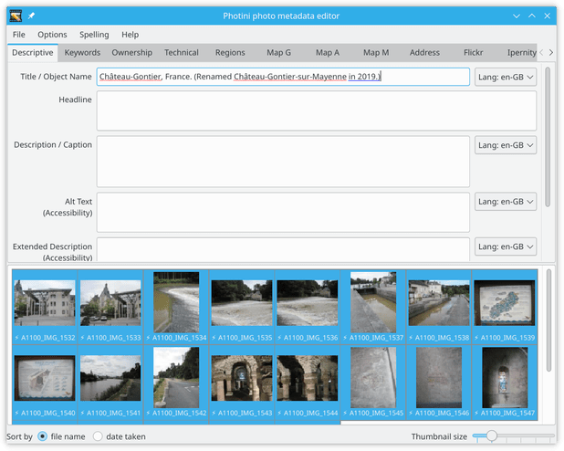

If you select a group of images you may see ``<multiple values>`` displayed in some of the text boxes.
You can right-click on the box to bring up a context menu from which you can choose a value to be copied to all the selected photographs.
Very long texts are elided with ``...`` replacing some of the text.

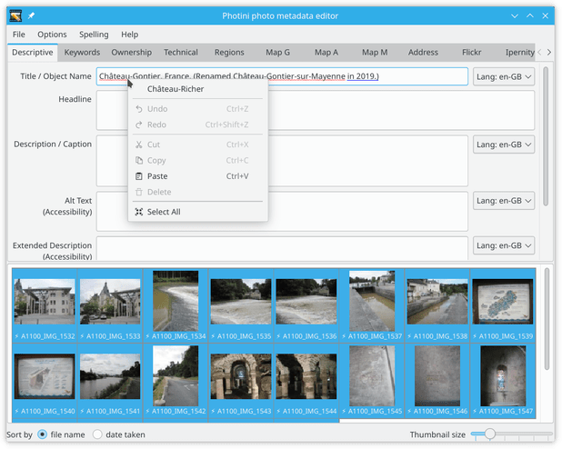

The ``Alt Text (Accessibility)`` and ``Extended Description (Accessibility)`` boxes are where you describe the photograph for visually impaired users.
These are a recent addition to the `IPTC standard`_ - in future image display programs and web sites should use this metadata to create their "ALT text" image description.

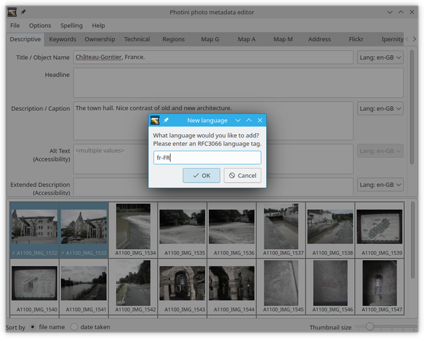

Next you can set a list of keywords for the image by typing them in the ``Keywords`` box.
Keywords should be separated by semi-colon (;) characters.
The ``<favourites>`` drop-down list can be used to select keywords from the ones you use most often.

Finally the ``Rating`` slider allows you to note any particularly good or bad pictures.
Good pictures can be given a one to five star rating.

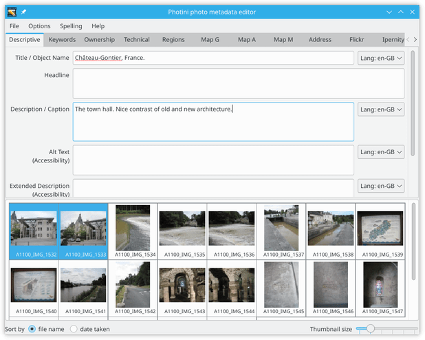

Bad pictures can be given a ``reject`` rating.
This is stored in the metadata as a rating value of -1.

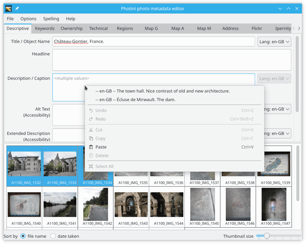

.. _alternative-languages:

Alternative Languages
---------------------

Some fields, such as title and description, are stored in XMP as `Lang Alt`_ data.
This allows translations into alternative languages to be stored along with the default language text.
(Only the default language is stored in Exif and IPTC-IIM.)

Photini has a language drop down selector next to each ``Lang Alt`` data field.
If the current text is in an unspecified default language the selector shows ``Language``, otherwise it shows ``Lang:`` and the current language.
If the field is empty the current language is set to your computer's default locale.
You can add an alternative language by clicking on the drop down and selecting ``<new>``.

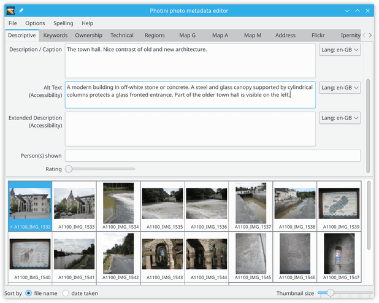

If there is already some text in an unspecified default language you will be asked to say what that language is.
Languages are specified with an RFC3066_ code.
This usually starts with a two-letter language code, e.g. ``en`` for English, and may be followed by a hyphen and a two-letter country code, e.g. ``en-GB`` for English as spoken in Great Britain.

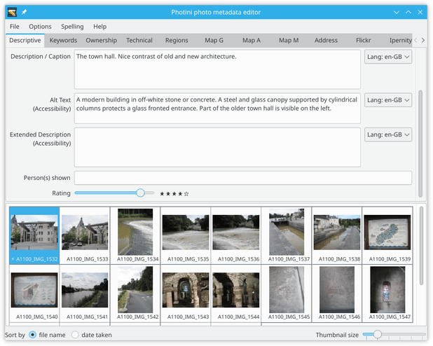

Next you can set the language to be added, e.g. ``fr-FR`` for French as spoken in France.

.. image:: ../images/screenshot_031.png

You can then type the translation in to the text field.

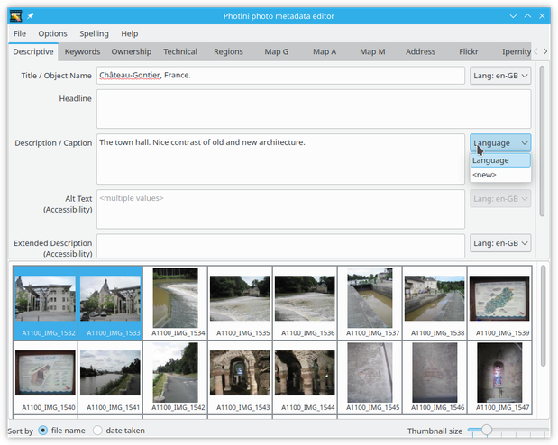

If you would like to change the default language, right-click on the ``Lang:`` dropdown and choose a language.

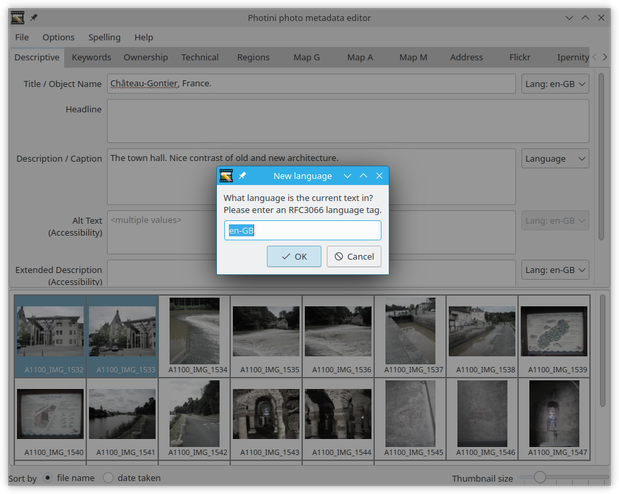

More information about the data fields
--------------------------------------

Click on any field name below to see the IPTC definition and user notes for that field.
Although these fields are defined in an `IPTC standard`_, they are all stored in XMP metadata.
Some of them are also stored in Exif and/or "legacy" IPTC-IIM data.

`Title / Object Name <http://www.iptc.org/std/photometadata/specification/IPTC-PhotoMetadata#title>`_
  A short title.
`Headline <http://www.iptc.org/std/photometadata/specification/IPTC-PhotoMetadata#headline>`_
  A brief description.
`Description / Caption <http://www.iptc.org/std/photometadata/specification/IPTC-PhotoMetadata#description>`_
  The who, what and why of what the image depicts.
`Alt Text (Accessibility) <http://www.iptc.org/std/photometadata/specification/IPTC-PhotoMetadata#alt-text-accessibility>`_
  Text description for visually impaired accessibility.
`Extended Description (Accessibility) <http://www.iptc.org/std/photometadata/specification/IPTC-PhotoMetadata#extended-description-accessibility>`_
  Extended description for visually impaired accessibility.
`Keywords <http://www.iptc.org/std/photometadata/specification/IPTC-PhotoMetadata#keywords>`_
  Separate words or phrases with ``;`` characters. Not stored in Exif.
`Rating <http://www.iptc.org/std/photometadata/specification/IPTC-PhotoMetadata#image-rating>`_
  How good is the photo.

.. _IPTC standard:
    http://www.iptc.org/std/photometadata/specification/IPTC-PhotoMetadata
.. _Lang Alt:
    https://developer.adobe.com/xmp/docs/XMPNamespaces/XMPDataTypes/#language-alternative
.. _RFC3066: https://www.ietf.org/rfc/rfc3066.txt
