.. This is part of the Photini documentation.
   Copyright (C)  2016  Jim Easterbrook.
   See the file ../DOC_LICENSE.txt for copying conditions.

Facebook uploader
=================

The ``Facebook`` tab (keyboard shortcut ``Alt+k``) allows you to upload photographs to `Facebook <https://www.facebook.com/>`_.
Your photos' descriptive metadata is used to generate a caption.
Note that the tab is only available if you have installed the relevant libraries.
See :ref:`installation <installation-facebook>` for more detail.

Initially most of the Facebook uploader tab is disabled, as shown below.
It's only usable after you've authorised Photini to access your Facebook account by clicking the ``Connect`` button.

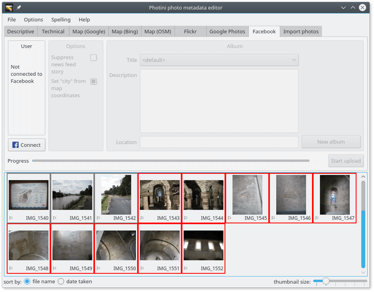

The first time you connect to Facebook a pop-up browser window opens for you to log in to your Facebook account.
You may need to enlarge or maximise this window.

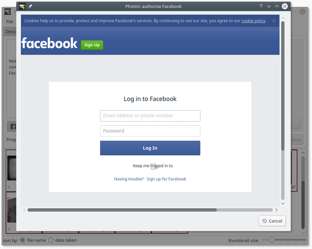

Photini requests permission to see "your photos".
It needs this to get details of your current photo albums -- title, description, location and cover photo.

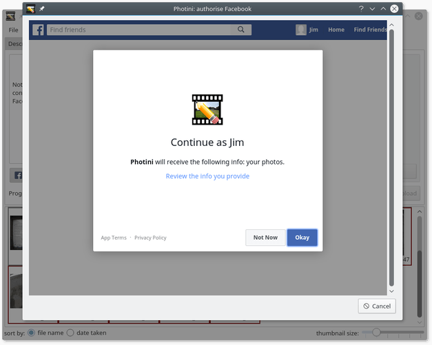

Once permission is granted the tab is enabled.
Your Facebook user name and profile picture are shown whenever Photini is connected to Facebook.
You won't need to login via the pop-up window again for up to two months unless you click on the ``Log out`` button or you remove Photini's permissions in your Facebook settings apps page.

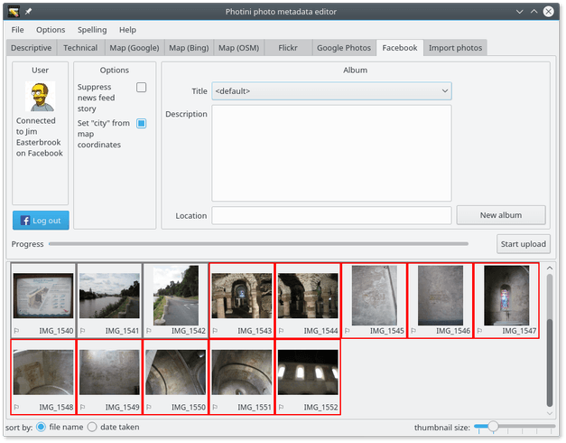

The album title widget shows a drop-down list of all your albums.
(Those that Photini is not yet authorised to upload to are disabled.)
The special title ``<default>`` is always available.
It corresponds to an application specific album called "Photini Photos".

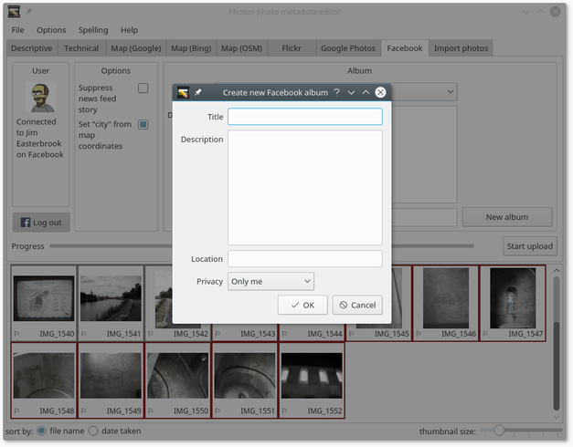

You can create a new album by clicking on the ``New album`` button.
This opens a pop-up dialog where you can set the album properties.
These are optional except for the title.
Note the privacy drop-down which controls the visibility of all photos uploaded to the album.

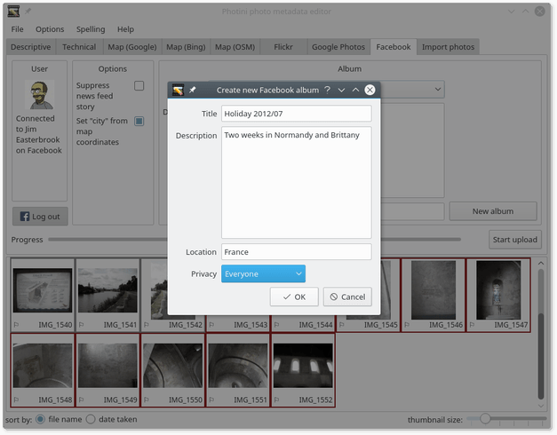

After typing in the album details, click ``OK``.

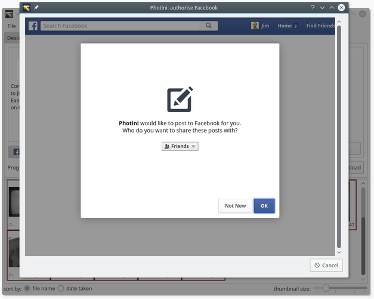

The first time you create an album or upload a photo a pop-up browser window opens asking you to authorise Photini to post to Facebook.

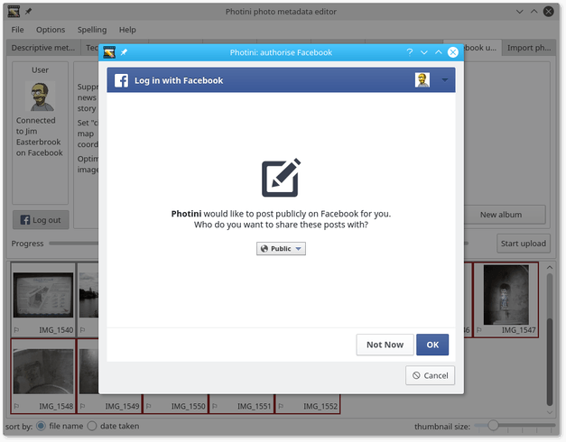

You should allow Photini to share things publicly as you can always specify a more restricted visibility when you create an album.

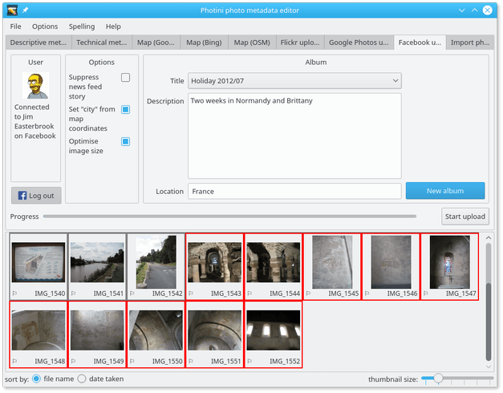

The newly created album is added to your album list and can be selected as the upload destination.
There are two more options to set before uploading any photos.

The ``Suppress news feed story`` option allows you to upload photos without generating a "Jim has uploaded 10 photos to the album Holiday 2012/07" type announcement on your Facebook timeline.
You will receive a notification that Photini has uploaded photos but this will not be visible to your friends.

The ``Set "city" from map coordinates`` option uses your photos' location data (if present) to choose a "city" from Facebook's places directory.
It may not always give the results you expect, so if you use this option you should check your photos after upload and change their location if necessary.

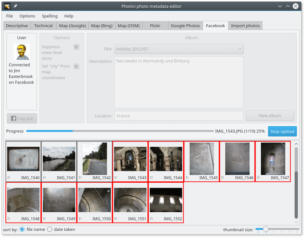

After selecting some photos you can click on the ``Start upload`` button.
The tab is mostly disabled during upload but other Photini tabs can be used.
The upload can be stopped at any time by clicking on the ``Stop upload`` button.

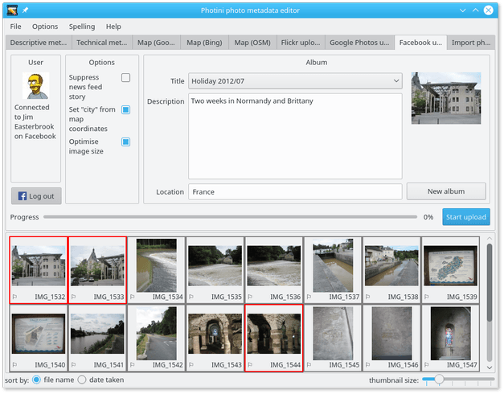

The first picture uploaded to a new album becomes the album's cover photo.
