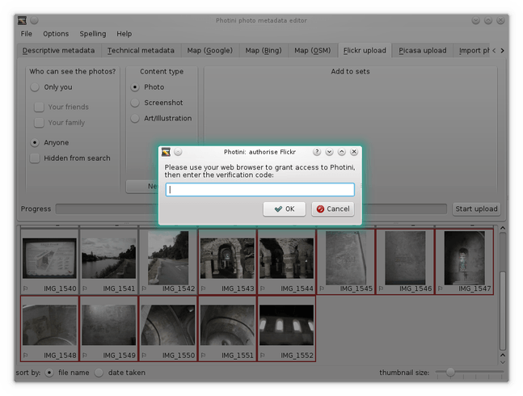
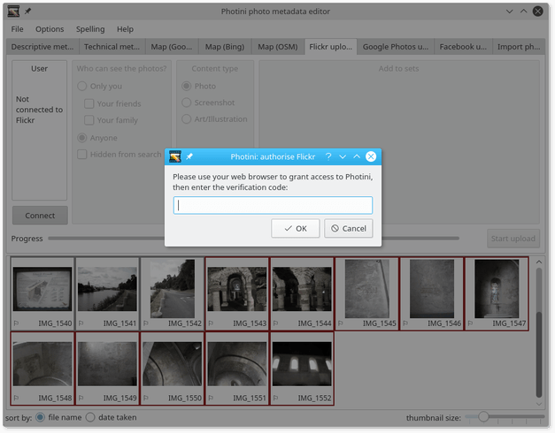
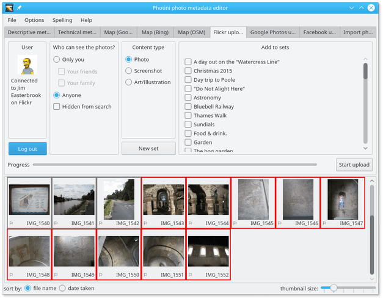
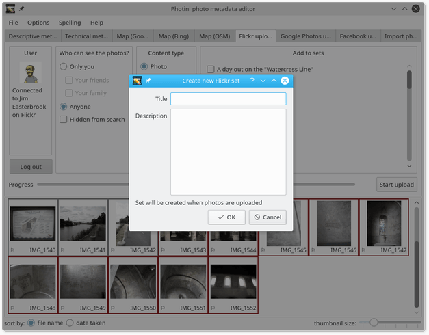
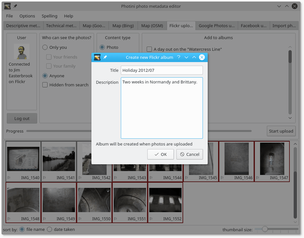
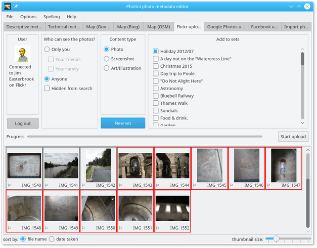
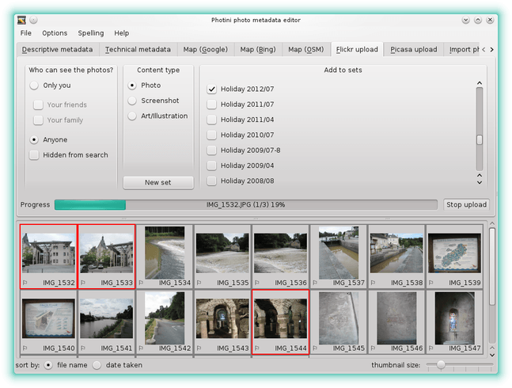

.. This is part of the Photini documentation.
   Copyright (C)  2012-16  Jim Easterbrook.
   See the file ../DOC_LICENSE.txt for copying condidions.

Flickr uploader
===============

The ``Flickr upload`` tab (keyboard shortcut ``Alt+F``) allows you to upload your photographs to `Flickr <http://www.flickr.com/>`_.
Flickr is a popular online photograph sharing service.

Unlike some other Flickr uploaders, Photini uses the descriptive metadata you've created to set Flickr's title, description and tags.
This means you don't have to retype all that information!

Note that the Flickr upload tab is only enabled if you have installed python-flickrapi.
See :ref:`installation <installation-flickr>` for more detail.

Initially most of the Flickr uploader tab is disabled.
It's only usable after you've authorised Photini to access your Flickr account by clicking the ``Connect`` button.

The first time you click ``Connect`` Photini connects your web browser to Flickr, from where you can log in and give Photini permission to access Flickr on your behalf.
You then copy a verification code from your browser to Photini.

If the authorisation is successful Photini displays your Flickr user name and profile picture.
You should not need to redo this authorisation process unless you click the ``Log out`` button.

Your current Flickr albums are shown on the right hand side of the Flickr uploader tab.
You can add a new album with the ``New album`` button.
This opens a pop-up dialog as shown below.

Type in the album details and click ``OK``.
Note that the album will not be created on Flickr until you upload a photo to it.

To upload one or more photographs to Flickr, select them in the image selector area, then choose which (if any) of your albums to add them to and set any of the other attributes, then click on the ``Start upload`` button.

During uploading Photini displays a progress bar.
Uploading takes place in the background, so you can continue to use other tabs while the upload is in progress.
The upload can be stopped by clicking the ``Stop upload`` button.
