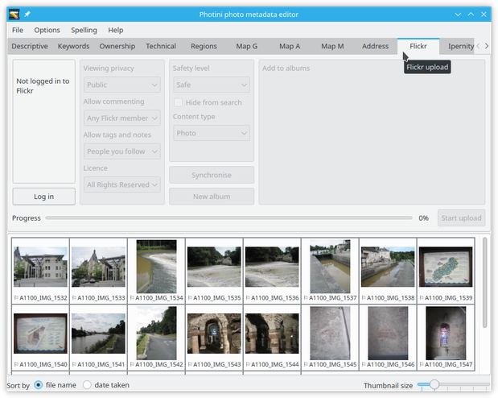
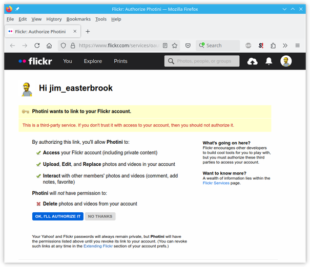
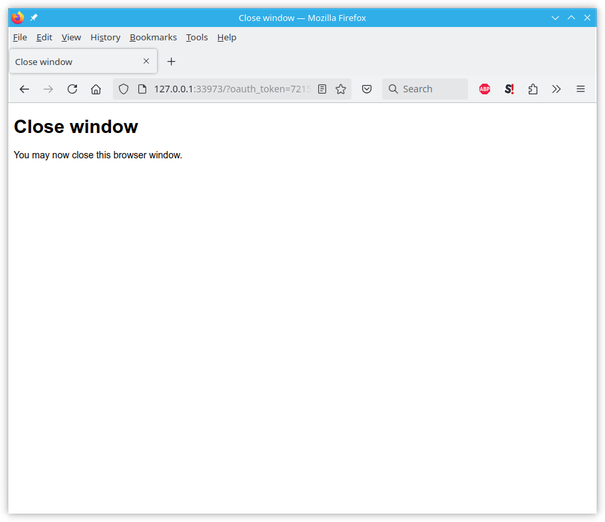
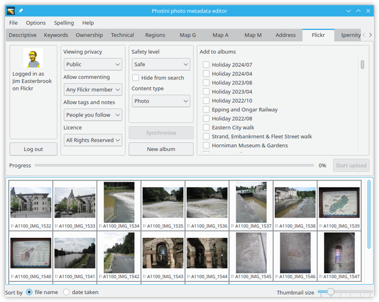
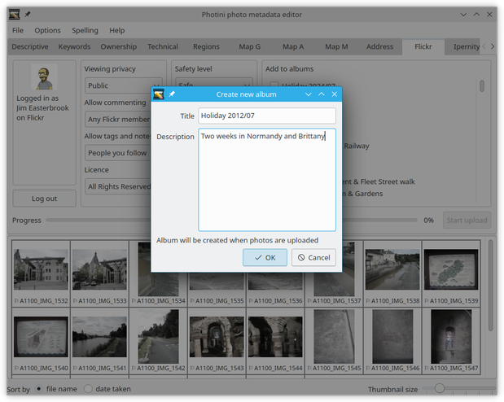
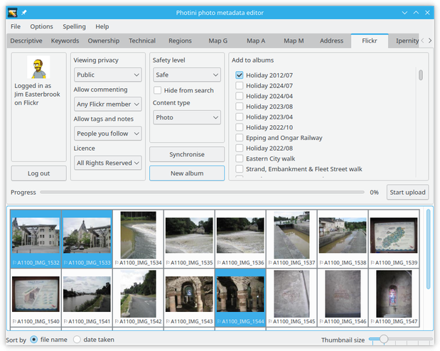
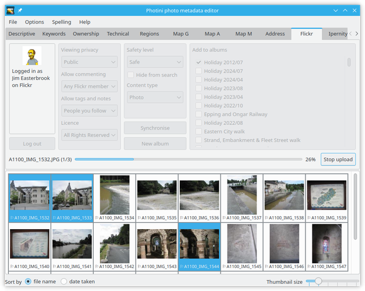
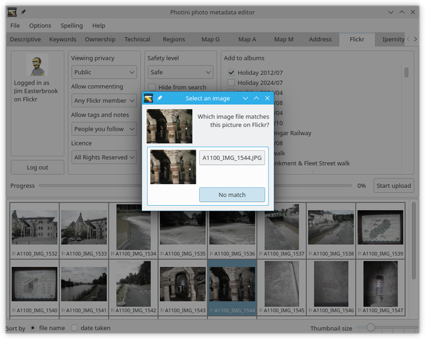
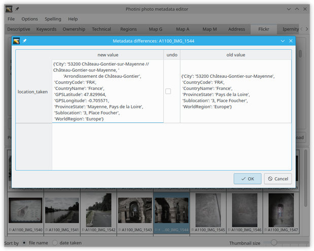

.. This is part of the Photini documentation.
   Copyright (C)  2012-20  Jim Easterbrook.
   See the file ../DOC_LICENSE.txt for copying condidions.

Flickr uploader
===============

The ``Flickr upload`` tab (keyboard shortcut ``Alt+F``) allows you to upload your photographs to `Flickr <http://www.flickr.com/>`_.
Flickr is a popular online photograph sharing service.
The Flickr upload tab uses the Flickr API but is not endorsed or certified by Flickr.

Unlike some other Flickr uploaders, Photini uses the descriptive metadata you've created to set Flickr's title, description and tags.
This means you don't have to retype all that information!

Note that the Flickr upload tab is only enabled if you have installed some extra software packages.
See :ref:`installation <installation-optional>` for more detail.

Initially most of the Flickr uploader tab is disabled.
It's only usable after you've authorised Photini to access your Flickr account by clicking the ``Log in`` button.

.. image:: ../images/screenshot_151a.png

The first time you click ``Log in`` Photini connects your web browser to Flickr, from where you can log in and give Photini permission to access Flickr on your behalf.

.. image:: ../images/screenshot_151b.png

In January 2020 Flickr introduced a bug in the authorisation process.
They are changing the "callback URL" from HTTP to HTTPS, which causes an error like the one shown above.
(Other browsers may show a different error.)

.. image:: ../images/screenshot_151c.png

The workaround is to click on the browser's URL display, change "https" to "http", then hit the return key.

.. image:: ../images/screenshot_151d.png

The web browser window can then be closed.

If the authorisation is successful Photini displays your Flickr user name and profile picture.
You should not need to redo this authorisation process unless you click the ``Log out`` button.

Your current Flickr albums are shown on the right hand side of the Flickr uploader tab.
You can add a new album with the ``New album`` button.
This opens a pop-up dialog as shown below.

Type in the album details and click ``OK``.
Note that the album will not be created on Flickr until you upload a photo to it.

To upload one or more photographs to Flickr, select them in the image selector area, then choose which (if any) of your albums to add them to and set any of the other attributes, then click on the ``Start upload`` button.

During uploading Photini displays a progress bar.
Uploading takes place in the background, so you can continue to use other tabs while the upload is in progress.
The upload can be stopped by clicking the ``Stop upload`` button.

After uploading a photograph it is marked as having new metadata.

If you switch to the ``Descriptive metadata`` tab you can see there is a new keyword ``flickr:photo_id=11-digit-number``.
Photini uses this `triple tag`_ to store the Flickr photo id so it can be used to synchronise metadata later on, as described below.

Synchronising local metadata to Flickr
--------------------------------------

Sometimes you might change your photograph's metadata on Flickr and would like to copy those changes back to the image file on your computer.
Select the image(s) you would like to update and click the ``Synchronise`` button.

.. image:: ../images/screenshot_159.png

If an image does not have a ``flickr:photo_id`` keyword then Photini will try to find the photograph on Flickr by matching the date and time it was taken.
If there is new metadata on Flickr then it is merged into the image's metadata.

You can see what changed with the image's context menu ``View changes``.
In this case Flickr has set its location city to "Chateau-Gontier" whereas I had set it to "Château-Gontier".
I chose to ignore this new metadata value.

Synchronising Flickr metadata to local
--------------------------------------

If you change your image file metadata and would like to make the same changes on Flickr you can select the image and click on the ``Start upload`` button.

If you upload an image that already has a ``flickr:photo_id`` keyword then Photini allows you to change the photograph's metadata instead of uploading a new photograph.
You can also replace the image itself, which might be useful if you've processed it in another application.

.. _triple tag: https://en.wikipedia.org/wiki/Tag_(metadata)#Triple_tags
