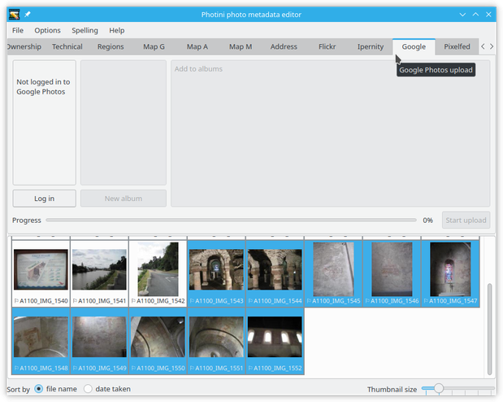
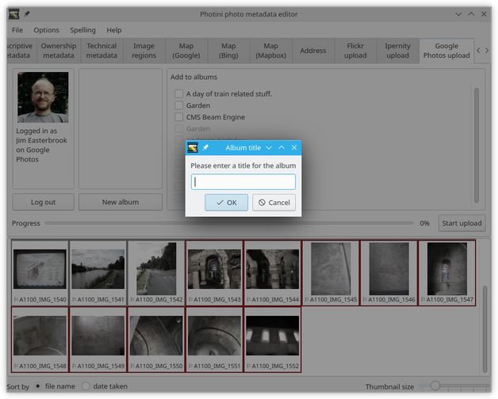
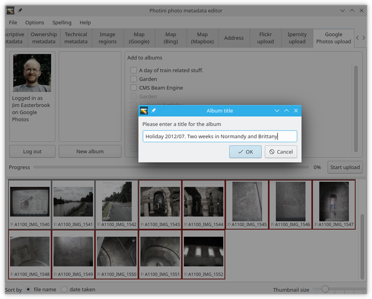

.. This is part of the Photini documentation.
   Copyright (C)  2019-20  Jim Easterbrook.
   See the file ../DOC_LICENSE.txt for copying conditions.

Google Photos uploader
======================

The ``Google Photos upload`` tab (keyboard shortcut ``Alt+P``) allows you to upload your photographs to `Google Photos`_.
The Google Photos API is quite restrictive, so 3rd party software such as Photini is rather limited in its abilities.

Note that the Google Photos upload tab is only enabled if you have installed some extra software packages.
See :ref:`installation <installation-optional>` for more detail.

Initially most of the Google Photos uploader tab is disabled.
It's only usable after you've authorised Photini to access your Google Photos account by clicking the ``Log in`` button.

The first time you click ``Log in`` Photini connects your web browser to Google Photos, from where you can log in and give Photini permission to access Google Photos on your behalf.

.. note::
   Unfortunately Google won't verify Photini because it continues to be developed, so you will be presented with several warning messages during the authentication process, and a warning email may be sent to your GMail account.

If the authorisation is successful Photini displays your Google Photos user name and profile picture.
You should not need to redo this authorisation process unless you click the ``Log out`` button.

Your current Google Photos albums are shown on the right hand side of the Google Photos uploader tab.
The Google Photos API only allows Photini to add pictures to albums created by Photini.
Other albums are shown but are disabled.

You can add a new album with the ``New album`` button.
This opens a pop-up dialog as shown below.

Type in the album title and click ``OK``.
The title can be up to 500 characters long, so you may want to enlarge the dialog box.

To upload one or more photographs to Google Photos, select them in the image selector area, then choose which (if any) of your albums to add them to, then click on the ``Start upload`` button.

During uploading Photini displays a progress bar.
Uploading takes place in the background, so you can continue to use other tabs while the upload is in progress.
The upload can be stopped by clicking the ``Stop upload`` button.

.. _Google Photos: https://photos.google.com/
