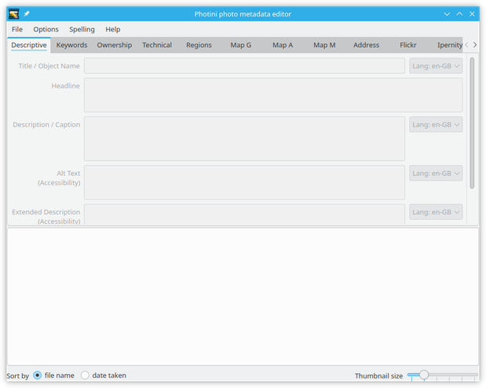
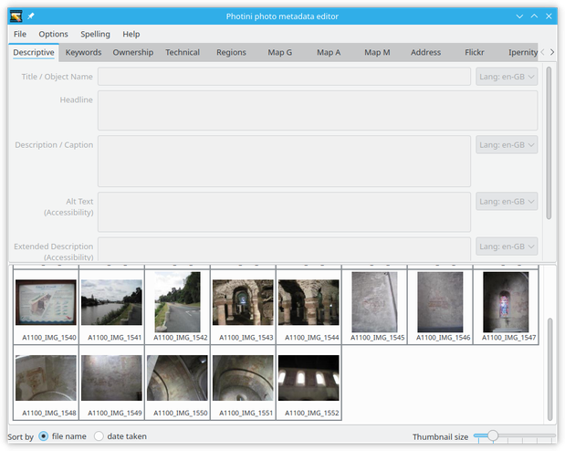
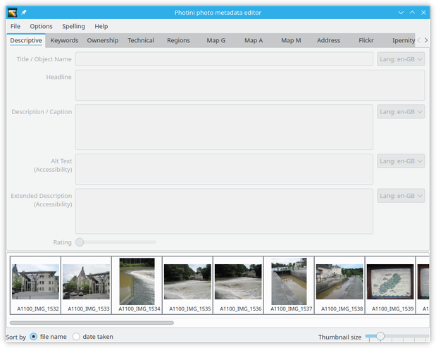
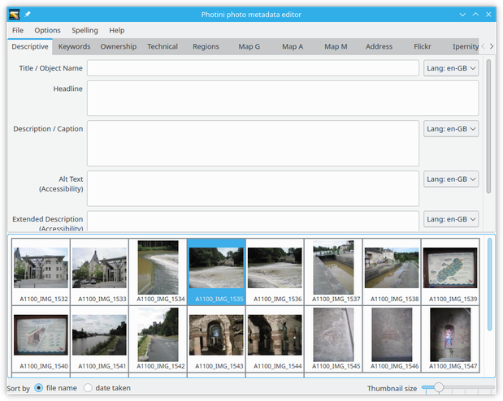
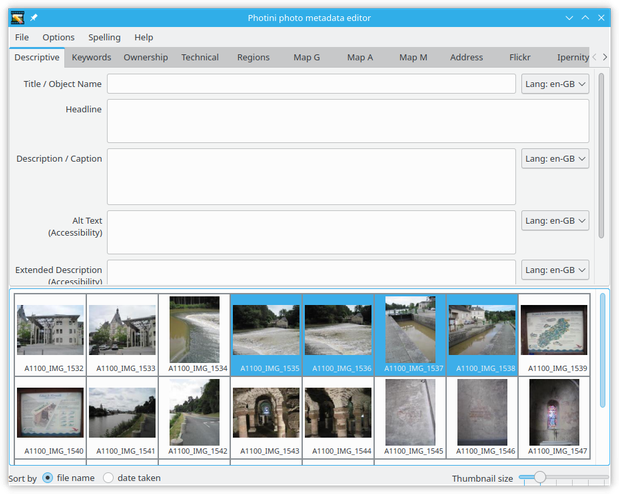
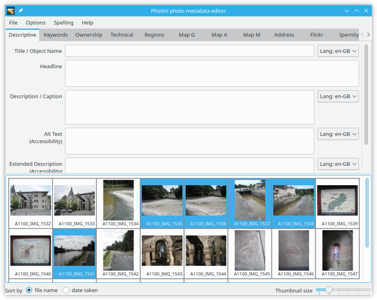
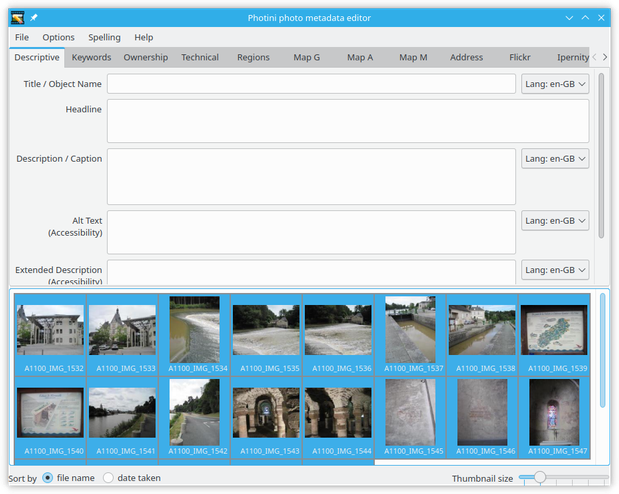
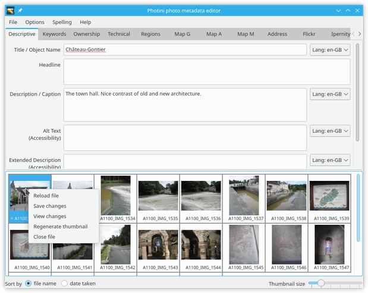
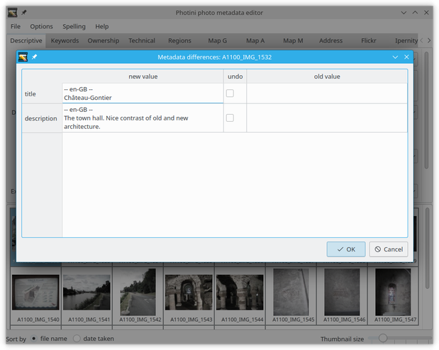

.. This is part of the Photini documentation.
   Copyright (C)  2012-21  Jim Easterbrook.
   See the file ../DOC_LICENSE.txt for copying conditions.

Image selector
==============

When you start the Photini editor it displays a GUI (graphical user interface) as shown below.
The exact appearance will depend on your operating system and window manager preferences, but the same functional elements should be present.
(The appearance can be altered by setting a different style, see the :ref:`configuration section <configuration-style>` for more detail.)

The Photini editor GUI has two main areas.
The upper part has a set of tabs to select different functions.
The lower part is an image selector that is common to all the tabs.
In between the two is a divider that can be dragged with the mouse to change the relative sizes of the two parts.
The overall size of the window can also be changed by dragging its edges or corners with the mouse.

Now load some images using the ``File`` menu ``Open files`` item (or its keyboard shortcut ``Ctrl+O``) or by "drag and drop" from a file manager window.
The loaded files are displayed as thumbnail images in the image selector part of the GUI.
Note that the thumbnail size can be changed with the slider control just beneath the thumbnail display area.
The files can also be sorted by name or date by clicking on the appropriate button.

Clicking on any thumbnail selects that file.
The selected file is highlighted by a red border.
Double clicking on a thumbnail should display the full size image, using your default image viewing application.

Multiple files can be selected by holding down the 'shift' key while clicking on a second image.
To select multiple files that are not adjacent, hold down the 'control' key while clicking on the images.

The keyboard shortcut ``Ctrl+A`` selects all the loaded files.

Selecting multiple files allows you to set metadata, such as the image title, on several files at once.
This is much quicker than having to edit the metadata of each file separately.
You will probably want to select a different group of files before editing each metadata item.
For example, you might give the same title (and copyright and creator) to all the images, then select only the first two or three before writing a description.

Context menu
------------

Right-clicking on a thumbnail displays a context menu for all the currently selected files.

The context menu currently has five items.
``Reload file`` discards any metadata changes.
``Save changes`` saves any changes to the file(s).
``View changes`` displays any changes of metadata, as shown below.
``Regenerate thumbnail`` creates a new thumbnail of the image(s).
``Close file`` closes the file(s).

The ``view changes`` context menu item displays all the metadata items that have changed.
In this example I've set four items that were previously empty.
If you want to discard any of these changes then select the appropriate ``undo`` checkboxes and click on ``OK``.

The same menu items also appear in the main ``File`` menu.
