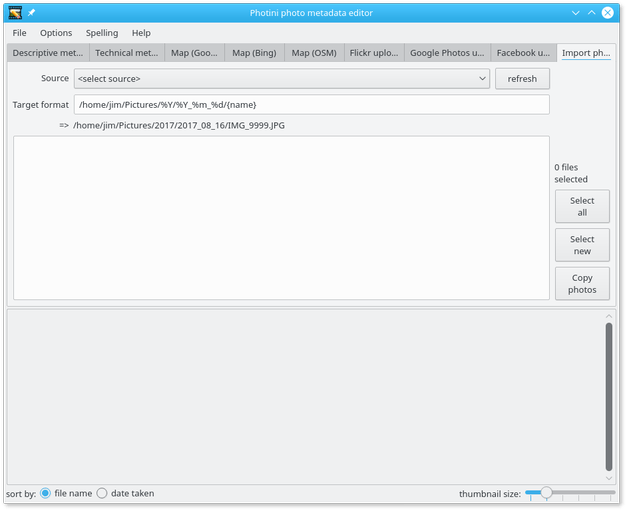
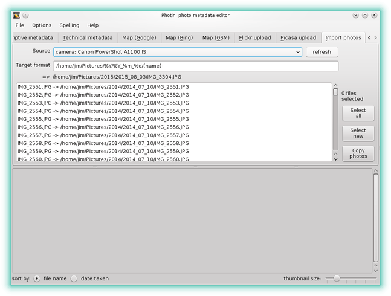
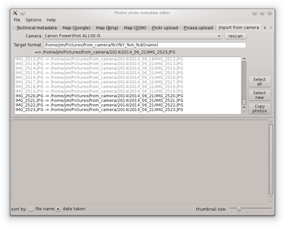
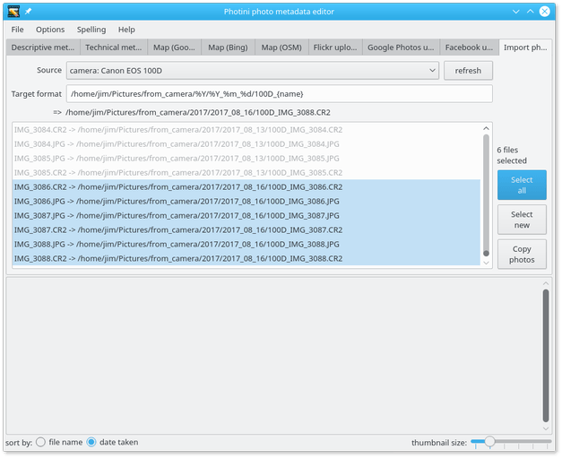
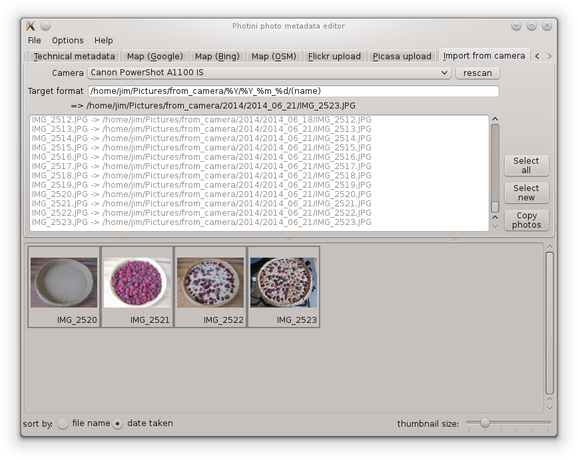

Image importer
==============

The ``Import from camera`` tab (keyboard shortcut ``Alt+I``) allows you to copy photographs from your digital camera.
Whilst there are many other programs to do this, I've never found one that does things the way I want, so I added one to Photini.

Note that the import from camera tab is only enabled if you have installed python-gphoto2.
See :ref:`installation <installation-importer>` for more detail.

The key part of the importer is the "target format" field.
This provides a very flexible way to specify where on your computer imported images should be stored.
It uses ``%`` formats to generate file and directory names based on the image capture date & time.
The most useful ones are ``%Y`` (year), ``%m`` (month number) and ``%d`` (day of the month) but many more are available.
See the `Python documentation <https://docs.python.org/2/library/datetime.html#strftime-strptime-behavior>`_ for a complete list.

As well as the date & time format strings, bracketed keywords can be used to manipulate parts of the file name:

========  ==================================  =======
keyword   meaning                             example
========  ==================================  =======
(name)    the complete file name              IMG_9999.JPG
(number)  the numeric part of the file name   9999
(root)    the filename without its extension  IMG_9999
(ext)     the filename extension              .JPG
========  ==================================  =======

Below the "target format" field is an example generated from the current format to help you edit it correctly.

Note that Photini stores a different target format for each camera you use.
This can be useful if you have two cameras that use the same file names.
For example, I use ``/home/jim/Pictures/from_camera/%Y/%Y_%m_%d/IMGe(number)(ext)`` for my DSLR to rename files from ``IMG_9999.JPG`` to ``IMGe9999.JPG`` so they don't clash with files from my compact camera, which also uses names like ``IMG_9999.JPG``.

After connecting one or more cameras and pressing the "rescan" button, a camera can be chosen from the drop down list.
Photini then fetches a list of all the files stored on the camera, which can take some time.

The list is displayed in the central area, with the location where the file would be stored.
It is sorted by name or date, as selected by the buttons below the image thumbnail area. 

When the "target format" has been set to match where previous images were put, images that have already been copied to the computer are non selectable (shown in light grey).

The remaining images can be selected by clicking on them, or by using the "select all" or "select new" buttons.

Clicking the "copy photos" button transfers the selected images to the computer and loads them into Photini.

