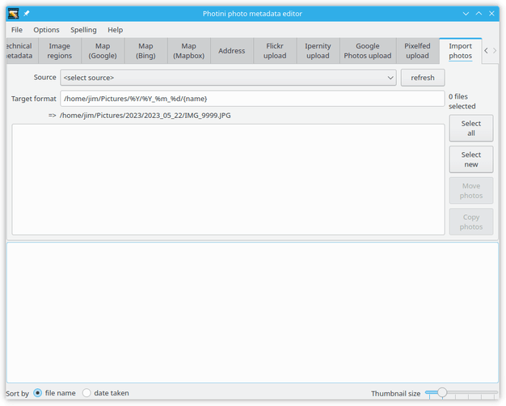
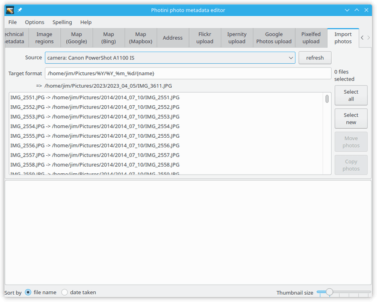
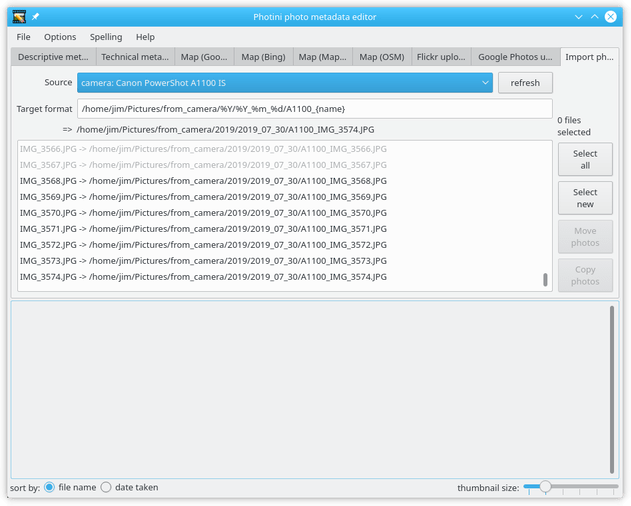
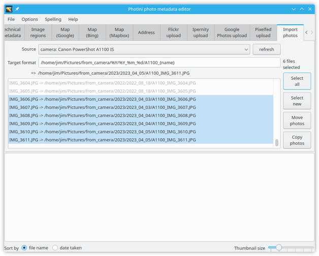
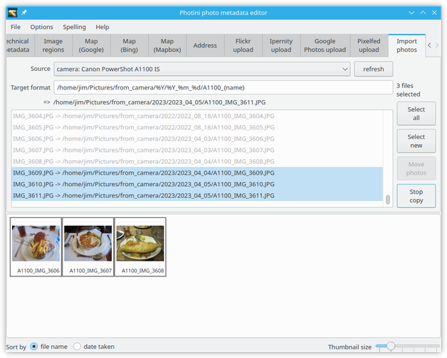
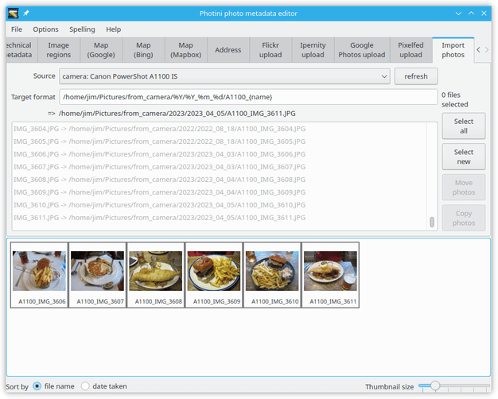

.. This is part of the Photini documentation.
   Copyright (C)  2012-19  Jim Easterbrook.
   See the file ../DOC_LICENSE.txt for copying conditions.

Image importer
==============

The ``Import photos`` tab (keyboard shortcut ``Alt+I``) allows you to copy photographs from your digital camera or anywhere else on your computer (for example, a camera memory card if your computer has a card reader).
Whilst there are many other programs to do this, I've never found one that does things the way I want, so I added one to Photini.

Note that you can only import directly from cameras if you have installed python-gphoto2 (which is not available on Windows).
See :ref:`installation <installation-optional>` for more detail.

The key part of the importer is the ``Target format`` field.
This provides a very flexible way to specify where on your computer imported images should be stored.
It uses ``%`` formats to generate file and directory names based on the image capture date & time.
The most useful ones are ``%Y`` (year), ``%m`` (month number) and ``%d`` (day of the month) but many more are available.
See the `Python documentation <https://docs.python.org/2/library/datetime.html#strftime-strptime-behavior>`_ for a complete list.

As well as the date & time format strings, bracketed keywords can be used to manipulate parts of the file name:

========  ==================================  =======
keyword   meaning                             example
========  ==================================  =======
{camera}  the camera model name               Canon_PowerShot_A1100_IS
{name}    the complete file name              IMG_9999.JPG
{number}  the numeric part of the file name   9999
{root}    the filename without its extension  IMG_9999
{ext}     the filename extension              .JPG
========  ==================================  =======

Below the ``Target format`` field is an example generated from the current format to help you edit it correctly.

Note that Photini stores a different target format for each camera or source folder that you use.
This can be useful if you have two cameras that use the same file names.
For example, I use ``/home/jim/Pictures/from_camera/%Y/%Y_%m_%d/100D_{name}`` for my DSLR to rename files from ``IMG_9999.JPG`` to ``100D_IMG_9999.JPG`` so they don't clash with files from my compact camera, which also uses names like ``IMG_9999.JPG``.

After connecting one or more cameras and pressing the ``refresh`` button, a camera can be chosen from the ``<select source>`` drop down list.
Photini then fetches a list of all the files stored on the camera, which can take some time.

The drop down list also includes the most recent source folders you have used.
Click on ``<add a folder>`` to add a new source folder to the list.
Photini lists all the image files in the source folder and all its sub-folders, so take care to navigate down to the folder containing the photos you want, to avoid including too many other files.

The list is displayed in the central area, with the location where the file would be stored.
It is sorted by name or date, as selected by the buttons below the image thumbnail area. 

When the ``Target format`` has been set to match where previous images were put, images that have already been copied to the computer are non selectable (shown in light grey).

The remaining images can be selected by clicking on them, or by using the ``Select all`` button (to select all uncopied images) or ``Select new`` button (to select images newer than the last ones copied).

Clicking the ``Copy photos`` button copies the selected images to the computer and loads them into Photini.
To avoid overloading Photini you should be careful not to select too many images before clicking on ``Copy photos``.

The ``Move photos`` button moves image files instead of copying them.
This is probably not useful with a camera source, but can be used to reorganise your photo files by moving them to different directories, perhaps renaming them as well.

As each file is copied it is shown in grey on the file list and the selected file count decreases.

After copying all the files the file list is refreshed, which may take some time.
Now that all the files have been copied from the camera none can be selected.
