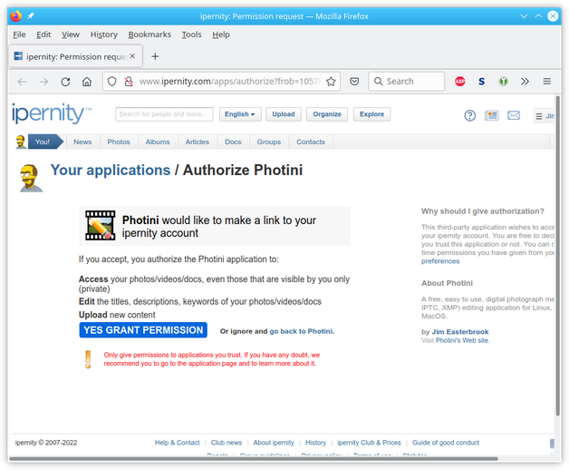
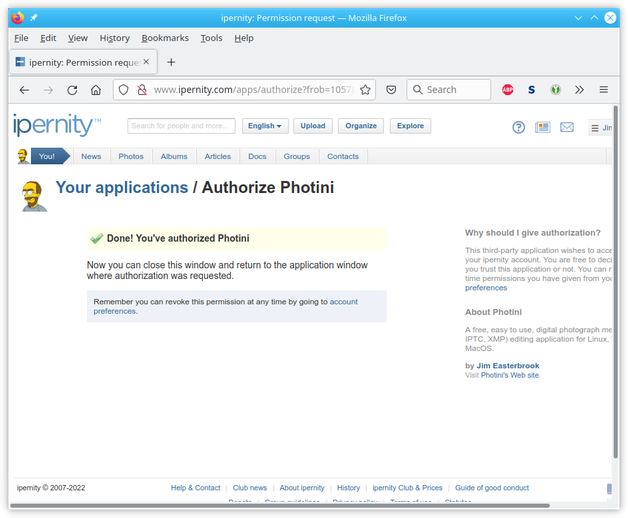
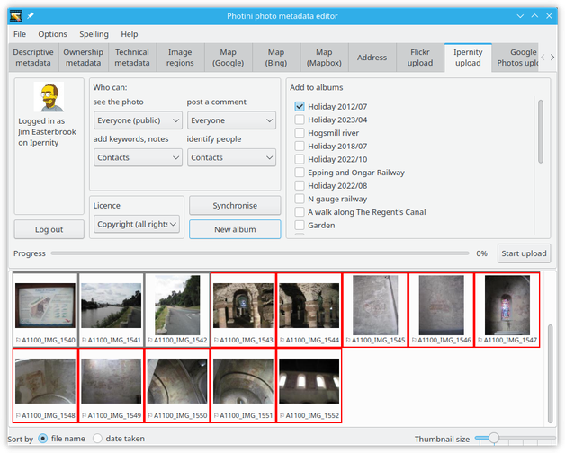
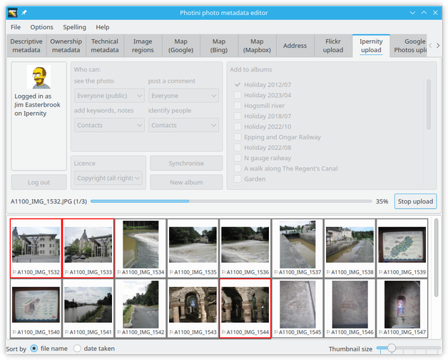
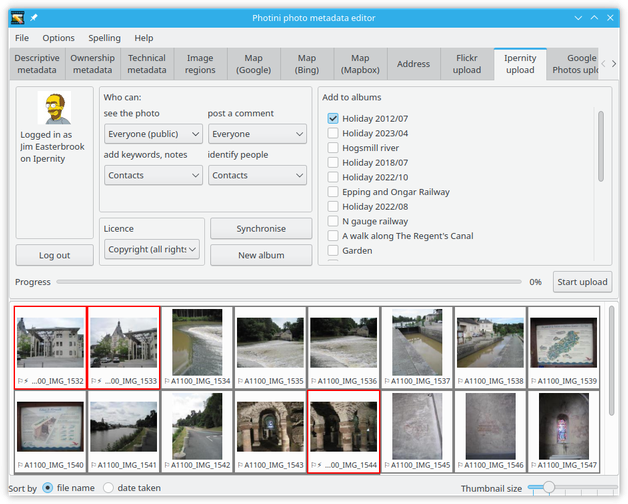
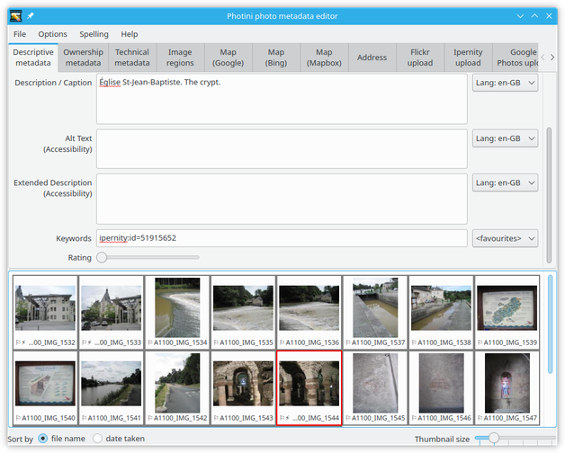
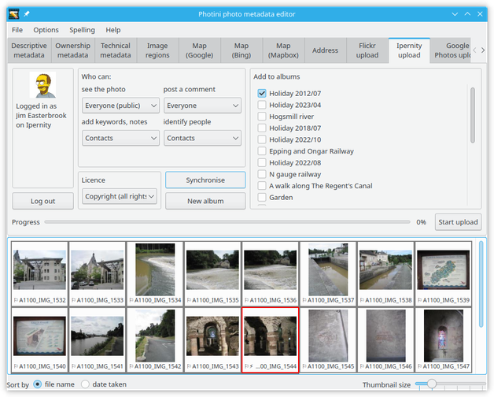
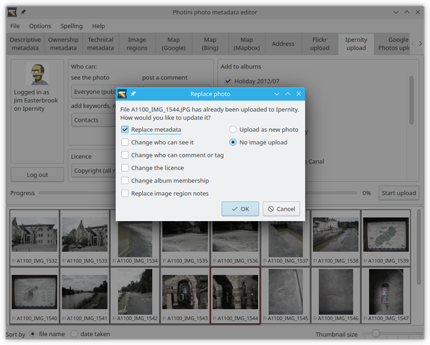

.. This is part of the Photini documentation.
   Copyright (C)  2022  Jim Easterbrook.
   See the file ../DOC_LICENSE.txt for copying condidions.

Ipernity uploader
=================

The ``Ipernity upload`` tab (keyboard shortcut ``Alt+I``) allows you to upload your photographs to `Ipernity <http://www.ipernity.com/>`_, a friendly online photograph sharing club.
The Ipernity upload tab uses the Ipernity API but is not endorsed or certified by Ipernity.

Unlike some other uploaders, Photini uses the descriptive metadata you've created to set Ipernity's title, description and keywords.
This means you don't have to retype all that information!

Note that the Ipernity upload tab is only enabled if you have installed some extra software packages.
See :ref:`installation <installation-optional>` for more detail.

Initially most of the Ipernity uploader tab is disabled.
It's only usable after you've authorised Photini to access your Ipernity account by clicking the ``Log in`` button.

The first time you click ``Log in`` Photini connects your web browser to Ipernity, from where you can log in and give Photini permission to access Ipernity on your behalf.

After authorising Photini close the web browser window or tab and return to the Photini window.
You can now close the "Authorisation required" dialog.

.. image:: ../images/screenshot_231.png

If the authorisation is successful Photini displays your Ipernity user name and profile picture.
You should not need to redo this authorisation process unless you click the ``Log out`` button.

Your current Ipernity albums are shown on the right hand side of the Ipernity uploader tab.
You can add a new album with the ``New album`` button.
This opens a pop-up dialog as shown below.

.. image:: ../images/screenshot_235.png

Type in the album details and click ``OK``.
Note that the album will not be visible on Ipernity until you upload a photo to it.

To upload one or more photographs to Ipernity, select them in the image selector area, then choose which (if any) of your albums to add them to and set the permissions and licence, then click on the ``Start upload`` button.

The permissions, licence, and album membership apply to all the photographs in this upload.
If you want some photographs to have different permissions, licence, or album membership you need to upload them as a separate batch.

During uploading Photini displays a progress bar.
Uploading takes place in the background, so you can continue to use other tabs while the upload is in progress.
The upload can be stopped by clicking the ``Stop upload`` button.

After uploading a photograph it is marked as having new metadata.

If you switch to the ``Descriptive metadata`` tab you can see there is a new keyword ``ipernity:id=<long-number>``.
Photini uses this `triple tag`_ to store the Ipernity photo id so it can be used to synchronise metadata later on, as described below.

Synchronising local metadata to Ipernity
----------------------------------------

Sometimes you might change your photograph's metadata on Ipernity and would like to copy those changes back to the image file on your computer.
Select the image(s) you would like to update and click the ``Synchronise`` button.

If an image does not have a ``ipernity:id`` keyword then Photini will try to find the photograph on Ipernity by matching the date and time it was taken.
If there is new metadata on Ipernity then it is merged into the image's metadata.
You can see what changed with the image's context menu ``View changes``.

Synchronising Ipernity metadata to local
----------------------------------------

If you change your image file metadata and would like to make the same changes on Ipernity you can select the image and click on the ``Start upload`` button.

If you upload an image that already has a ``ipernity:id`` keyword then Photini allows you to change the photograph's metadata instead of uploading a new photograph.

.. _triple tag: https://en.wikipedia.org/wiki/Tag_(metadata)#Triple_tags
