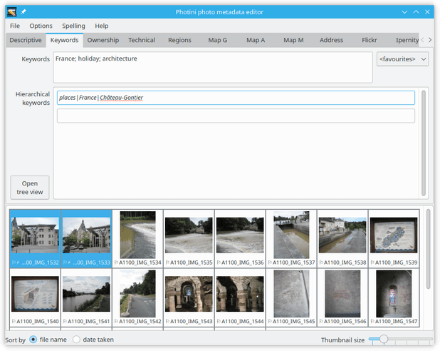
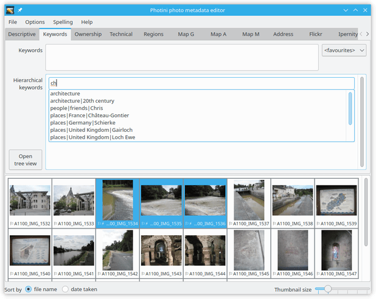
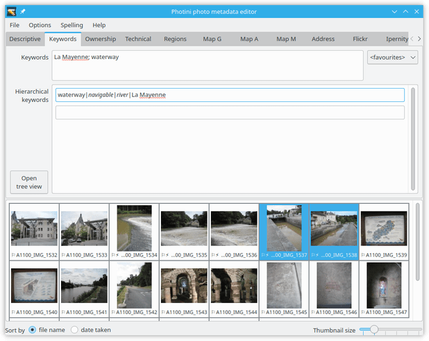
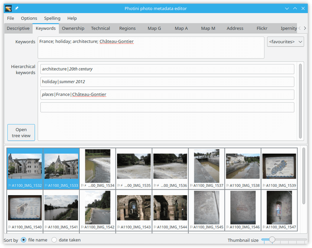
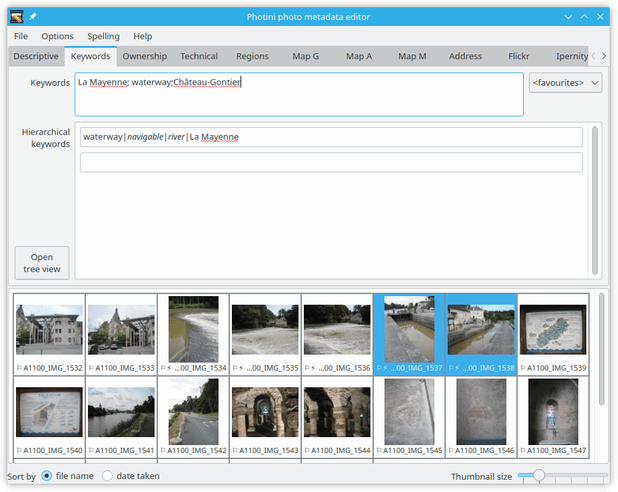
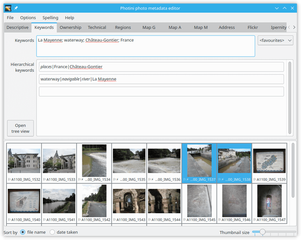
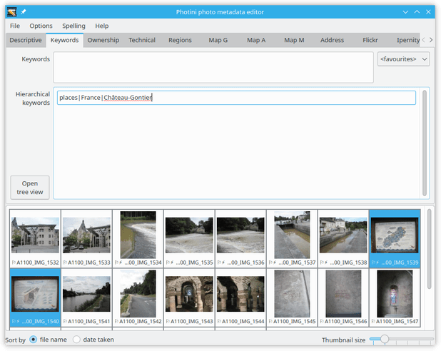
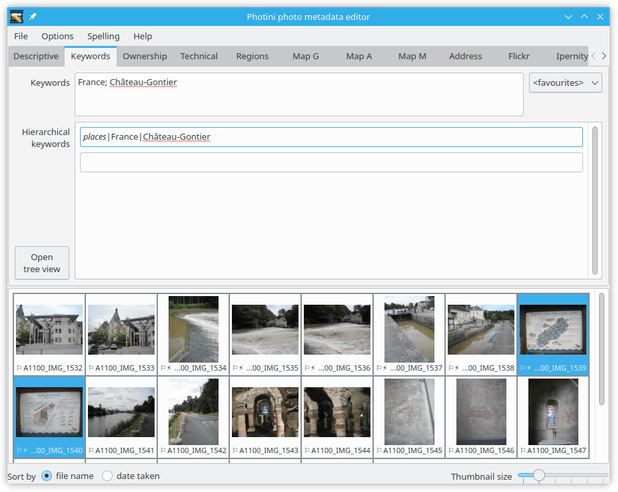

.. This is part of the Photini documentation.
   Copyright (C)  2024  Jim Easterbrook.
   See the file ../DOC_LICENSE.txt for copying condidions.

Keywords
========

The ``Keywords`` tab (keyboard shortcut ``Alt+K``) allows you to add "keywords" or "tags" to your photographs.
These are words or short phrases that describe the subject of the image.

Note that these fields are stored in XMP but not in Exif, so may not be visible to software that only handles Exif metadata (see :doc:`tag reference <tags>` for more detail).
You may prefer not to use this tab.

.. image:: ../images/screenshot_050.png

Photini handles two types of keywords, simple and hierarchical.
The simple (or "flat") keywords are widely used, for example they are recognised by Flickr's image uploader.
Hierarchical keywords are a more recent addition to photography metadata and may not be widely recognised.

.. image:: ../images/screenshot_051.png

You can set a list of simple keywords for the image by typing them in the ``Keywords`` box.
Keywords are separated by semicolon (``;``) characters.
The ``<favourites>`` drop-down list can be used to select keywords from the ones you use most often.

Hierarchical keywords are sequences of words or phrases that describe the subject in descending generality or increasing precision.
For example, a geographical location could be continent > country > county > city.
There are no rules about what hierarchies you use, but in some cases there are obvious choices.
A bird watcher or botanist might want to use the full `Linnaean taxonomy`_.

Hierarchical keywords are added by typing the complete hierarchy, separating terms with pipe (``|``) or slash (``/``) characters.

After entering the keyword Photini converts ``/`` characters to ``|`` and displays a field for the next hierarchical keyword.
Note that each word is shown in italics, for reasons that are explained later.

.. image:: ../images/screenshot_054.png

As more keywords are added they are sorted alphabetically.
You can add as many keywords as you want.

Your hierarchical keywords are added to a personal dictionary, stored in a file called ``keywords.json`` in your :ref:`configuration-file-location`.

The keyword dictionary is used to provide suggestions for keywords as you type.

.. image:: ../images/screenshot_056.png

After choosing one of the suggested keywords you can edit it further if needed.

.. image:: ../images/screenshot_057.png

The ``open tree view`` button opens a dialog that displays all the keywords in your dictionary.
Each word in a hierarchy is shown as a node with parent and child nodes above and below.
To rename a node you can double-click on it (or press the ``F2`` key) and then edit the text.
Deleting the text will delete the node and its children.

When the dialog opens the selected photographs' keywords are highlighted.
The ``search`` box can be used to find other keywords in the hierarchy.

The ``in photo`` tick boxes allow you to add keywords to the selected photographs by ticking the box, or remove them by unticking the box.

Keyword synchronisation
-----------------------

.. image:: ../images/screenshot_058.png

The ``copyable`` tick boxes set which keywords are automatically copied between "flat" and hierarchical keywords.
Typically the last word of each hierarchy is copyable, but in some cases this is unsuitable.
For example, "20th century" and "summer 2012" are almost meaningless outside their hierarchical context.
On the other hand, a country name is usually not the last word in a hierarchy, but is meaningful in isolation.

After editing the keywords' ``copyable`` setting, the ones that are copyable are no longer shown in italics.
Note that as "Château-Gontier" is now copyable, it has been automatically added to the "flat" keywords.

The ``copyable`` status of a keyword can also be set by preceding it with an asterisk (``*``) when typing in the keyword hierarchy.

The word "holiday" is immediately marked as copyable.

When a copyable keyword is added to the "flat" keywords...

...the corresponding hierarchical keyword is automatically added.
Note that as "France" is also copyable, it is added to the flat keywords.

When a hierarchical keyword is added...

...its copyable keywords are automatically added to the "flat" keywords.

Ambiguous keywords
^^^^^^^^^^^^^^^^^^

.. |pipe| unicode:: 0x7C
    :trim:

The automatic synchronisation of "flat" and hierarchical keywords discussed above can fail if a flat keyword occurs more than once in your personal hierarchical keyword dictionary.
For example, if your dictionary contains both "*places* |pipe| *France* |pipe| Paris" and "*places* |pipe| *USA* |pipe| *Texas* |pipe| Paris" then the single word "Paris" has two matching hierarchical keywords.

When this happens Photini searches the flat keywords for other words in the hierarchies.
For example, if the flat keywords contain "USA" or "Texas" but not "France" then the choice is obvious.
If the ambiguity cannot be resolved then the flat keyword is not copied to the hierarchical keywords.

.. _Linnaean taxonomy: https://en.wikipedia.org/wiki/Linnaean_taxonomy
