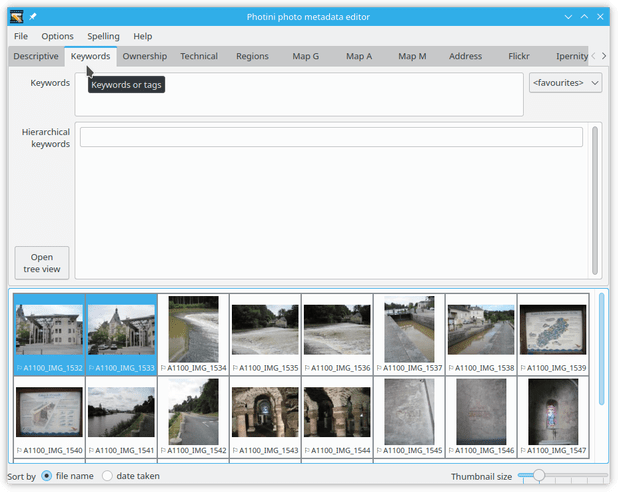
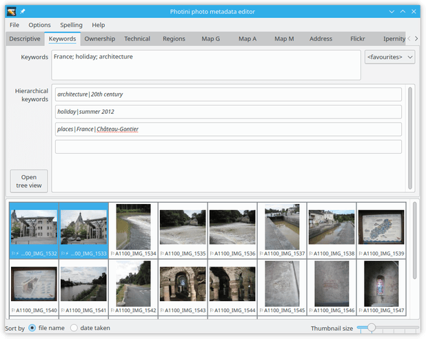
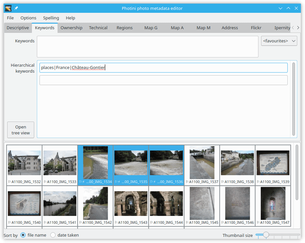
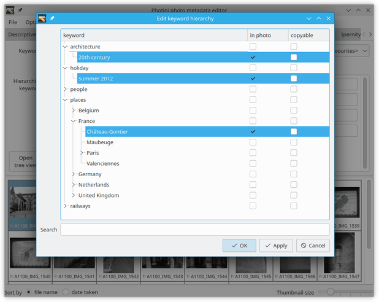
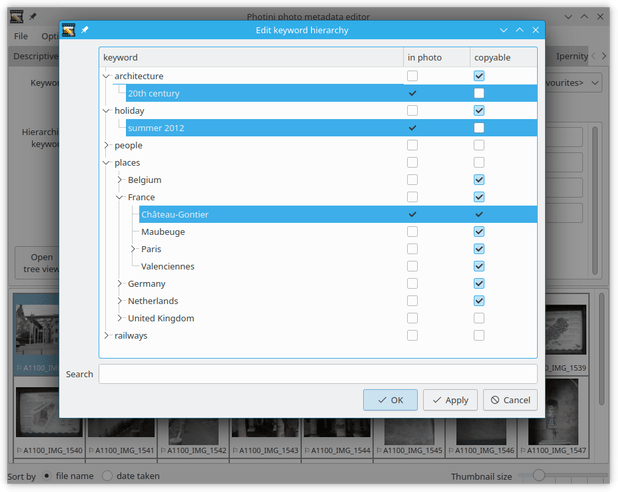

.. This is part of the Photini documentation.
   Copyright (C)  2024  Jim Easterbrook.
   See the file ../DOC_LICENSE.txt for copying condidions.

Keywords
========

The ``Keywords`` tab (keyboard shortcut ``Alt+K``) allows you to add "keywords" or "tags" to your photographs.
These are words or short phrases that describe the subject of the image.

Note that these fields are stored in XMP but not in Exif, so may not be visible to software that only handles Exif metadata (see :doc:`tag reference <tags>` for more detail).
You may prefer not to use this tab.

Photini handles two types of keywords, simple and hierarchical.
The simple (or "flat") keywords are widely used, for example they are recognised by Flickr's image uploader.
Hierarchical keywords are a more recent addition to photography metadata and may not be widely recognised.

You can set a list of simple keywords for the image by typing them in the ``Keywords`` box.
Keywords should be separated by semi-colon (``;``) characters.
The ``<favourites>`` drop-down list can be used to select keywords from the ones you use most often.

Hierarchical keywords are sequences of words or phrases that describe the subject in descending generality or increasing precision.
For example, a geographical location could be continent > country > county > city.
There are no rules about what hierarchies you use, but in some cases there are obvious choices.
A bird watcher or botanist might want to use the full `Linnaean taxonomy`_.

.. image:: ../images/screenshot_052.png

Hierarchical keywords are added by typing the complete hierarchy, separating terms with ``|`` (pipe) or ``/`` (slash) characters.

.. image:: ../images/screenshot_053.png

After entering the keyword Photini converts ``/`` characters to ``|`` and displays a field for the next hierarchical keyword.
Note that all but the last word are shown in italics, for reasons that are explained later.

As more keywords are added they are sorted alphabetically.
You can add as many keywords as you want.

Your hierarchical keywords are added to a personal dictionary, stored in a file called ``keywords.json`` in your :ref:`configuration-file-location`.

.. image:: ../images/screenshot_055.png

The keyword dictionary is used to provide suggestions for keywords as you type.

After choosing one of the suggested keywords you can edit it further if needed.

The ``open tree view`` button opens a dialog that displays all the keywords in your dictionary.
When the dialog opens the selected photographs' keywords are highlighted.

The ``in photo`` tick boxes allow you to add keywords to the selected photographs by ticking the box, or remove them by unticking the box.

The ``copyable`` tick boxes set which keywords can be easily copied between "flat" and hierarchical keywords.
Initially the last word of each hierarchy is copyable, but in some cases this is unsuitable.
For example, "20th century" and "summer 2012" are almost meaningless outside their hierarchical context.
On the other hand, a country name is usually not the last word in a hierarchy, but is meaningful in isolation.

.. image:: ../images/screenshot_059.png

After editing the keywords' ``copyable`` setting, the ones that are no longer copyable are shown in italics.

.. image:: ../images/screenshot_060.png

The ``copy to hierarchy`` button searches your keyword dictionary for any of the words in the "flat" keyword list, and copies all that are copyable.
In this case it has copied both "places|France" and "places|France|Château-Gontier".
Only the latter is needed so the former can be deleted.

.. image:: ../images/screenshot_061.png

The ``copy to keywords`` button copies the copyable words in your hierarchical keywords to the "flat" keywords list.
In this case both "France" and "Château-Gontier" are copyable so one hierarchical keyword has generated two flat keywords.

.. _Linnaean taxonomy: https://en.wikipedia.org/wiki/Linnaean_taxonomy
