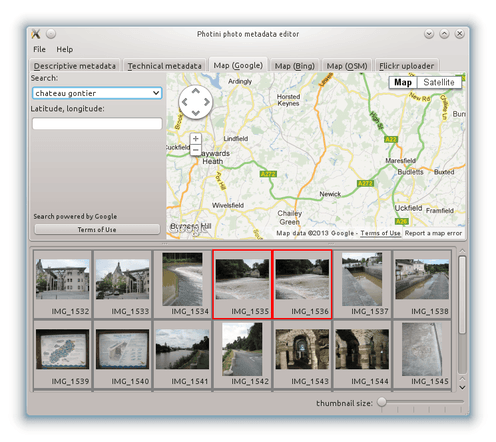
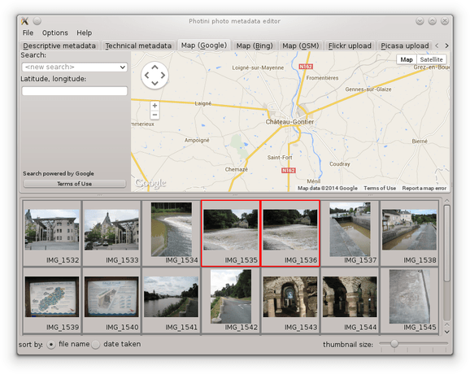
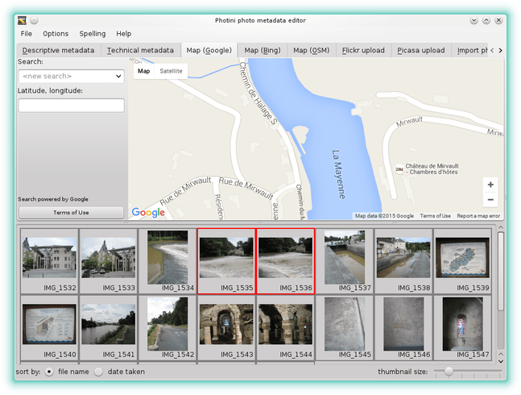
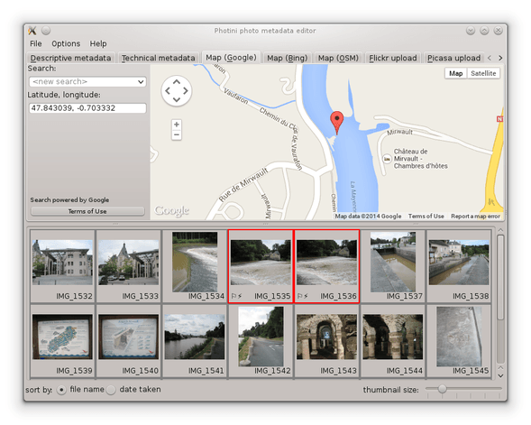
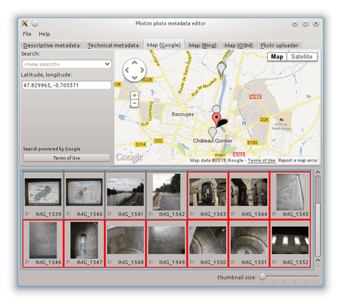
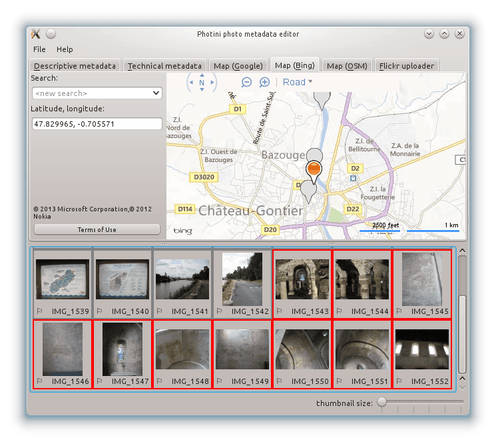
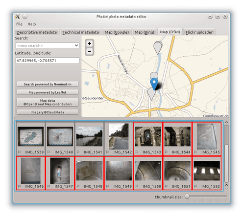

.. This is part of the Photini documentation.
   Copyright (C)  2012-15  Jim Easterbrook.
   See the file ../DOC_LICENSE.txt for copying condidions.

Geotagging
==========

The ``Map (Google)`` (keyboard shortcut ``Alt+G``), ``Map (Bing)`` (keyboard shortcut ``Alt+B``) & ``Map (OSM)`` (keyboard shortcut ``Alt+O``) tabs allow you to set geolocation data (latitude & longitude) where a photograph was taken.
(Some people argue that it should be the position of the subject of the photograph, but what about photographs of the Moon?)
All three tabs have similar functionality, but use different providers of map data and imagery.

.. image:: ../images/screenshot_13.png

When you first select one of the map tabs you need to click the ``Load map`` button.
This helps reduce the load on the map providers' servers by not having them contacted every time you run Photini.

.. image:: ../images/screenshot_14.png

Once the map is loaded, the ``Load map`` button is replaced by legal notices and a button (or buttons) to display the terms of use in your web browser.

The map initially displays the previously used location.
You can change the view by zooming in or out, or by panning the map with the pan control, or by dragging it with the mouse.
However, it's usually easier to find a specific location by using the search facility.

Click on the ``<new search>`` edit box and type in a search term such as the name of a town, then press the 'return' key.
A drop down list of place names should appear, from which you can select one.
Note that the search is influenced by the current location shown on the map.
A search for 'newport' will return different results if the map is showing New York than if it's showing London.
Sometimes you may need to drag the map to somewhere near where you want to be and then click on the ``<repeat search>`` item in the drop down list.

Having found the right town, you can then zoom in and pan around to find the exact location where your photograph was taken.
Using aerial / satellite imagery (if it's available) can help with this.

Now you can drag and drop your photograph onto the map to set its location.
To set the same location on multiple images, select them all and then drag and drop any one of them.

.. |flag| unicode:: U+02690

Note that photographs that have location data are shown with a flag symbol (|flag|) in the image selector area.

The location coordinates are shown in the ``Latitude, longitude:`` box.
These values are editable, so you can set the location of photographs directly, e.g. by copying and pasting from another one.

When several photographs have location metadata Photini will pan the map (and zoom out if required) to ensure all the selected images are shown on the map.
Selected images are shown with coloured markers.
Unselected images are shown with grey markers.

Selecting another map tab, and loading the map, will show the same location but with data from a different provider.

