.. This is part of the Photini documentation.
   Copyright (C)  2012-17  Jim Easterbrook.
   See the file ../DOC_LICENSE.txt for copying condidions.

Geotagging
==========

The ``Map (Google)`` (keyboard shortcut ``Alt+G``), ``Map (Bing)`` (keyboard shortcut ``Alt+B``) & ``Map (OSM)`` (keyboard shortcut ``Alt+O``) tabs allow you to set the location of where a photograph was taken.
(Some people argue that it should be the location of the subject of the photograph, but what about photographs of the Moon?)
All three tabs have similar functionality, but use different providers of map data and imagery.

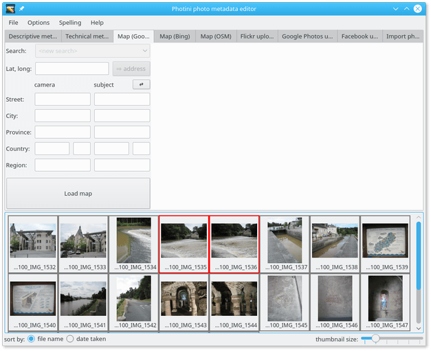

When you first select one of the map tabs you need to click the ``Load map`` button.
This helps reduce the load on the map providers' servers by not having them contacted every time you run Photini.

.. image:: ../images/screenshot_61.png

Once the map is loaded, the ``Load map`` button is replaced by legal notices and a button (or buttons) to display the terms of use in your web browser.

The map initially displays the previously used location.
You can change the view by zooming in or out, or by panning the map by dragging it with the mouse.
However, it's usually easier to find a specific location by using the search facility.

.. image:: ../images/screenshot_62.png

Click on the ``<new search>`` edit box and type in a search term such as the name of a town, then press the 'return' key.
A drop down list of place names should appear, from which you can select one.
Note that the search may be influenced by the current location shown on the map.
A search for 'newport' may return different results if the map is showing New York than if it's showing London.
Sometimes you may need to drag the map to somewhere near where you want to be and then click on the ``<repeat search>`` item in the drop down list.

Note that the OSM map's search box is disabled for a few seconds after each search to limit the load on the free servers that provide the service.

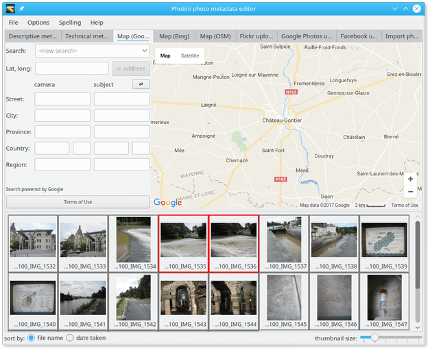

Having found the right town, you can then zoom in and pan around to find the exact location where your photograph was taken.
Using aerial / satellite imagery (if it's available) can help with this.

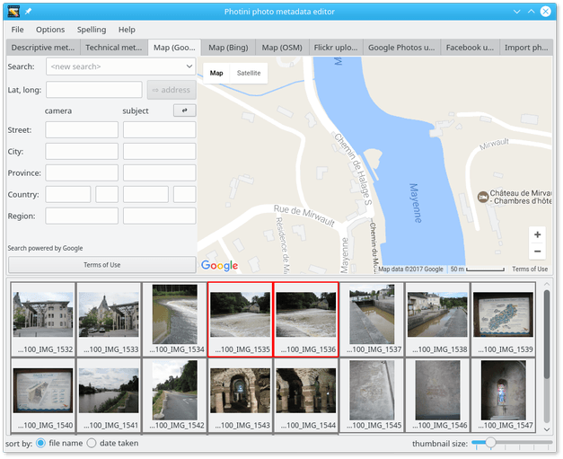

Now you can drag and drop your photograph onto the map to set its location.
To set the same location on multiple images, select them all and then drag and drop one of them.

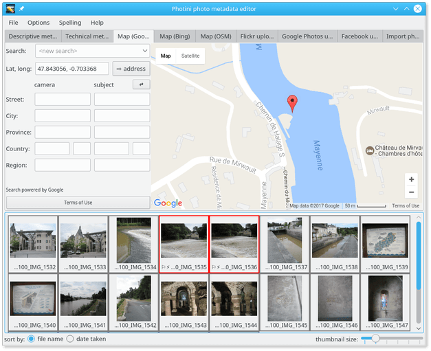

.. |flag| unicode:: U+02690

Note that photographs that have location data are shown with a flag symbol (|flag|) in the image selector area.

The location coordinates are shown in the ``Lat, long:`` box.
These values are editable, so you can set the location of photographs directly, e.g. by copying and pasting from another one.

.. image:: ../images/screenshot_66.png

When several photographs have location metadata Photini will pan the map (and zoom out if required) to ensure all the selected images are shown on the map.
Selected images are shown with coloured markers.
Unselected images are shown with grey markers.

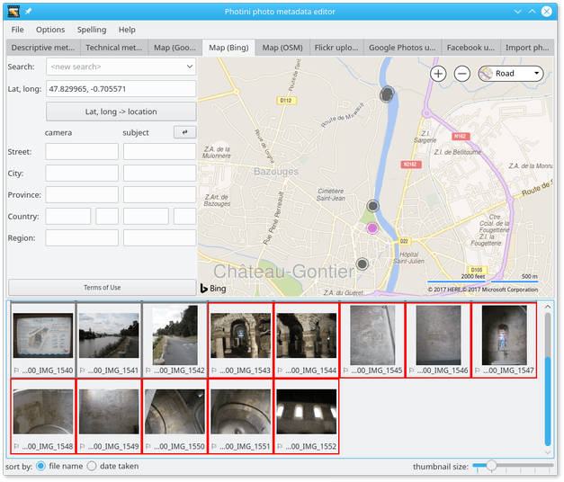

Selecting another map tab, and loading the map, will show the same location but with data from a different provider.

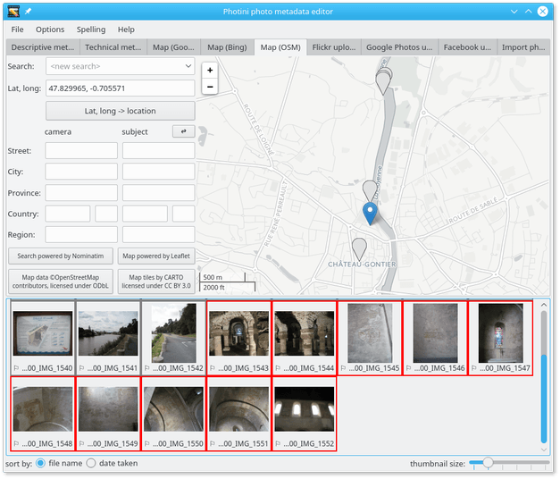

Address lookup
--------------

Photograph metadata can include textual address elements as well as the latitude & longitude.
These are stored in a 5-level hierarchy: ``street``, ``city``, ``province``, ``country`` and ``region``.
The meaning of these terms is rather loose, especially when out in the countryside, and there's no requirement to fill them all in.
Typically ``city`` can be anything from a village to a metropolis, and ``street`` is a more specific location, e.g. "23 Abdication Avenue".
``Province`` would be a state in the USA or a county in the UK.
``Country`` is stored as a name and a 2 or 3 letter ISO code.
``Region`` appears to be rarely used but could be a continent or sub-continent.

Photini stores two addresses: ``camera`` is where the photographer was positioned and ``subject`` is the location being photographed.
For example, a general view of the Eiffel Tower will almost certainly have been taken from somewhere else in Paris.
This separation of camera and subject addresses was added to the IPTC specification in 2009, but you may still have software that only recognises "legacy" address metadata.
In this case you should not use the ``subject`` column or ``region`` row.
(Note that although the address metadata is standardised by the IPTC, it's actually stored in the XMP data.)

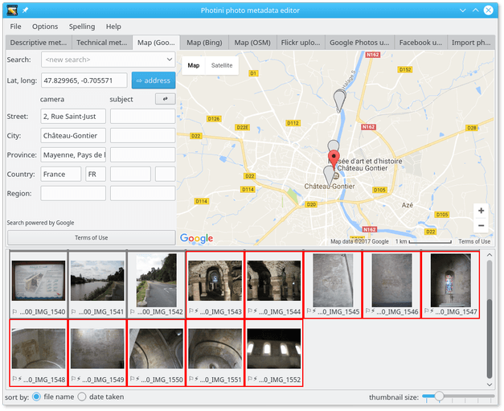

The ``⇨ address`` button uses the map provider's "reverse geolocation" service to convert latitude & longitude into a hierarchical address.
This is a rather imprecise process so you may need to edit the results yourself.

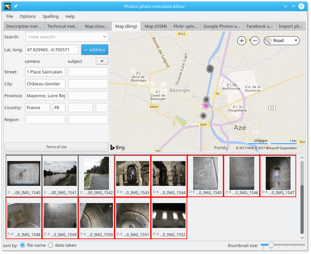

In this example Google and Bing disagree about the street address and are using different languages for the ``state`` element.

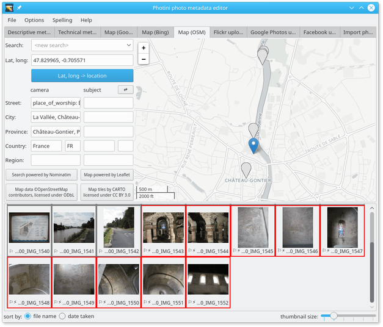

With OpenStreetMap we get more information.
This is more visible if you expand the address area by dragging its border with the map to the right.

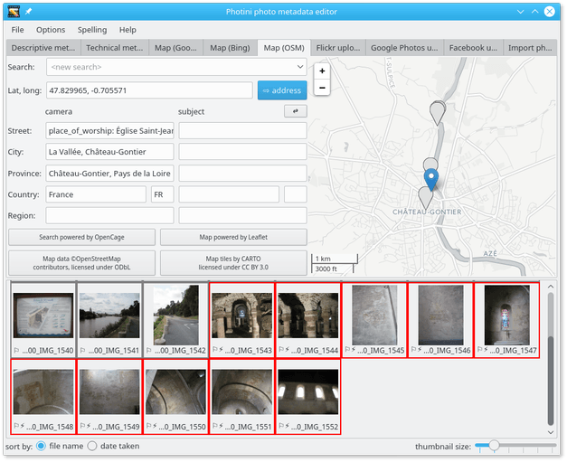

OpenStreetMap is the only provider to include the fact that the location is a church.
There are many different types of premises (shops, cafés, parks, etc.) included in OSM addresses.
Photini adds all the information supplied to the ``street`` element.
You can edit it out if it's not appropriate.

The ``⇄`` button exchanges the ``camera`` and ``subject`` addresses.
This may be useful if you have files with "legacy" address metadata that should really be in the ``subject`` column.

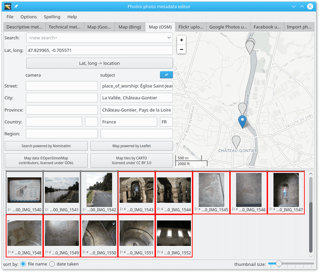

