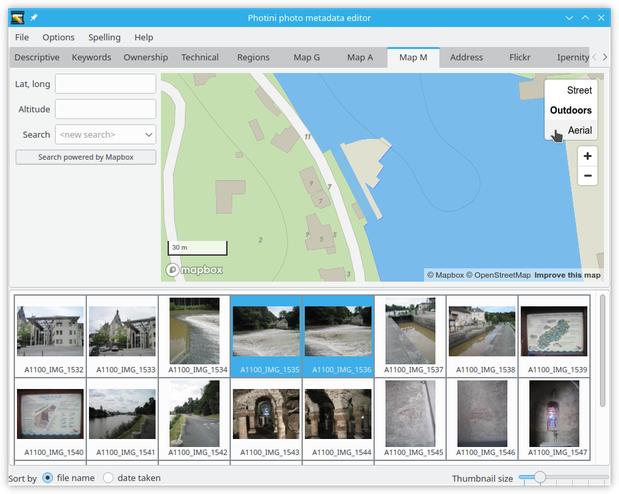
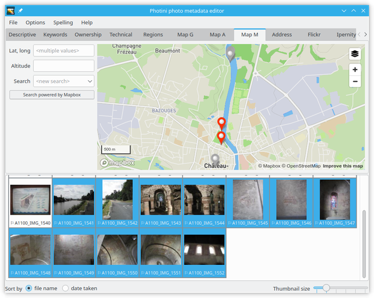

.. This is part of the Photini documentation.
   Copyright (C)  2012-19  Jim Easterbrook.
   See the file ../DOC_LICENSE.txt for copying condidions.

Geotagging
==========

The map tabs allow you to set the location of where a photograph was taken.
Photini currently uses four different map providers: Google, Bing, Mapbox, and OpenStreetMap (OSM).
All four tabs have similar functionality, but have different styles and levels of detail.
Google, Bing, and Mapbox also offer aerial (or "satellite") photography.

.. image:: ../images/screenshot_130.png

The map initially displays the previously used location.
You can change the view by zooming in or out, or by panning the map by dragging it with the mouse.
However, it's usually easier to find a specific location by using the search facility.

.. image:: ../images/screenshot_131.png

Click on the ``<new search>`` edit box and type in a search term such as the name of a town, then press the 'return' key.
A drop down list of place names should appear, from which you can select one.
Note that the search box may be disabled for a few seconds after each search to limit the load on the free servers that provide the service.

.. image:: ../images/screenshot_132.png

The search is influenced by the current location shown on the map.
A search for 'newport' may return different results if the map is showing New York than if it's showing London.
You can do a world wide search, ignoring the current location, by clicking on the ``<widen search>`` item in the drop down list.
Alternatively you can drag the map to somewhere near where you want to be and then click on the ``<repeat search>`` item in the drop down list.

Each map provider has its own search facility.
You may get more useful results by switching to a different map tab.

.. image:: ../images/screenshot_133.png

Having found the right town, you can then zoom in and pan around to find the exact location where your photograph was taken.
Using aerial / satellite imagery can help with this.

.. image:: ../images/screenshot_134.png

Now you can drag and drop your photograph onto the map to set its location.
To set the same location on multiple images, select them all and then drag and drop one of them.

.. |flag| unicode:: U+02690

Note that photographs that have location data are shown with a flag symbol (|flag|) in the image selector area.

The location coordinates are shown in the ``Lat, long:`` box.
These values are editable, so you can set the location of photographs directly, e.g. by copying and pasting from another one.
You can also adjust the location by dragging the marker on the map.
To clear a photograph's location data just delete the coordinates.

.. image:: ../images/screenshot_136.png

When several photographs have location metadata Photini will pan the map (and zoom out if required) to ensure all the selected images are shown on the map.
Selected images are shown with coloured markers.
Unselected images are shown with grey markers.

.. image:: ../images/screenshot_137.png

Selecting another map tab will show the same location but with data and imagery from a different provider.

.. image:: ../images/screenshot_138.png

.. image:: ../images/screenshot_139.png

Address lookup
--------------

Photograph metadata can include textual address elements as well as the latitude & longitude.
These are stored in a 5-level hierarchy: ``street``, ``city``, ``province``, ``country`` and ``region``.
The meaning of these terms is rather loose, especially when out in the countryside, and there's no requirement to fill them all in.
Typically ``city`` can be anything from a village to a metropolis, and ``street`` is a more specific location, e.g. "23 Abdication Avenue".
``Province`` would be a state in the USA or a county in the UK.
``Country`` is stored as a name and a 2 or 3 letter ISO code.
``Region`` appears to be rarely used but could be a continent or sub-continent.
More detail about these can be found on the `IPTC web site <https://www.iptc.org/std/photometadata/documentation/userguide/index.htm#!Documents/locations.htm>`_.

Photini stores two types of address: ``camera`` is where the photographer was positioned and ``subject`` is a location being photographed.
For example, a general view of the Eiffel Tower will almost certainly have been taken from somewhere else in Paris.
This separation of camera and subject addresses was added to the IPTC specification in 2009, but you may still have software that only recognises "legacy" address metadata.
In this case you should not use the ``subject`` tabs or ``region`` fields.
(Note that although the address metadata is standardised by the IPTC, it's actually stored in the XMP data.)

The ``⇨ address`` button uses "reverse geocoding" to convert latitude & longitude into a hierarchical address.
This is a rather imprecise process so you may need to edit the results yourself.
All the map tabs use the same address lookup service provided by OpenCage_, using data from OpenStreetMap_.
Other providers don't allow lookup results to be permanently stored.

.. image:: ../images/screenshot_141.png

It's easier to see the address data if you drag the divider between address data and map to the right.
Here you can see there is some duplication as a result of the imprecision of address lookup.

.. image:: ../images/screenshot_142.png

It is usually necessary to edit the address quite a lot.

.. image:: ../images/screenshot_143.png

Right-clicking on a location tab displays a context menu that allows the tab to be copied to a new tab or deleted.
Copying the ``camera`` location is an easy way to initialise a ``subject`` location.
(An empty ``subject 2`` tab is immediately created, in case the photograph has more than one subject.)

.. image:: ../images/screenshot_144.png

In this case most of the data is the same, but I changed the ``street`` to the subject of the photograph rather than where I was standing.

.. image:: ../images/screenshot_145.png

To reorder the subject locations, or to convert between camera and subject, you can drag any of the tabs to another position.
If this results in the rightmost tab having data then another tab will be added.
If the two rightmost tabs have no data then one of the empty tabs will be removed.

.. _OpenCage:      https://opencagedata.com/
.. _OpenStreetMap: https://www.openstreetmap.org/about/
