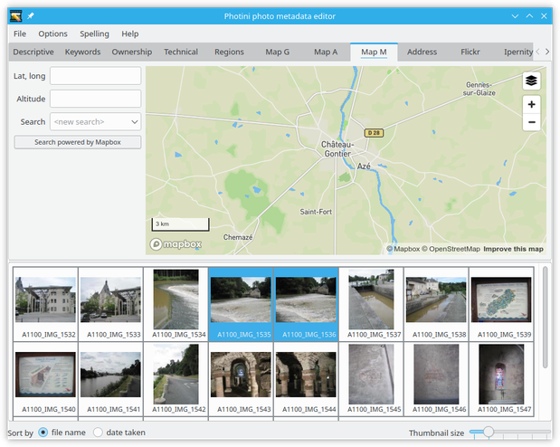
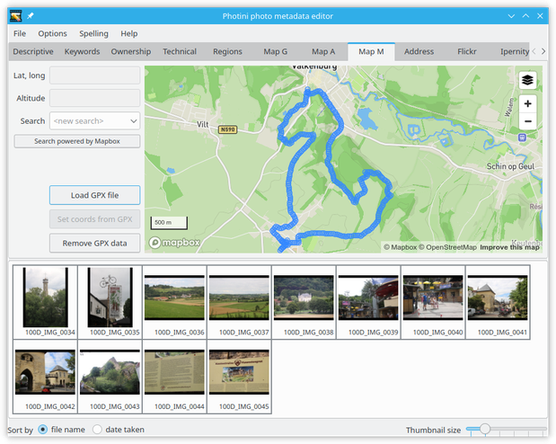
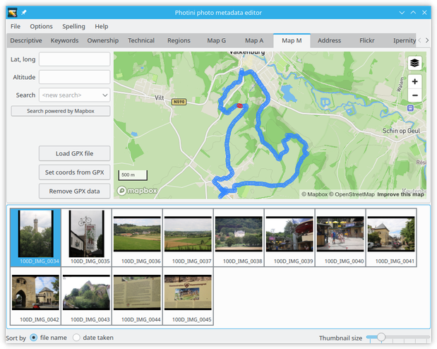
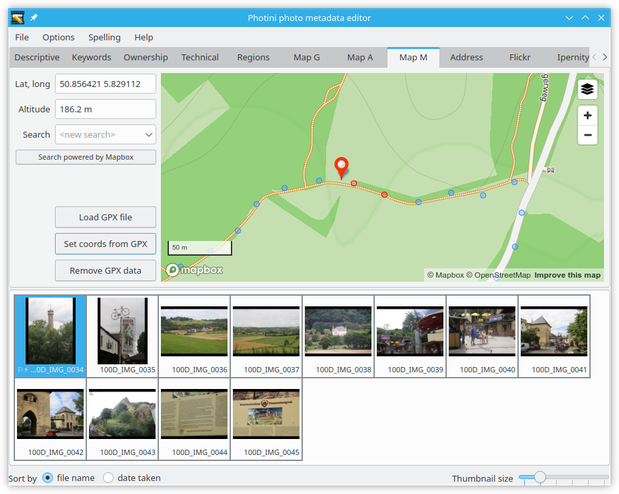

.. This is part of the Photini documentation.
   Copyright (C)  2012-22  Jim Easterbrook.
   See the file ../DOC_LICENSE.txt for copying conditions.

Geotagging
==========

The map tabs allow you to set the location of where a photograph was taken.
Photini currently uses three different map providers: Google, Bing, and Mapbox/OpenStreetMap.
All three tabs have similar functionality, but have different styles and levels of detail.
Google, Bing, and Mapbox also offer aerial (or "satellite") photography.

The map initially displays the previously used location.
You can change the view by zooming in or out, or by panning the map by dragging it with the mouse.
However, it's usually easier to find a specific location by using the search facility.

.. image:: ../images/screenshot_131.png

Click on the ``<new search>`` edit box and type in a search term such as the name of a town, then press the 'return' key.
A drop down list of place names should appear, from which you can select one.
Note that the search box may be disabled for a few seconds after each search to limit the load on the free servers that provide the service.

.. image:: ../images/screenshot_132.png

The search is influenced by the current location shown on the map.
A search for 'newport' may return different results if the map is showing New York than if it's showing London.
You can do a world wide search, ignoring the current location, by clicking on the ``<widen search>`` item in the drop down list.
Alternatively you can drag the map to somewhere near where you want to be and then click on the ``<repeat search>`` item in the drop down list.

Each map provider has its own search facility.
You may get more useful results by switching to a different map tab.

Having found the right town, you can then zoom in and pan around to find the exact location where your photograph was taken.
Using aerial / satellite imagery can help with this.

.. image:: ../images/screenshot_134.png

Now you can drag and drop your photograph onto the map to set its location.
To set the same location on multiple images, select them all and then drag and drop one of them.

.. image:: ../images/screenshot_135.png

.. |flag| unicode:: U+02690

Note that photographs that have location data are shown with a flag symbol (|flag|) in the image selector area.

The location coordinates are shown in the ``Lat, long:`` box.
These values are editable, so you can set the location of photographs directly, e.g. by copying and pasting from another one.
You can also adjust the location by dragging the marker on the map.
To clear a photograph's location data just delete the coordinates.

.. image:: ../images/screenshot_136.png

When several photographs have location metadata Photini will pan the map (and zoom out if required) to ensure all the selected images are shown on the map.
Selected images are shown with coloured markers.
Unselected images are shown with grey markers.

The ``Get altitude from map`` button sets the photograph's altitude (in metres) from its latitude and longitude, using data from the map provider.
Not all map providers have altitude data, and the accuracy varies quite a lot.
You can edit the value to correct it.

.. image:: ../images/screenshot_137.png

Selecting another map tab will show the same location but with data and imagery from a different provider.

.. image:: ../images/screenshot_138.png

.. image:: ../images/screenshot_139.png

GPX file import
---------------

If you have a mobile phone or other device with a GPS logger you may be able to set the approximate locations of photographs from logged GPS positions.
If you have installed gpxpy_ then the map pages have a button to import GPX files.

.. image:: ../images/screenshot_220.png

First you need to export your GPS log as a GPX_ (GPS eXchange format) file, then transfer the .gpx file to your computer.
Make sure your images have the correct time zone set so that Photini can calculate their UTC_ timestamps.

When a GPX file is imported its track points are displayed on the map as blue circles.
If the file has a large number of points, closely positioned in space or time, then not all of them are shown.

Selecting a photograph shows up to four track points in red.
These are points with time stamps around the time the photograph was taken.

.. image:: ../images/screenshot_223.png

After zooming in on the red track points the photograph can be dragged to the map as usual.

Alternatively, the ``Set coords from GPX`` button can be used to set the latitude and longitude of all the selected photographs to the nearest (in time) GPX track point.

.. image:: ../images/screenshot_225.png

Sometimes GPS receivers lose accuracy, so some GPX file points can be wrong by over 100 metres.
In this case the ``Set coords from GPX`` button is not very useful.

When you've finished with the GPX track points they can be removed from the map with the ``Remove GPX data`` button.

.. _gpxpy:         https://github.com/tkrajina/gpxpy
.. _GPX:           https://en.wikipedia.org/wiki/GPS_Exchange_Format
.. _UTC:           https://en.wikipedia.org/wiki/Coordinated_Universal_Time
