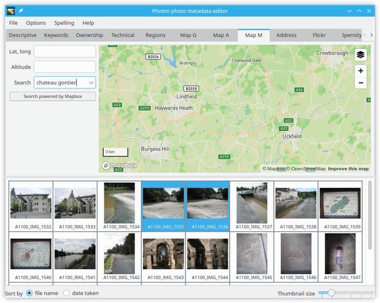
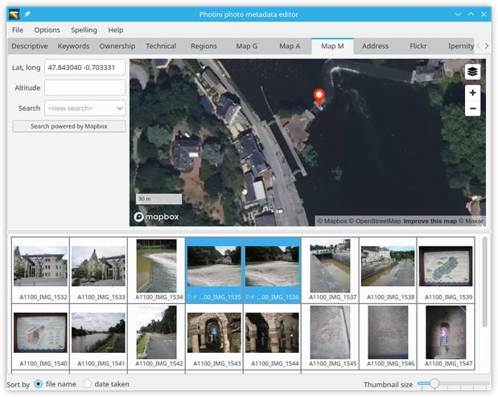
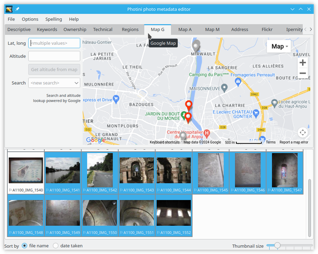
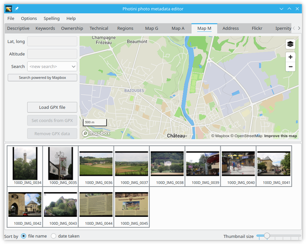
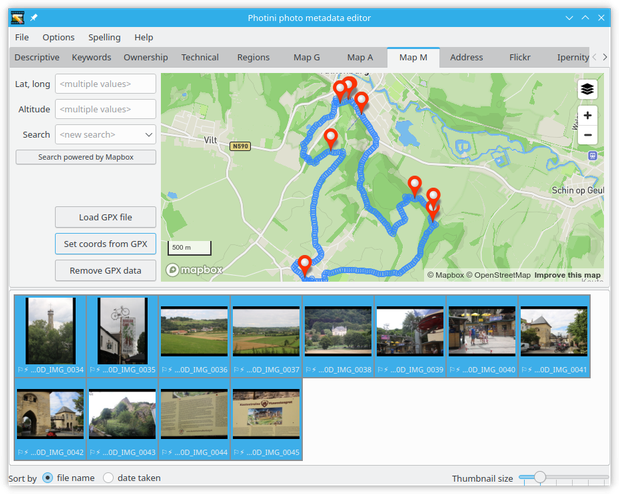

.. This is part of the Photini documentation.
   Copyright (C)  2012-24  Jim Easterbrook.
   See the file ../DOC_LICENSE.txt for copying conditions.

.. |nbsp| unicode:: 0xA0
    :trim:

Geotagging
==========

The map tabs allow you to set the location of where a photograph was taken.
Photini currently uses four different map providers: Google, Bing, Azure, and Mapbox/OpenStreetMap.
(Microsoft have announced that Bing Maps will be "retired" in June 2025. Azure Maps is its replacement.)
All four tabs have similar functionality, but have different styles and levels of detail.
Each map has a button to switch between map and aerial / satellite imagery.

.. image:: ../images/screenshot_130.png

The map initially displays the previously used location.
You can change the view by zooming in or out (with scroll wheel or the maps' buttons), or by panning the map by dragging it with the mouse.
However, it's usually easier to find a specific location by using the search facility.

Click on the ``<new search>`` edit box and type in a search term such as the name of a town, then press the 'return' key.
A drop down list of place names should appear, from which you can select one.
Note that the search box may be disabled for a few seconds after each search to limit the load on the map provider's servers.

.. image:: ../images/screenshot_132.png

The search is influenced by the current location shown on the map.
A search for 'newport' may return different results if the map is showing New York than if it's showing London.
You can do a world wide search, ignoring the current location, by clicking on the ``<widen search>`` item in the drop down list.
Alternatively you can drag the map to somewhere near where you want to be and then click on the ``<repeat search>`` item in the drop down list.

Each map provider has its own search facility.
You may get more useful results by switching to a different map tab.

.. image:: ../images/screenshot_133.png

Selecting one of the search results shows the selected location on the map.
The map's zoom level will be adjusted to include the entire area of the named place.

.. image:: ../images/screenshot_134.png

Having found the right town, you can then zoom in and pan around to find the exact location where your photograph was taken.

.. image:: ../images/screenshot_135.png

Using aerial / satellite imagery can help with this.

Now you can drag and drop your photograph onto the map to set its location.
To set the same location on multiple images, select them all and then drag and drop one of them.

.. |flag| unicode:: U+02690

Note that photographs that have location data are shown with a flag symbol (|flag|) in the image selector area.

The location coordinates are shown in the ``Lat, long:`` box.
These values are editable, so you can set the location of photographs directly, e.g. by copying and pasting from another one.
You can also adjust the location by dragging the marker on the map.
To clear a photograph's location data just delete the coordinates.

.. image:: ../images/screenshot_139.png

When several photographs have location metadata Photini will pan the map (and zoom out if required) to ensure all the selected images are shown on the map.
Selected images are shown with red markers.
Unselected images are shown with grey markers.

If you find the marker colours don't contrast well with your preferred map style or aerial photography then you can change their colours in Photini's :doc:`configuration <configuration>`.

As shown above, several images can have the same location.
A red marker is shown if any of the images is selected, but clicking on the marker will select all the images that have that location.

.. tip::
    If you have several images at one location, but need to move some of them to a different location, select the images to be moved in the image selector, then drag them onto their new position on the map.

Double clicking on a marker will select both it and the nearest marker.
Clicking three or more times in rapid succession will select three or more markers.
(Except on the Google map tab, which currently requires three clicks to select two markers, five clicks to select three markers, and so on.)

.. tip::
    If you have two closely spaced markers that you'd like to merge, double click to select both, then right-click on the location coordinates box to select one of the locations from the multiple values context menu.

.. image:: ../images/screenshot_140.png

Selecting another map tab will show the same location but with data and imagery from a different provider.

.. image:: ../images/screenshot_141.png

The ``Get altitude from map`` button sets the photograph's altitude (in metres) from its latitude and longitude, using data from the map provider.
Not all map providers have altitude data, and the accuracy varies quite a lot.
You can edit the value to correct it.

Map failures
------------

Some map tabs might fail to load, showing the above error message instead.
This could be because of problems with WebGL_, a sophisticated graphics system used in HTML |nbsp| 5.
Some of the map providers use WebGL to draw their maps, so if WebGL, or some feature of it, is missing the map won't load.

Problems with WebGL could be caused by having an incompatible graphics card or driver, or by the system configuration.
Clicking on the link in the error message might provide some useful diagnostic information.
You could also try choosing a different Qt package in Photini's :doc:`configuration <configuration>`.

GPX file import
---------------

If you have a mobile phone or other device with a GPS logger you may be able to set the approximate locations of photographs from logged GPS positions.
If you have installed gpxpy_ then the map pages have a button to import GPX files.

First you need to export your GPS log as a GPX_ (GPS eXchange format) file, then transfer the .gpx file to your computer.
Make sure your images have the correct time zone set so that Photini can calculate their UTC_ timestamps.

.. image:: ../images/screenshot_221.png

When a GPX file is imported its track points are displayed on the map as blue circles.
If the file has a large number of points, closely positioned in space or time, then not all of them are shown.

.. image:: ../images/screenshot_222.png

Selecting a photograph shows up to four track points in red.
These are points with time stamps around the time the photograph was taken.
The blue and red colours used can be changed in Photini's :doc:`configuration <configuration>`.

After zooming in on the red track points the photograph can be dragged to the map as usual.

.. image:: ../images/screenshot_224.png

Alternatively, the ``Set coords from GPX`` button can be used to set the latitude and longitude of the selected photograph to the nearest (in time) GPX track point.
Note that this also sets the altitude if your GPX file has altitude data.
This can be disabled in Photini's :doc:`configuration <configuration>`.

If multiple images are selected the ``Set coords from GPX`` button sets all their locations.

The usefulness of GPX data depends on the accuracy of your GPS tracker, and on your camera's clock accuracy.
You might want to adjust the timestamps in the :doc:`technical metadata <technical_metadata>` tab first.

When you've finished with the GPX track points they can be removed from the map with the ``Remove GPX data`` button.

Altitude considerations
-----------------------

The definition and measurement of altitude is made more complicated by the Earth not being exactly spherical, and its gravitational field not being completely uniform.
The GPS system uses a "World Geodetic System" known as `WGS 84`_.
This has had several `Earth Gravitational Models`_ (EGM) over the years, each of which has improved the accuracy of altitude data.

The GPS tracking app I use on my phone has an option to apply "EGM96 correction", which changes the altitude by 45 m at my home in the UK.
If your app has a similar option I recommend you enable it.

Bing Maps' altitude is corrected using the "EGM2008" model, according to their documentation.
Google Maps uses "local mean sea level".
They don't cite a standard and may be using their own measurements, or combining data from several sources.

I do not know which of these, if any, is correct for the GPS altitude in a photograph's Exif data.

.. _Earth Gravitational Models:
    https://en.wikipedia.org/wiki/Earth_Gravitational_Model
.. _gpxpy:         https://github.com/tkrajina/gpxpy
.. _GPX:           https://en.wikipedia.org/wiki/GPS_Exchange_Format
.. _UTC:           https://en.wikipedia.org/wiki/Coordinated_Universal_Time
.. _WebGL:         https://www.khronos.org/webgl/
.. _WGS 84:        https://en.wikipedia.org/wiki/World_Geodetic_System#WGS_84
