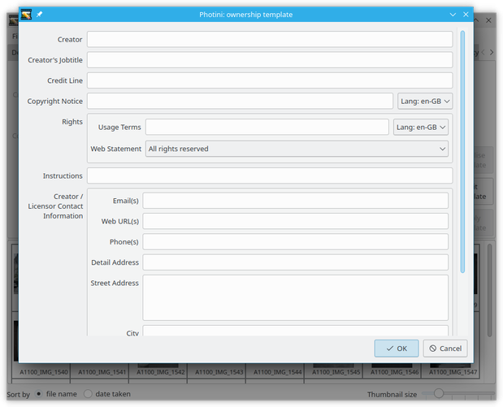

.. This is part of the Photini documentation.
   Copyright (C)  2021-22  Jim Easterbrook.
   See the file ../DOC_LICENSE.txt for copying condidions.

Ownership metadata
==================

The ``Ownership metadata`` tab (keyboard shortcut ``Alt+O``) allows you to edit ownership and copyright information about your photographs.

.. image:: ../images/screenshot_200.png

Most of this data will be the same for all your photographs, so Photini uses a "template" to apply the same text to all the selected images.
If your photographs already have some of this information (some cameras set the creator and copyright notice) you can copy it to the template by selecting one or more photographs and clicking on ``Initialise template``.
Otherwise use the ``Edit template`` button to open the dialog shown below.

Fill in any of the fields you want to use on every photograph.
The field labels are copied from the `IPTC standard`_, as is the help text which should pop up if you hover your mouse over a field.
Note that the ``Copyright Notice`` and ``Rights: Usage Terms`` fields can have alternative languages, as discussed in :ref:`alternative-languages`.

.. image:: ../images/screenshot_202.png

Note that you can insert the year in which a photograph was taken with ``%Y``.
This is probably only useful in the ``Copyright Notice``, but is available for all fields.
(You can actually use any directive recognised by the `Python strftime function`_, such as ``%m`` for month number or ``%B`` for the month name.)

.. image:: ../images/screenshot_203.png

The ``Rights: Web Statement`` field is a drop down list of `Creative Commons`_ licences which you can extend with any other licences you use.
The widget's context menu allows you to visit any of the licence URLs with your web browser.

Google Image Search displays the ``Creator``, ``Credit Line``, and ``Copyright Notice`` values alongside search results.
It also uses the ``Rights: Web Statement`` and ``Rights: Licensor URL`` to help people find images that can be licensed for reuse.
See the `Quick guide to IPTC Photo Metadata and Google Images`_ for more detail.

The ``Apply template`` button copies the template data to all the selected images, setting the correct year in the ``Copyright Notice``.
If you want to clear any of the images' existing ownership data when the template is applied, then set the corresponding template field to a single space.
You can then add more information, or edit the existing information, in the usual way.

More information about the data fields
--------------------------------------

Click on any field name below to see the IPTC definition and user notes for that field.
Although these fields are defined in an `IPTC standard`_, they are all stored in XMP metadata.
Some of them are also stored in "legacy" IPTC-IIM data.

`Creator <http://www.iptc.org/std/photometadata/specification/IPTC-PhotoMetadata#creator>`_
  Usually the photographer's name.
  If there is more than one creator, separate them with a ``;`` character.
`Creator's Jobtitle <http://www.iptc.org/std/photometadata/specification/IPTC-PhotoMetadata#creators-jobtitle>`_
  Job title of the first creator.
  Do not fill in this field unless the creator field is filled in.
`Credit Line <http://www.iptc.org/std/photometadata/specification/IPTC-PhotoMetadata#credit-line>`_
  Usually the photographer's name, but could be their employer or client.
`Copyright Notice <http://www.iptc.org/std/photometadata/specification/IPTC-PhotoMetadata#copyright-notice>`_
  Who owns the copyright.
`Rights: Usage Terms <http://www.iptc.org/std/photometadata/specification/IPTC-PhotoMetadata#rights-usage-terms>`_
  Plain text summary of how the image may be reused.
  Not stored in IPTC-IIM.
`Rights: Web Statement <http://www.iptc.org/std/photometadata/specification/IPTC-PhotoMetadata#web-statement-of-rights>`_
  URL of a web page describing the usage rights of an image.
  `All rights reserved`_ is shown for any image with no URL set.
  Not stored in IPTC-IIM.
`Rights: Licensor URL <http://www.iptc.org/std/photometadata/specification/IPTC-PhotoMetadata#licensor>`_
  URL of a person or company who can grant a right to reuse the image.
  Not stored in IPTC-IIM.
`Instructions <http://www.iptc.org/std/photometadata/specification/IPTC-PhotoMetadata#instructions>`_
  Notes to a publisher of the image.
`Contact Information <http://www.iptc.org/std/photometadata/specification/IPTC-PhotoMetadata#creators-contact-info>`_
  Only the `Address <http://www.iptc.org/std/photometadata/specification/IPTC-PhotoMetadata#address>`_ is stored in IPTC-IIM.
  Multiple email addresses, URLs, or phone numbers should be separated by commas.

.. _All rights reserved: https://en.wikipedia.org/wiki/All_rights_reserved
.. _Creative Commons: https://creativecommons.org/licenses/
.. _IPTC standard:
    http://www.iptc.org/std/photometadata/specification/IPTC-PhotoMetadata
.. _Python strftime function:
    https://docs.python.org/3.6/library/datetime.html#strftime-strptime-behavior
.. _Quick guide to IPTC Photo Metadata and Google Images:
    https://iptc.org/standards/photo-metadata/quick-guide-to-iptc-photo-metadata-and-google-images/
