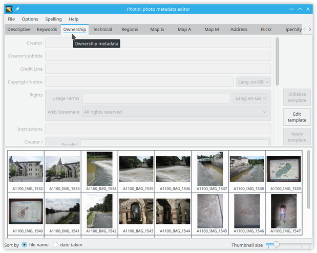
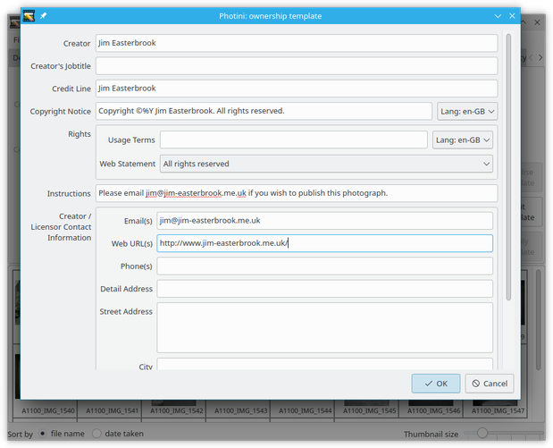
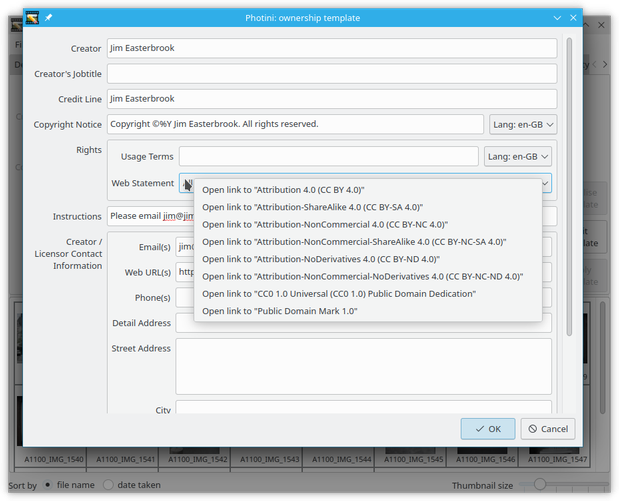

.. This is part of the Photini documentation.
   Copyright (C)  2021  Jim Easterbrook.
   See the file ../DOC_LICENSE.txt for copying condidions.

Ownership metadata
==================

The ``Ownership metadata`` tab (keyboard shortcut ``Alt+O``) allows you to edit ownership and copyright information about your photographs.

Most of this data will be the same for all your photographs, so Photini uses a "template" to apply the same text to all the selected images.
The ``Edit template`` button opens the dialog shown below.

.. image:: ../images/screenshot_201.png

Fill in any of the fields you want to use on every photograph.
The field labels are copied from the `IPTC standard`_, as is the help text which should pop up if you hover your mouse over a field.
If you have already set your copyright holder and creator names on the :doc:`descriptive_metadata` tab then this information should already be on the form.

Note that you can insert the year in which a photograph was taken with ``%Y``.
This is probably only useful in the ``Copyright Notice``, but is available for all fields.
(You can actually use any directive recognised by the `Python strftime function`_, such as ``%m`` for month number or ``%B`` for the month name.)

The ``Apply template`` button copies the template data to all the selected images, setting the correct year in the ``Copyright Notice``.
If you want to clear any of the images' existing ownership data when the template is applied, then set the corresponding template field to a single space.
You can then add more information, or edit the existing information, in the usual way.

More information about the data fields
^^^^^^^^^^^^^^^^^^^^^^^^^^^^^^^^^^^^^^

Click on any field name below to see the IPTC definition and user notes for that field.
Although these fields are defined in an `IPTC standard`_, they are all stored in XMP metadata.
Most of them are also stored in "legacy" IPTC-IIM data.

`Creator <http://www.iptc.org/std/photometadata/specification/IPTC-PhotoMetadata#creator>`_
  Usually the photographer's name.
  If there is more than one creator, separate them with a ``;`` character.
  This shows the same information as the :doc:`descriptive_metadata` ``Creator / Artist`` field.
`Creator's Jobtitle <http://www.iptc.org/std/photometadata/specification/IPTC-PhotoMetadata#creators-jobtitle>`_
  If there is more than one creator, there should be a matching number of creator jobtitles, separated by ``;`` characters.
`Credit Line <http://www.iptc.org/std/photometadata/specification/IPTC-PhotoMetadata#credit-line>`_
  Usually the photographer's name, but could be their employer or client.
`Copyright Notice <http://www.iptc.org/std/photometadata/specification/IPTC-PhotoMetadata#copyright-notice>`_
  Who owns the copyright.
  This shows the same information as the :doc:`descriptive_metadata` ``Copyright`` field.
`Rights Usage Terms <http://www.iptc.org/std/photometadata/specification/IPTC-PhotoMetadata#rights-usage-terms>`_
  Not stored in IPTC-IIM.
`Instructions <http://www.iptc.org/std/photometadata/specification/IPTC-PhotoMetadata#instructions>`_
  Notes to a publisher of the image.
`Contact Information <http://www.iptc.org/std/photometadata/specification/IPTC-PhotoMetadata#creators-contact-info>`_
  Only the `Address <http://www.iptc.org/std/photometadata/specification/IPTC-PhotoMetadata#address>`_ is stored in IPTC-IIM.
  Multiple email addresses, URLs, or phone numbers should be separated by commas.

.. _IPTC standard:            http://www.iptc.org/std/photometadata/specification/IPTC-PhotoMetadata
.. _Python strftime function: https://docs.python.org/3.6/library/datetime.html#strftime-strptime-behavior
