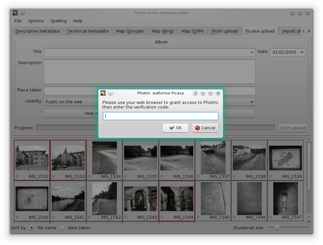
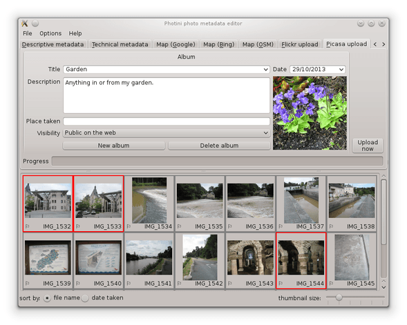
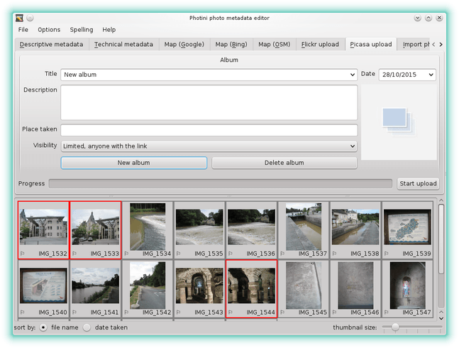
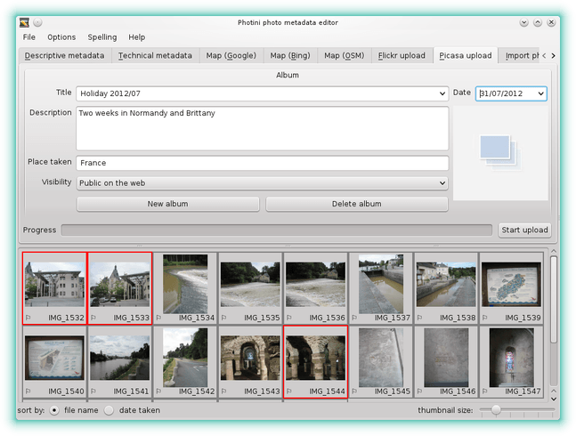
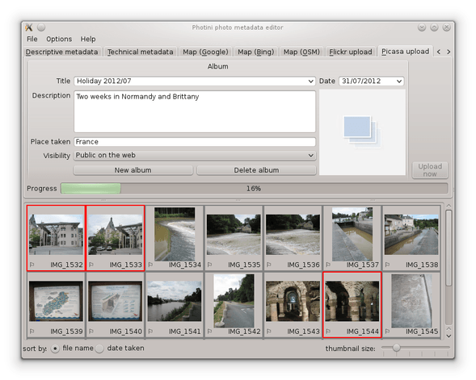
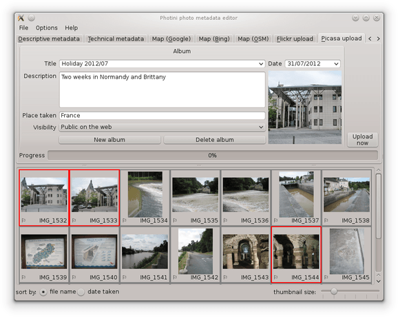

.. This is part of the Photini documentation.
   Copyright (C)  2012-16  Jim Easterbrook.
   See the file ../DOC_LICENSE.txt for copying condidions.

Google Photos / Picasa uploader
===============================

The ``Google Photos upload`` tab (keyboard shortcut ``Alt+P``) allows you to upload your photographs to `Google Photos <https://photos.google.com/>`_ and `Picasa Web Albums <https://picasaweb.google.com/>`_.
Although it was originally written as a Picasa uploader, it also uploads to Google Photos.

Unlike some other uploaders, Photini uses the descriptive metadata you've created to set the photo's title and tags.
This means you don't have to retype all that information!

Note that the Google Photos upload tab is only enabled if you have installed the relevant libraries.
See :ref:`installation <installation-picasa>` for more detail.

The first time you select Photini's Google Photos upload tab it will ask you to authorise Photini to access Google Photos.
It does this by connecting your web browser to Google, from where you can log in and give Photini permission to access Google Photos on your behalf.
You then copy a verification code from your browser to Photini, as shown below.

Every image uploaded to Google Photos has to be stored in a "collection" or "album".
You can select one of your existing albums from the drop down list (next to the "title" label) or you can create a new album by clicking on the ``New album`` button.

The title, description and other attributes of an album can be changed simply by editing the appropriate fields.
Note that Google Photos does not display the description or location of a collection / album.
(The album cover photograph cannot be changed due to a restriction in the API. You need to log into Picasa with a web browser to change it.)

To upload one or more photographs to Google Photos, select them in the image selector area, then click on the ``Start upload`` button.
During uploading Photini displays a progress bar.
Uploading takes place in the background, so you can continue to use other tabs while the upload is in progress.

The first image uploaded to a new album becomes the album's cover image.

