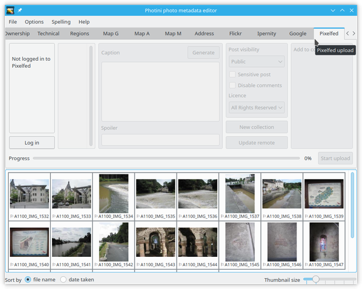
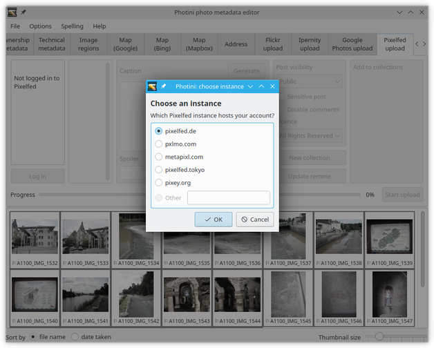
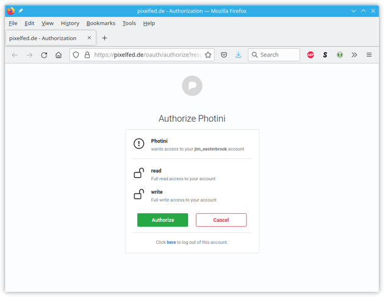
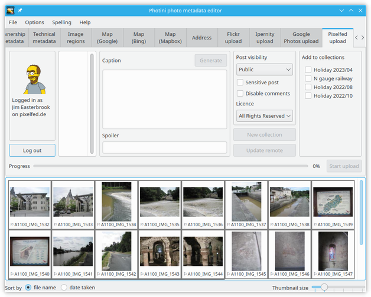
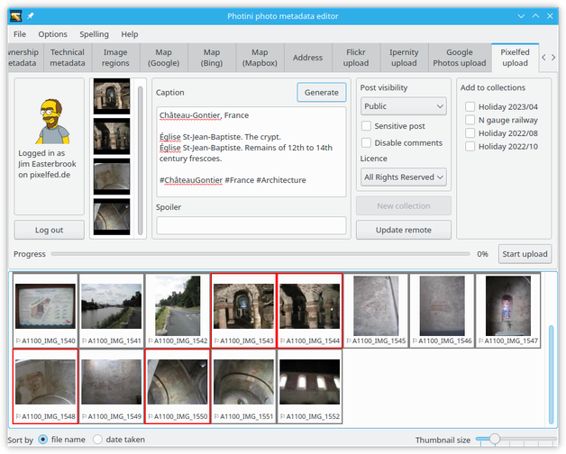
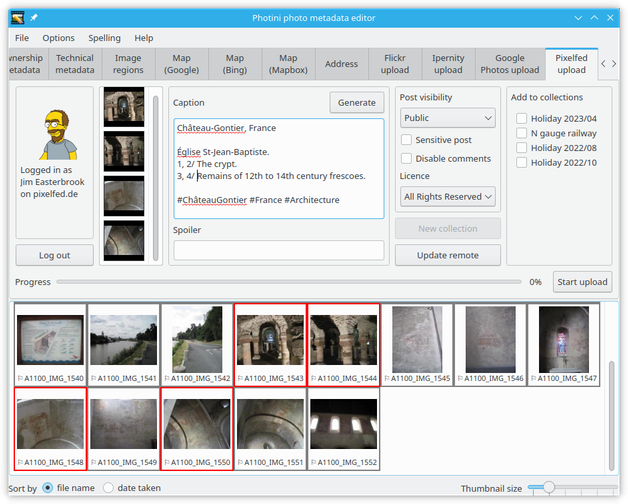
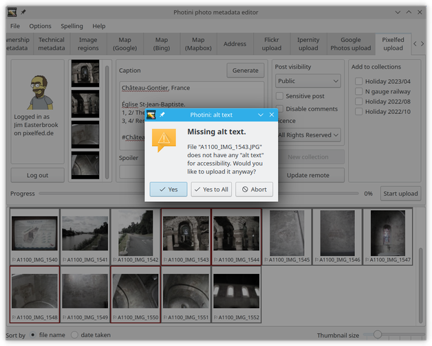
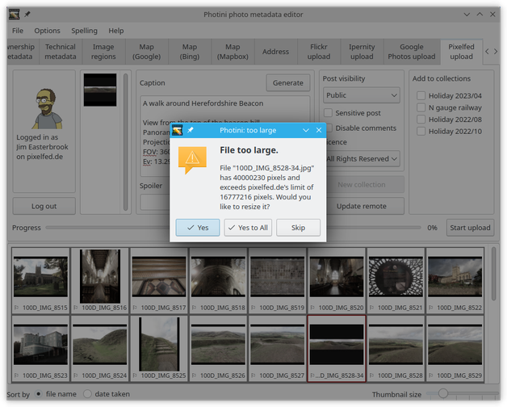

.. This is part of the Photini documentation.
   Copyright (C)  2023  Jim Easterbrook.
   See the file ../DOC_LICENSE.txt for copying condidions.

Pixelfed uploader
=================

The ``Pixelfed upload`` tab (keyboard shortcut ``Alt+P``) allows you to upload your photographs to Pixelfed_, an open source decentralised photo sharing system.
Pixelfed is built on the same federated publishing system as Mastodon_ and the uploader can also be used with Mastodon, but with some features disabled.

Note that the Pixelfed upload tab is only enabled if you have installed some extra software packages.
See :ref:`installation <installation-optional>` for more detail.

Initially most of the Pixelfed uploader tab is disabled.
It's only usable after you've authorised Photini to access your Pixelfed account by clicking the ``Log in`` button.

The first time you click ``Log in`` Photini asks you to choose a Pixelfed "instance" (or server) where you have an account.
Photini already knows a few popular instances, but you can choose another by putting its domain name in the ``other`` box.

After choosing an instance Photini opens a page in your web browser where you can log in to your Pixelfed account and then authorise Photini to access it.

If the authorisation is successful Photini displays your Pixelfed user name and profile picture.
You should not need to redo this authorisation process unless you click the ``Log out`` button.

After logging in most of the Pixelfed uploader interface is enabled.
However some features remain disabled if they are not available with the software version running on the chosen instance.

.. image:: ../images/screenshot_255.png

When you select some pictures to upload they are shown in the column to the right of your user details.
The number of pictures you can upload in one go depends on the instance.
Pixelfed instances usually allow twelve, but Mastodon instances only allow four.

The pictures are uploaded, and displayed on Pixelfed, in the order you selected them.
Using the ``Ctrl`` key while clicking in the image selector area allows you to choose them one at a time.

The ``Generate`` button creates a caption for the uploaded pictures based on their title, headline, description, and keywords metadata.

You will almost certainly want to edit the generated text to make a good caption.

If you want to hide your pictures from users until they choose to see them (e.g. if the pictures are "not suitable for work") you can check ``Sensitive post`` and optionally write some text in the ``Spoiler`` box.
You can add the post to up to three of your "collections" by checking their tick-boxes.

Clicking the ``Start upload`` button uploads each picture and then posts a Pixelfed "status" with your pictures and caption.

If your Pixelfed account settings have ``require media descriptions`` set then Photini will warn you if the picture you are uploading does not have "alt text" set.
(See :doc:`descriptive_metadata` for more about alt text.)
You can abort the upload and edit your photograph's alt text, or you can carry on and upload without alt text.

If you add alt text later on you can use the ``Update remote`` button to copy the updated alt text to a previously uploaded picture.
This is not available on Mastodon instances, and your updated alt text might not propagate to all federated instances if they have already cached your picture.

Pixelfed instances have maximum allowed image sizes, both pixel count and bytes in the file.
If your image is too large, and is in a format Photini can process, Photini will offer to resize it for you.
For best picture quality Photini will use Pillow_ if it is installed.

.. _Mastodon: https://joinmastodon.org/
.. _Pillow:   http://pillow.readthedocs.io/
.. _Pixelfed: https://pixelfed.org/
