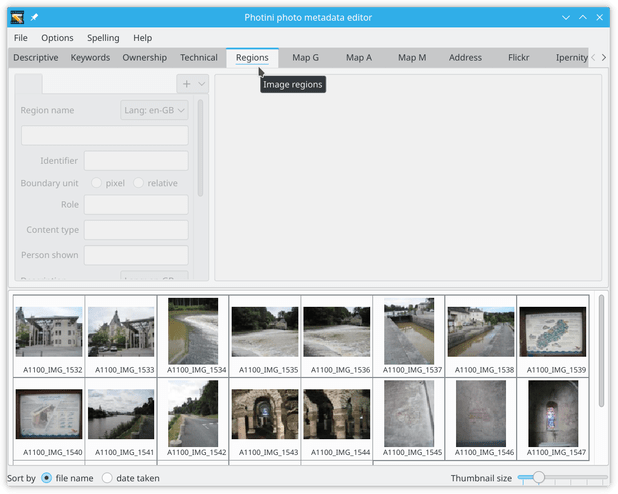
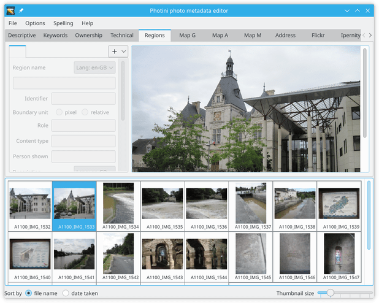
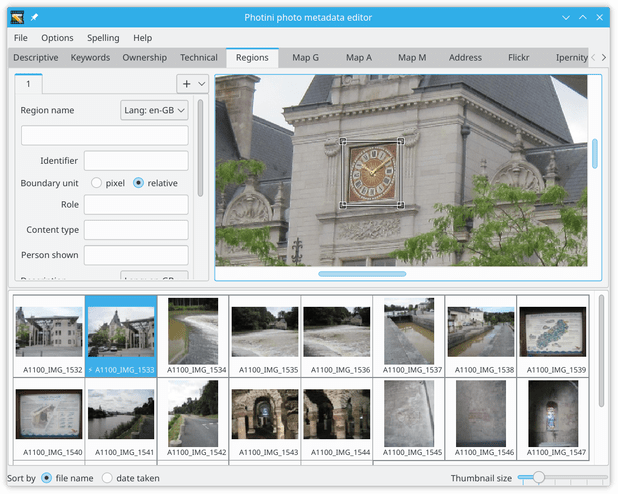
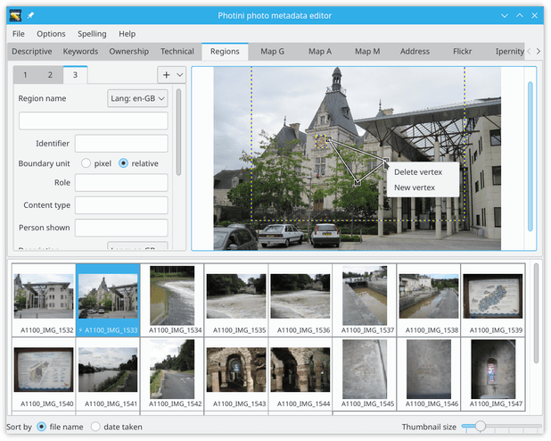
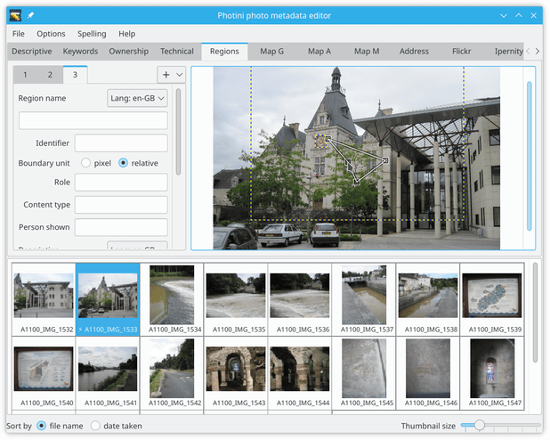

.. This is part of the Photini documentation.
   Copyright (C)  2023-24  Jim Easterbrook.
   See the file ../DOC_LICENSE.txt for copying condidions.

Image regions
=============

The ``Image regions`` tab (keyboard shortcut ``Alt+R``) allows you to select part of a picture and label it with metadata.
This can be useful to identify people in a photograph, or to mark which part of the photograph should remain visible if the image is cropped.
The `IPTC User Guide`_ discusses possible uses of image regions in more detail.

Photini stores image regions in both IPTC_ and MWG_ (Metadata Working Group) formats.
(Both are stored in the XMP metadata.)
The MWG format is older and less capable than the IPTC format, for example it cannot store polygonal regions, but it may be compatible with more software.

The user interface is disabled until one image file is selected.

The image is shown on the right hand side in a scrollable area.
On the left are one or more tabs showing metadata for each image region.

.. note::
    You should avoid using "raw" image format photographs as these are often slightly larger than the intended display size.
    This could lead to errors in the size and position of image regions.
    Photini attempts to use the correct area of raw photographs, but this cannot be guaranteed to work in all cases.

.. image:: ../images/screenshot_272.png

.. |plus| unicode:: U+002b

To create a new region, click on the |plus| button and select a region shape.
(To delete a region, right-click on its tab and select ``Delete region``.)

.. image:: ../images/screenshot_273.png

The new region (a rectangle in this example) is initially placed at the centre of the image.

The small squares at each corner of the rectangle can be dragged to change the size and shape.
The entire region can be dragged by clicking within it.

This is made easier if you zoom in by holding down the ``Ctrl`` key while scrolling with the mouse scroll wheel.
(The zoom can also be adjusted with ``Ctrl-Plus`` and ``Ctrl-Minus`` key combinations.)

.. image:: ../images/screenshot_276.png

The most important metadata for a region is probably its "role_".
This is chosen from a "controlled vocabulary" defined by the IPTC.
Photini shows the IPTC names and definitions (as "tooltips") in a drop down menu when you click on the ``Role`` entry.
You can select one or more roles from the list.

Other, less useful, metadata includes a name and identifier for the region.

.. image:: ../images/screenshot_276a.png

The `content type`_ is another controlled vocabulary that allows you to say what's special about the selected area.
The upper part shows the IPTC controlled vocabulary.
The most useful of these is probably ``human``.
The lower part shows MWG "types".
These are primarily intended for use by automatic systems such as face detectors and camera autofocus.

.. image:: ../images/screenshot_277.png

The IPTC and MWG specifications allow any other metadata to be attached to a region.
Photini includes ``Person shown`` and ``Description``, which I think are most likely to be useful.
Names in the ``Person shown`` box are also added to the :doc:`descriptive_metadata` tab's ``Person(s) shown`` box.

Rectangular subject area regions with a description or person's name attached are used by the :doc:`flickr` and :doc:`ipernity` to create "notes".
Please let me know if there is any other metadata you would like to be added.

.. image:: ../images/screenshot_278.png

It can be useful to set cropping regions for an image.
Many social media web sites crop images, typically to square or 16:9 aspect ratio landscape.
This often causes problems such as decapitated bodies.

Note that the unselected region is shown with a blue & yellow dashed outline.
You can select an unselected region by clicking on it.

.. image:: ../images/screenshot_279.png

The polygon region is initially a triangle shape.
Right-clicking on one of its vertices allows a vertex to be added or deleted.
Note that polygon refions are not saved in MWG metadata.

A vertex can also be added by right-clicking anywhere within the polygon.

Vertices can be added to make shapes of arbitrary complexity.
Is this useful for anything?

.. _content type:
    https://cv.iptc.org/newscodes/imageregiontype/
.. _IPTC:
    http://www.iptc.org/std/photometadata/specification/IPTC-PhotoMetadata#image-region
.. _IPTC User Guide:
    https://www.iptc.org/std/photometadata/documentation/userguide/#_image_regions
.. _MWG:
    https://en.wikipedia.org/wiki/Metadata_Working_Group
.. _role:
    https://cv.iptc.org/newscodes/imageregionrole/
