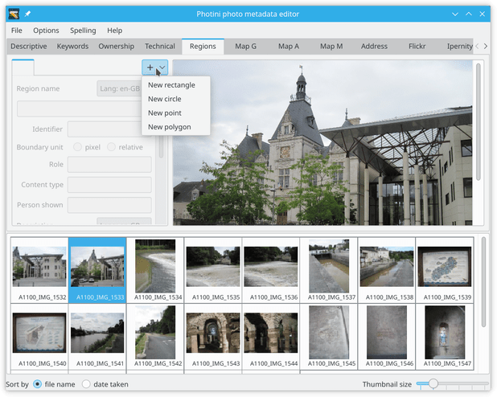
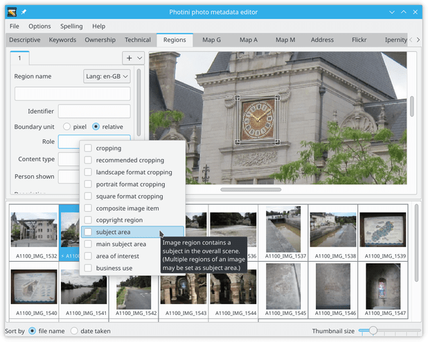
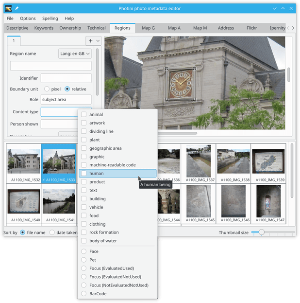
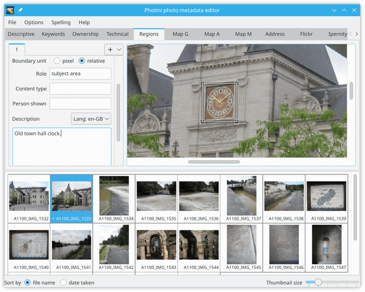
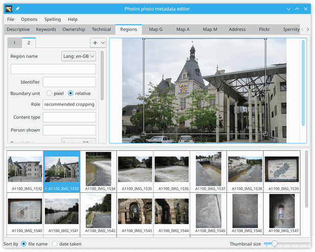

.. This is part of the Photini documentation.
   Copyright (C)  2023  Jim Easterbrook.
   See the file ../DOC_LICENSE.txt for copying condidions.

Image regions
=============

The ``Image regions`` tab (keyboard shortcut ``Alt+R``) allows you to select part of a picture and label it with metadata.
This can be useful to identify people in a photograph, or to mark which part of the photograph should remain visible if the image is cropped.
The `IPTC User Guide`_ discusses possible uses of image regions in more detail.

.. image:: ../images/screenshot_270.png

The user interface is disabled until one image file is selected.

.. image:: ../images/screenshot_271.png

The image is shown on the right hand side in a scrollable area.
On the left are one or more tabs showing metadata for each image region.

To create a new region, right-click on the region info tab bar and select the region shape.
This same context menu can also be used to delete regions.

The new region is initially placed at the centre of the image.

.. image:: ../images/screenshot_274.png

The small squares at each corner of the rectangle can be dragged to change the size and shape.
The entire region can be dragged by clicking within it.

.. image:: ../images/screenshot_275.png

The most important metadata for a region is probably its "role".
This is chosen from a "`controlled vocabulary`_" defined by the IPTC.
Photini shows the IPTC names and definitions (as "tooltips") in a drop down menu when you click on the ``Role`` entry.
You can select one or more roles from the list.

Other, less useful, metadata includes a name and identifier for the region.
The ``Content type`` is another controlled vocabulary that allows you to say what's special about the selected area.
The most useful of these is probably ``human``.

The IPTC specification allows any other metadata to be attached to a region.
Photini includes ``Person shown`` and ``Description``, which I think are most likely to be useful.
Rectangular subject area regions with a description or person's name attached are used by the :doc:`flickr` and :doc:`ipernity` to create "notes".
Please let me know if there is anything you would like to be added.

It can be useful to set cropping regions for an image.
Many social media web sites crop images, typically to square or 16:9 aspect ratio landscape.
This often causes problems such as decapitated bodies.

The polygon region is initially a triangle shape.
Right-clicking on one of its vertices allows a vertex to be added or deleted.

A vertex can also be added by right-clicking anywhere within the polygon.

.. image:: ../images/screenshot_280.png

Vertices can be added to make shapes of arbitrary complexity.
Is this useful for anything?

.. _controlled vocabulary:
    https://cv.iptc.org/newscodes/imageregionrole/
.. _IPTC User Guide:
    https://www.iptc.org/std/photometadata/documentation/userguide/#_image_regions
