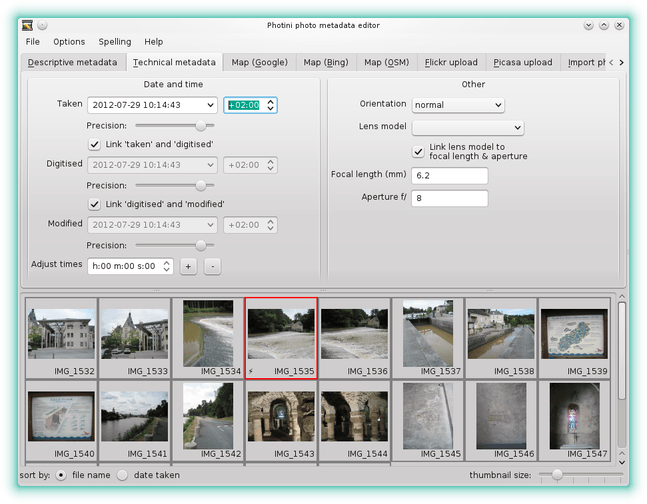
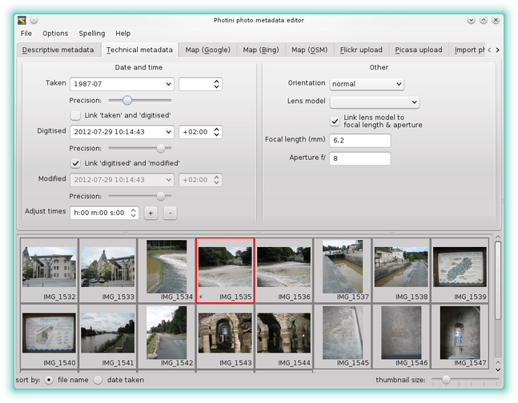
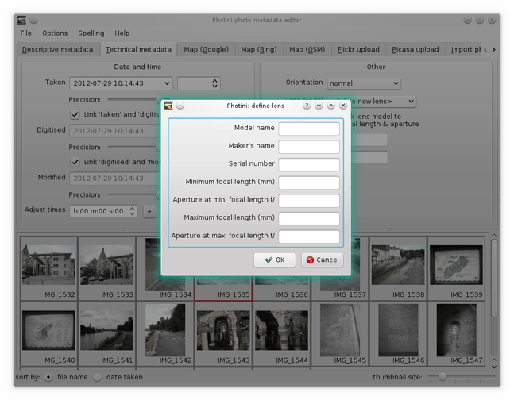
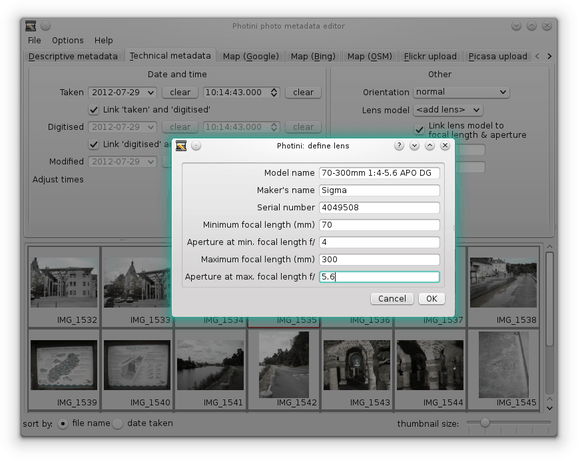

.. This is part of the Photini documentation.
   Copyright (C)  2012-15  Jim Easterbrook.
   See the file ../DOC_LICENSE.txt for copying conditions.

Technical metadata
==================

The ``Technical metadata`` tab (keyboard shortcut ``Alt+T``) allows you to edit 'technical' information about your photographs, such as the date & time they were taken.
Generally you should not need to edit any of this data, as it should have been correctly set by your camera.

.. image:: ../images/screenshot_12.png

The GUI shows three date/time entries - ``taken``, ``digitised`` and ``modified``.
These are often the same, and are linked by the ``link ...`` check boxes.
These allow you to change all three when you change the ``taken`` date/time.

You may wish to unlink the three entries and adjust the dates or times separately.
For example, you could use the ``modified`` entry to note when you have edited the metadata with Photini.
If you scan some old photographs you should set the ``taken`` entry to when the photographs were taken and the ``digitised`` entry to when you scanned them.

The date can be picked from a calendar widget that pops up when you click on the down arrow in a date/time entry.
Clicking on any of the numbers allows them to be adjusted with your keyboard up & down arrow keys.
You can also double click on any of the numbers to select it and type a new value in directly.

To the right of each date/time is a widget to adjust the time zone.
The time a photograph was taken is assumed to be "local time".
The time zone records how many hours & minutes offset from UTC (or GMT) the local time zone was when the photograph was taken, digitised or modified.

Below each date/time is a slider that allows you to set the precision.
At its maximum value the time is shown to a precision of 1 millisecond.
Cameras that can take more than one photograph per second need this precision!
Moving the slider to the left removes parts of the date & time.
For example, you may know the date when an old photograph was taken but not the time.
You might only know the year it was taken in.
Setting the precision allows you to record this uncertainty.

The ``Adjust times`` field allows a constant offset to be applied to the time stamps of several pictures at once.
This can be useful if you forgot to set your camera's clock before a day's shooting!
Set the required offset hours, minutes & seconds, then use the ``+`` or ``-`` button to add or subtract that amount from each selected picture's timestamp.

The ``Orientation`` value sets the required rotation or reflection to display the image.
Note that this does not actually transform the image data.
Image display programs should rotate or reflect the image according to the orientation metadata, but not all of them do.

The ``Lens model`` dropdown list allows you to change the lens specification stored in the image metadata.
This should usually be left blank for cameras with non-removable lenses, but may be useful if you have an SLR that you use with lenses that its electronics doesn't recognise.

If the ``Link lens model ...`` tick-box is selected when you change the lens model then the focal length and aperture will be adjusted to fit the lens specification.
The focal length and aperture can also be edited directly, regardless of the tick-box status.

Lens details already in a photograph's metadata are automatically added to the list when the photograph is loaded.
If your camera doesn't record the details of some lenses you can add them by selecting ``<define new lens>`` from the dropdown list.

This brings up a dialog box for you to enter the lens details.
You might want to start by dragging the edge of the box to make the text fields a bit larger.
Type all the relevant information into the appropriate boxes, leaving blank any information you don't have such as the serial number.
Only the ``Model name`` and ``Minimum focal length`` are required.

The data you enter is stored in the Photini configuration file so you can easily apply it to images in future by selecting the lens you have defined from the dropdown list.
To remove a lens from the list right-click on it to bring up its context menu.
This includes options to delete any lens but the one currently in use.
