.. This is part of the Photini documentation.
   Copyright (C)  2012-21  Jim Easterbrook.
   See the file ../DOC_LICENSE.txt for copying conditions.

Technical metadata
==================

The ``Technical metadata`` tab (keyboard shortcut ``Alt+T``) allows you to edit 'technical' information about your photographs, such as the date & time they were taken and the lens that was used (if your camera has interchangable lenses).
You can also set the image orientation, which is useful if your camera doesn't set it correctly.
(This often happens to me when taking pictures looking almost straight up or down.)
I also like to set the time zone of all my pictures, especially when I'm holidaying in another country.

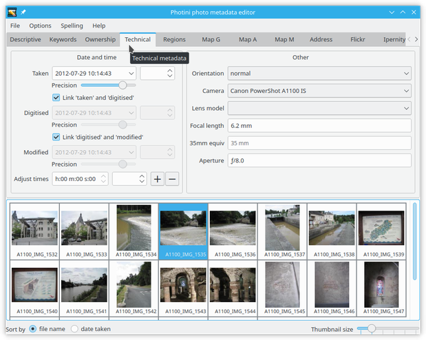

The GUI shows three date/time entries - ``taken``, ``digitised`` and ``modified``.
These are often the same, and are linked by the ``link ...`` check boxes.
These allow you to change all three when you change the ``taken`` date/time.

You may wish to unlink the three entries and adjust the dates or times separately.
For example, you could use the ``modified`` entry to note when you have edited the metadata with Photini.
If you scan some old photographs you should set the ``taken`` entry to when the photographs were taken and the ``digitised`` entry to when you scanned them.

The date can be picked from a calendar widget that pops up when you click on the down arrow in a date/time entry.
Clicking on any of the numbers allows them to be adjusted with your keyboard up & down arrow keys.
You can also double click on any of the numbers to select it and type a new value in directly.
Selecting all the numbers, e.g. with ``Ctrl+A``, allows them to be deleted which removes the date & time metadata from the photograph(s).

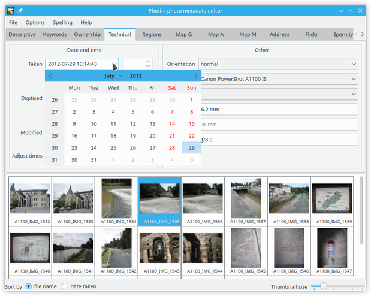

To the right of each date/time is a widget to adjust the time zone.
The time a photograph was taken is assumed to be "local time".
The time zone records how many hours & minutes offset from UTC (or GMT) the local time zone was when the photograph was taken, digitised or modified.

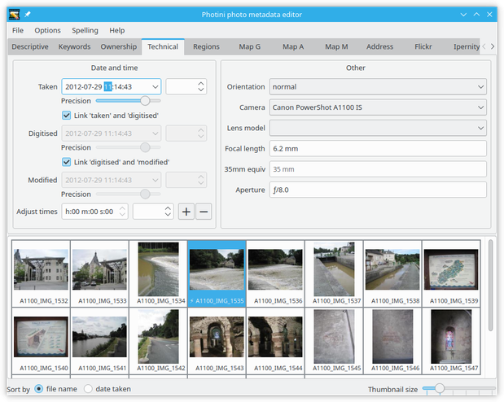

The ``Adjust times`` field allows a constant offset to be applied to the ``taken`` time stamps of several pictures at once.
(The other time stamps are also adjusted if the ``link ...`` boxes are checked.)
This can be useful if you are in a different time zone to your camera's setting or you forgot to set your camera's clock before a day's shooting!
Set the required offset hours, minutes & seconds, then use the ``+`` or ``-`` button to add or subtract that amount from each selected picture's timestamp.

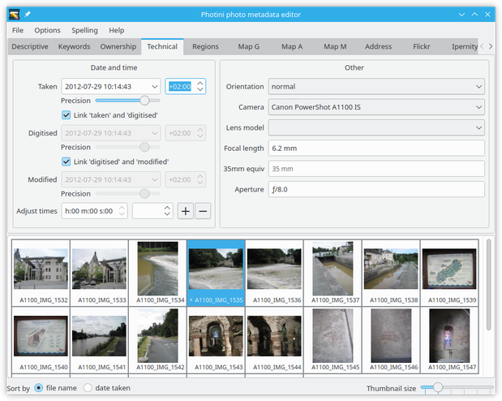

You can also offset the time zone.
In this example my camera clock was set to British Summer Time (+01:00) but records timestamps without zone information.
I was on holiday in mainland Europe (+02:00) so I need to add 1 hour to each timestamp and 2 hours to the time zone.
The ``Adjust times`` values are stored in Photini's configuration file, so each day's photos can be given the same offset with just one button click.

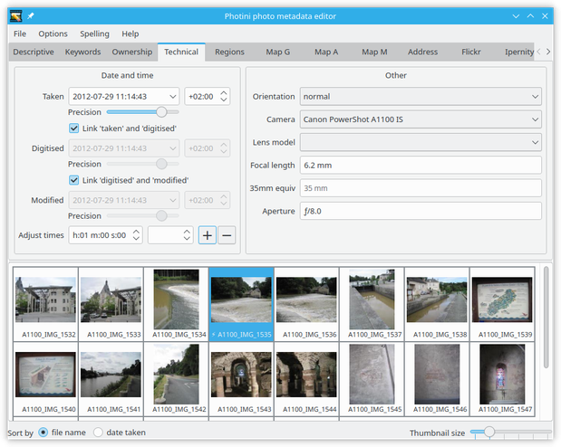

Below each date/time is a slider that allows you to set the precision.
At its maximum value the time is shown to a precision of 1 millisecond.
Cameras that can take more than one photograph per second need this precision!
Moving the slider to the left removes parts of the date & time.
This is useful for scans of old photographs where, for example, you might only know the year and month it was taken in.
Setting the precision allows you to record this uncertainty.

The ``Orientation`` value sets the required rotation or reflection to display the image.
Note that this does not actually transform the image data.
Image display programs should rotate or reflect the image according to the orientation metadata, but not all of them do.

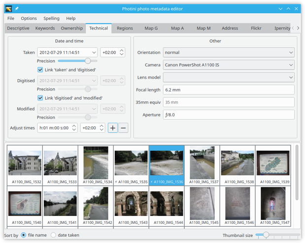

The ``Camera`` dropdown list shows the camera model and serial number, if known.
You can choose a different camera from the list, or click on ``<new>`` to add another camera.

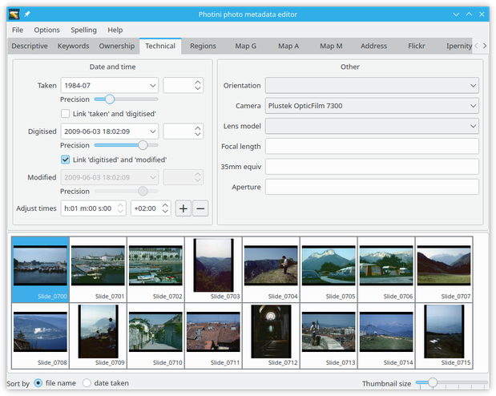

It is quite common for the maker's name to appear in the model name, as shown here, but it doesn't have to.
The serial number is optional, but could be useful if you have more than one of the same model of camera.

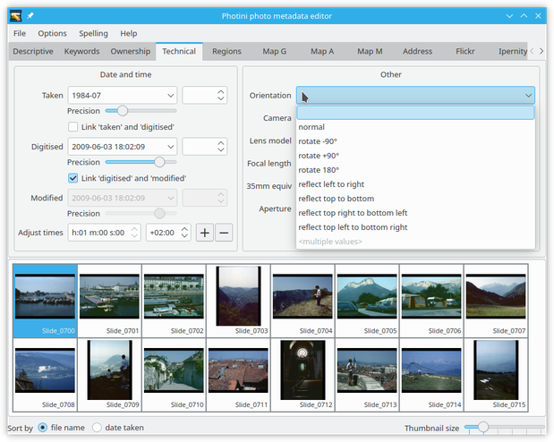

After changing the camera you may see this warning message.
The makernote_ is a block of proprietary data stored in a photograph's Exif metadata.
If you change the camera maker then other software (such as the libexiv2 package used by Photini) may no longer be able to decode the makernote.
Deleting the makernote prevents any such errors, but if you have any proprietary software that uses the makernote it may no longer work correctly.

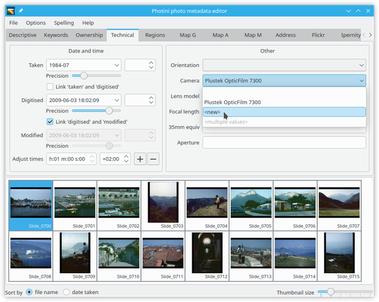

The ``Lens model`` dropdown list allows you to change the lens specification stored in the image metadata.
This should not usually be changed for cameras with non-removable lenses, but may be useful if you have an SLR that you use with lenses that its electronics doesn't recognise.

This is particularly useful if you use your camera with 3rd party lenses and/or telescopes via a T-thread adaptor.
My adaptor identifies itself to the camera as a 50mm f/1.8 lens.
Here I've used it with my 500mm mirror lens to take some pictures of the moon.

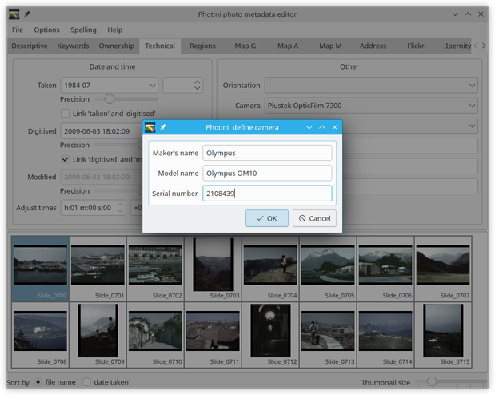

Selecting ``<new>`` from the dropdown list allows me to enter details of my mirror lens.
As it is not a zoom lens there is no need to fill in the maximum focal length details.
Only the ``Model name`` and ``Minimum focal length`` are required information.

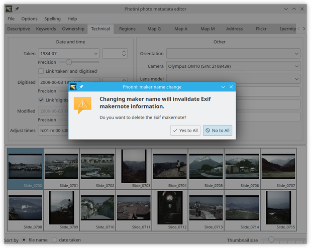

The data you enter is stored in the Photini configuration file so you can easily apply it to images in future by selecting the lens you have defined from the dropdown list.

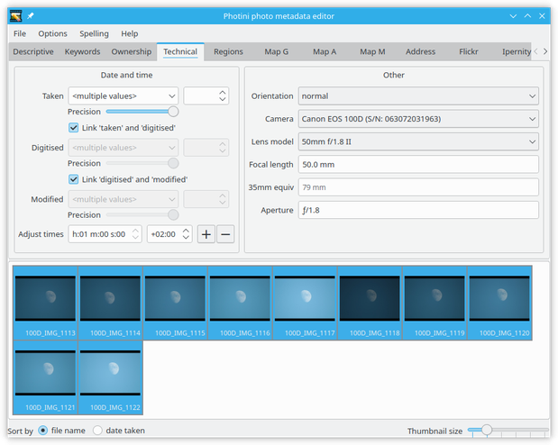

When the lens model is changed Photini offers the option to adjust the focal length and aperture used for each image, if the current values are inconsistent with the new lens.
In this case I definitely do want to update these parameters so I click on ``Yes``.

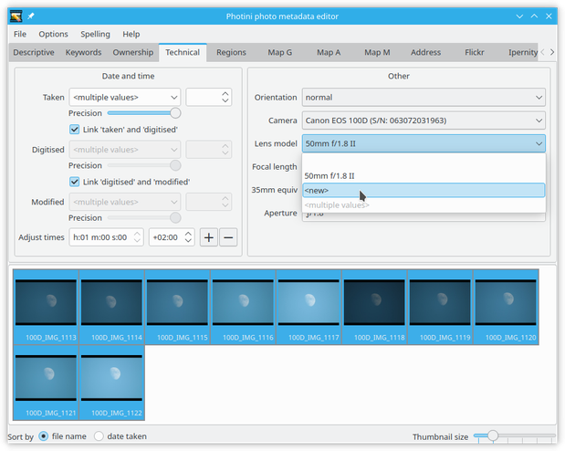

When the mouse pointer is held over the lens model dropdown for a few seconds a "tooltip" shows the focal length and aperture details of the lens.
This can be useful if they're not obvious from the lens model name.

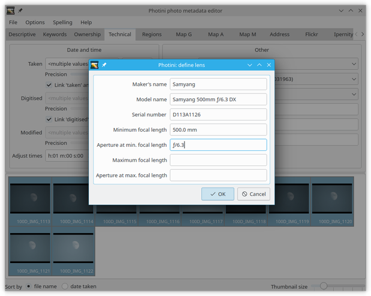

To remove a lens from the list right-click on the list to bring up its context menu.
This includes options to delete any lens but the one currently in use.

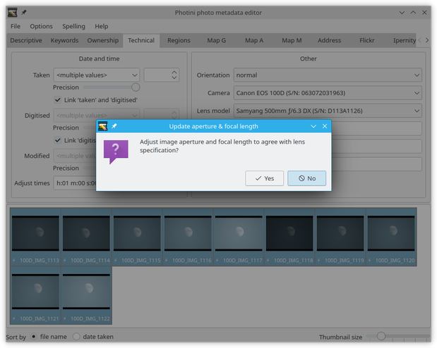

The ``35mm equiv`` field shows the "`35mm equivalent focal length <https://en.wikipedia.org/wiki/35_mm_equivalent_focal_length>`_" of the actual focal length.
These two numbers are related by the camera's "`crop factor <https://en.wikipedia.org/wiki/Crop_factor>`_".
Some cameras store both focal length numbers in the image metadata.
In this case both numbers are shown normally.
If the 35mm equivalent focal length is not present Photini attempts to calculate it from the actual focal length and other metadata.
These calculated values are shown in faint text.

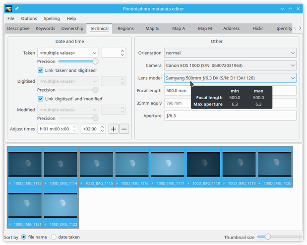

If you know your camera's crop factor you can correct Photini's calculation by typing in the correct 35mm equivalent focal length.
Photini will then store the crop factor for that camera model in its config file for future use.

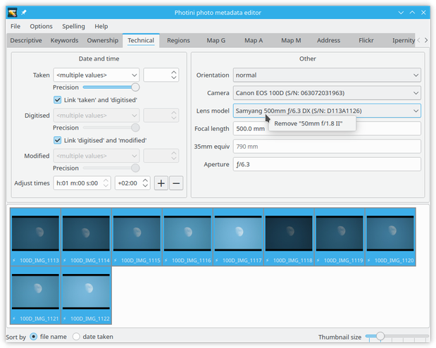

If you don't want to store the 35mm equivalent focal length you entered in the photograph's metadata you can undo the edit by reloading the metadata.
Right-click on the thumbnail and select ``reload file`` from the context menu.

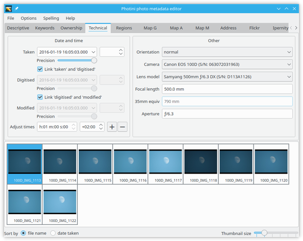

Now the 35mm equivalent focal length is computed using the correct crop factor.

.. _makernote: https://www.exiv2.org/makernote.html
